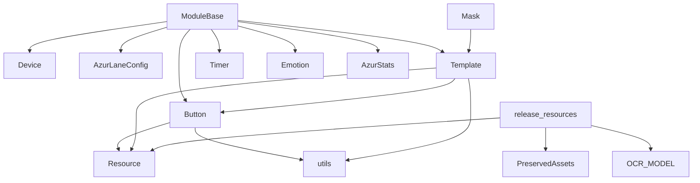

---
description:
alwaysApply: true
---
> **文档元信息**：生成日期 2026-08-14 ｜ 项目分支 `dev` ｜ 最后分析的代码版本 `f992af6c0`

# module/base/ 模块分析

## 1. 模块概述

**定位**：基础工具层，为所有游戏逻辑模块提供核心抽象和通用工具。

**角色**：定义 `ModuleBase` 根类（所有功能模块的公共祖先）、`Button`/`Template` 视觉交互原语、`Resource` 资源管理、`Timer` 计时器、装饰器、过滤器、异步执行器等基础设施。

**输入/输出**：
- 输入：截图（`np.ndarray`）、配置（`AzurLaneConfig`）、设备实例（`Device`）
- 输出：布尔检测结果、点击操作、裁剪图像、过滤结果

**核心职责**：
1. 提供状态循环（`loop()`）和按钮检测/点击（`appear()`/`appear_then_click()`）的统一抽象
2. 定义 `Button`/`Template` 作为 UI 交互的基本单位，封装颜色检测和模板匹配
3. 管理资源生命周期（`Resource`），支持缓存释放和服务器切换
4. 提供 `Timer` 双重计时器、`Filter` 正则过滤等通用组件
5. 提供装饰器（`Config.when`、`cached_property`、`retry`）和异步执行器

## 2. 文件清单与逐文件分析

> 实际文件清单（共 14 个 `.py` 文件）：`base.py`、`button.py`、`template.py`、`resource.py`、`utils.py`、`timer.py`、`decorator.py`、`filter.py`、`mask.py`、`retry.py`、`async_executor.py`、`api_client.py`、`device_id.py`、`ssh.py`。
> 注：`Switch`（`module/ui/switch.py`）、`Scroll`、`Navbar` 不在此目录下，位于 UI 层。

### 2.1 base.py（468 行）

**导出类型**：类 `ModuleBase`

**导入依赖**：
- 内部：`button.Button`、`decorator.cached_property`、`timer.Timer`、`utils.*`、`combat.Emotion`、`config.AzurLaneConfig`、`config.server`（`set_server`/`to_package`）、`device.Device`、`device.method.utils.HierarchyButton`、`logger`、`map_detection.utils.fit_points`、`statistics.AzurStats`、`webui.setting.cached_class_property`
- 外部：`typing`（`Tuple`、`Union`）、`numpy`、`PIL.Image`

**逐段分析**：

- `L26-67`：`ModuleBase` 类定义与 `__init__()` — 接受 `config`（`AzurLaneConfig` 实例或字符串）、`device`（`Device`、`None` 或序列号字符串）和 `task`（开发调试用），初始化 `interval_timer` 字典并调用 `early_ocr_import()`。支持多种构造方式。
- `L69-75`：`stat`/`emotion` 缓存属性 — 惰性创建 `AzurStats` 和 `Emotion` 实例。
- `L77-84`：`early_ocr_import()` — 预留的 OCR 预导入钩子，当前为空实现。
- `L86-101`：`worker` — 类级 `cached_class_property`，创建单线程 `ThreadPoolExecutor` 用于后台任务。
- `L103-107`：`ensure_button()` — 将字符串 xpath 转换为 `HierarchyButton`。
- `L109-155`：`loop()` — 状态循环生成器，核心设计模式。支持 `skip_first` 复用上次截图、`timeout` 超时控制（秒数或 `Timer`）。`for _ in self.loop()` 语法糖。
- `L157-190`：`loop_hierarchy()`/`loop_screenshot_hierarchy()` — 层次结构循环变体，同时获取截图与 UI 层级树。
- `L192-236`：`appear()` — 按钮出现检测。支持 `HierarchyButton`、颜色检测（`appear_on`）、模板匹配（`match`）。`interval` 参数防止频繁触发。
- `L238-272`：`match_template_color()` — 先模板匹配再颜色验证的双重检测。
- `L274-286`：`appear_then_click()` — 检测到按钮后点击，含 0.1s 安全延迟（防止误触退役金船）。
- `L288-329`：`wait_until_appear()`/`wait_until_appear_then_click()`/`wait_until_disappear()`/`wait_until_stable()` — 等待辅助方法。`wait_until_stable` 使用双重计时器确保 UI 稳定。
- `L331-392`：图像工具方法 — `image_crop()`、`image_color_count()`、`image_color_button()`（区域纯色查找并生成可点击 Button）。
- `L394-435`：间隔计时器管理 — `get_interval_timer()`、`interval_reset()`、`interval_clear()`。
- `L437-468`：`image_file` 属性（开发调试用，支持 `PIL.Image`/路径/数组）、`set_server()` 方法（切换服务器与设备包名）。

### 2.2 button.py（482 行）

**导出类型**：类 `Button`、`ButtonGrid`

**导入依赖**：
- 内部：`decorator.cached_property`、`resource.Resource`、`utils.*`、`config.server.VALID_SERVER`、`logger`
- 外部：`typing`、`os`、`traceback`、`PIL.ImageDraw`

**逐段分析**：

- `L22-112`：`Button` 类定义与 `__init__()` — 五参数构造：`area`（检测区域）、`color`（期望颜色）、`button`（点击区域）、`file`（模板文件）、`name`（名称）。支持 dict（按服务器区分）和 tuple（通用）。`cached` 列表与 `area`/`color`/`_button`/`file`/`name`/`is_gif` 六个 `cached_property` 惰性解析；含比较/哈希魔术方法与 `button` 属性（点击区域偏移）。
- `L114-128`：`appear_on()` — 颜色检测：计算区域平均颜色与期望颜色的相似度，阈值默认 10。
- `L130-154`：`load_color()`/`load_offset()`/`clear_offset()` — 动态加载颜色和偏移。
- `L156-193`：模板加载 — `ensure_template()`（原图）、`ensure_binary_template()`（二值化）、`ensure_luma_template()`（亮度通道）。GIF 模板逐帧加载。
- `L195-202`：`resource_release()` — 释放所有缓存图像。
- `L204-326`：匹配方法 — `match()`（模板匹配 `TM_CCOEFF_NORMED`）、`match_binary()`（二值化后匹配）、`match_luma()`（亮度通道匹配）。GIF 模板逐帧尝试。
- `L328-346`：`match_template_color()` — 先 `match_luma` 再颜色验证。
- `L348-386`：`crop()`/`move()` — 基于相对坐标创建新 Button。
- `L388-403`：`split_server()` — 按服务器拆分为 4 个 Button。
- `L406-482`：`ButtonGrid` — 网格按钮生成器。`__getitem__` 按索引生成 Button，`generate()` 迭代器，`buttons` 缓存属性，`crop()`/`move()` 相对变换，`gen_mask()`/`show_mask()`/`save_mask()` 遮罩调试。

### 2.3 template.py（307 行）

**导出类型**：类 `Template`

**导入依赖**：
- 内部：`button.Button`、`decorator.cached_property`、`resource.Resource`、`utils.*`、`config.server.VALID_SERVER`、`map_detection.utils.Points`
- 外部：`os`、`imageio`

**逐段分析**：

- `L19-31`：`Template` 类定义与 `__init__()` — 接受 `file` 参数，注册到资源表。
- `L33-45`：`file`/`name`/`is_gif` 缓存属性。
- `L47-67`：`image` 属性惰性加载，支持 GIF（逐帧，自动通道对齐），经 `pre_process()` 预处理。
- `L69-95`：`image_binary`/`image_luma` — 惰性计算二值化和亮度图像。
- `L97-109`：`_match_gif()` — GIF 匹配，每帧同时尝试原图和水平翻转。
- `L111-137`：`image` setter、`resource_release()`、`pre_process()`（默认原样返回）、`size`。
- `L139-173`：`match()` — 模板匹配，支持 `scaling` 缩放和 GIF 翻转。
- `L175-212`：`match_binary()`/`match_luma()` — 二值化和亮度匹配变体。
- `L214-257`：`_point_to_button()`/`match_result()`/`match_luma_result()` — 返回相似度和 Button 位置。
- `L259-294`：`match_multi()` — 多目标匹配，使用 `Points.group()` 聚类去重。
- `L296-307`：`split_server()` — 按服务器拆分。

### 2.4 resource.py（253 行）

**导出类型**：类 `Resource`、`PreservedAssets`，函数 `release_resources()`

**导入依赖**：
- 内部：`config.server`、`decorator.cached_property`、`decorator.del_cached_property`
- 外部：`re`、`gc`

**逐段分析**：

- `L21-37`：`get_assets_from_file()` — 从源文件中用正则提取资源名。
- `L40-70`：`PreservedAssets` — 识别需要在任务切换时保留的 UI 资源（`module/ui/assets.py`、`ui.py`、`handler/info_handler.py` 中的按钮），并提供全局实例 `_preserved_assets`。
- `L73-163`：`Resource` — 基类。`instances` 类级字典跟踪所有实例；`resource_add()` 注册，`resource_release()` 释放缓存，`is_loaded()`/`resource_show()` 调试辅助，`parse_property()` 根据服务器选择属性值。
- `L166-253`：`release_resources()` — 全局资源释放函数。按策略释放 OCR 模型（20-40MB）、UI 资源缓存（3MB+）、地图检测缓存（`utils_assets.ASSETS`）；保留 `PreservedAssets` 中的 UI 资源；根据 `State.deploy_config.UseOcrServer` 分流处理。

### 2.5 utils.py（1288 行）

**导出类型**：大量工具函数和全局变量

**导入依赖**：
- 内部：无（纯工具函数，不依赖项目内部模块）
- 外部：`random`、`re`、`numpy`、`cv2`、`PIL.Image`

**关键函数分析**：

- `L14-17`：全局标志 — `REGEX_NODE`（节点正则）、`TEMPLATE_MATCH_NON_NATIVE_720P`/`_THRESHOLD`/`_RESOLUTION`。
- `L20-41`：`set_template_match_non_native_720p()`/`lower_template_match_similarity()` — 非原生 720p 截图模板匹配阈值放宽（上限 0.75）。
- `L44-102`：随机分布 — `random_normal_distribution_int()`、`random_rectangle_point()`、`random_rectangle_vector()`。
- `L105-159`：`random_rectangle_vector_opted()` — 带白名单/黑名单过滤的随机向量（防止卡死时滑动被当作点击）。
- `L162-175`：`random_line_segments()` — 线段分割为多段。
- `L178-205`：`ensure_time()` — 时间值规范化（支持元组/字符串区间）。
- `L208-229`：`ensure_int()` — 嵌套结构整数转换。
- `L232-311`：区域操作 — `area_offset()`、`area_pad()`、`limit_in()`、`area_limit()`、`area_size()`。
- `L314-377`：点/区域判断 — `point_limit()`、`point_in_area()`、`area_in_area()`、`area_cross_area()`。
- `L380-404`：字符串转换 — `float2str()`、`point2str()`。
- `L407-520`：Excel 风格网格转换 — `col2name()`、`name2col()`、`node2location()`、`location2node()`。
- `L523-532`：坐标格式转换 — `xywh2xyxy()`、`xyxy2xywh()`。
- `L535-570`：`load_image()`（移除 alpha 通道、支持裁剪）、`save_image()`。
- `L573-589`：`copy_image()` — 等效 `image.copy()` 但更快的图像复制。
- `L592-670`：`crop()` — 图像裁剪，越界时黑色填充或返回零数组。
- `L673-697`：`resize()`、`image_channel()`。
- `L700-725`：`image_size()`、`image_paste()`。
- `L728-798`：色彩空间转换 — `rgb2gray()`、`rgb2hsv()`、`rgb2yuv()`、`rgb2luma()`。
- `L801-813`：`get_color()` — 区域平均颜色。
- `L816-878`：`ImageNotSupported` 异常、`get_bbox()` — 图像内容外接边界框。
- `L881-938`：`get_bbox_reversed()` — 反向阈值边界框。
- `L941-1062`：颜色相似度 — `color_similarity()`、`color_similar()`、`color_similar_1d()`、`color_similarity_2d()`（向量化）。
- `L1065-1080`：`image_color_count()` — 相似像素计数。
- `L1083-1142`：字母提取 — `extract_letters()`、`extract_white_letters()`。
- `L1145-1186`：`crop_to_text()` — 文本区域裁剪（OCR 预处理）。
- `L1189-1209`：`color_mapping()` — 颜色映射到 0-255 范围。
- `L1212-1233`：`image_left_strip()` — 裁剪图像左侧部分。
- `L1236-1247`：`red_overlay_transparency()` — 红色叠加层透明度计算。
- `L1250-1288`：`color_bar_percentage()` — 颜色进度条百分比。

### 2.6 timer.py（242 行）

**导出类型**：类 `Timer`，函数 `timer()`、`future_time()`、`past_time()`、`future_time_range()`、`time_range_active()`

**导入依赖**：
- 内部：`config.time_source`（`now`，统一时间源）
- 外部：`time`（`monotonic`/`sleep`）、`datetime`、`functools`

**逐段分析**：

- `L14-25`：`timer()` — 调试用计时装饰器，打印函数执行耗时。
- `L28-41`：`future_time()` — 解析 "HH:MM" 返回未来最近的对应时刻。
- `L44-57`：`past_time()` — 返回过去最近的对应时刻。
- `L60-72`：`future_time_range()` — 解析 "23:30-06:30" 区间。
- `L75-84`：`time_range_active()` — 判断当前时间是否在区间内。
- `L87-242`：`Timer` — 双重计时器。`limit`（时间限制）和 `count`（访问次数）。`reached()` 需要同时满足 `_access > count` 和 `time() - _start > limit`。`from_seconds()` 工厂方法按截图耗时估算 count。`start()`/`reset()`/`clear()`/`started()`/`current_time()`/`current_count()`/`add_count()`/`reached_and_reset()`/`wait()`/`show()` 控制状态。未启动时 `reached()` 返回 `True`（快速首次尝试）。

### 2.7 decorator.py（211 行）

**导出类型**：类 `Config`、`cached_property`，函数 `del_cached_property()`、`has_cached_property()`、`set_cached_property()`、`function_drop()`、`run_once()`

**导入依赖**：外部 `random`、`re`、`functools`（`wraps`）、`typing`（`Callable`、`Generic`、`TypeVar`）

**逐段分析**：

- `L15-82`：`Config` — 装饰器类。`@Config.when(SERVER='en')` 根据配置分发不同实现。`func_list` 类级字典存储同名函数的多个变体。
- `L85-103`：`cached_property` — 带泛型支持的缓存属性描述符。首次访问计算并存入 `__dict__`。
- `L106-140`：缓存属性辅助函数 — `del_cached_property()`、`has_cached_property()`、`set_cached_property()`。
- `L143-182`：`function_drop()` — 随机丢弃函数调用，模拟卡顿，用于测试。
- `L185-211`：`run_once()` — 函数只执行一次。

### 2.8 filter.py（143 行）

**导出类型**：类 `Filter`

**导入依赖**：
- 内部：`logger`
- 外部：`re`、`functools`（`reduce`）

**逐段分析**：

- `L13-143`：`Filter` — 正则过滤系统。`__init__()` 接收 `regex`/`attr`/`preset`；`load()` 解析过滤字符串（支持 `>` 优先级分隔符和 Unicode 全角 `>`，含 `＞﹥›˃ᐳ❯`）；`apply()`/`applys()` 匹配对象属性（`sub_genre` 为 None 时放宽匹配）；`parse_filter()` 解析单个条件，无效条件返回 `['1nVa1d', ...]` 以确保被跳过。支持预设（`preset`）。

### 2.9 mask.py（64 行）

**导出类型**：类 `Mask`

**导入依赖**：
- 内部：`template.Template`、`utils`（`image_channel`、`load_image`、`rgb2gray`）
- 外部：`cv2`、`numpy`

**逐段分析**：

- `L14-64`：`Mask` — 继承 `Template`，重写 `image` 属性自动将 RGB 图像转为灰度；`set_channel()` 调整通道数；`apply()` 使用 `cv2.bitwise_and` 应用遮罩。

### 2.10 retry.py（139 行）

**导出类型**：函数 `retry()`、`retry_call()`（内部 `__retry_internal()`）

**导入依赖**：
- 内部：`logger`
- 外部：`time`、`random`、`functools`（`wraps`、`partial`）、`decorator`（可选，缺失时提供降级实现）

**逐段分析**：

- `L40-84`：`__retry_internal()` — 指数退避 + 抖动，支持 `exceptions`、`tries`、`delay`、`max_delay`、`backoff`、`jitter`、`logger`。
- `L87-112`：`retry()` — 返回重试装饰器。
- `L115-139`：`retry_call()` — 直接调用并重试。

### 2.11 async_executor.py（75 行）

**导出类型**：类 `AsyncExecutor`，模块级单例 `async_executor`

**导入依赖**：
- 内部：`logger`
- 外部：`asyncio`、`threading`、`typing`、`atexit`

**逐段分析**：

- `L14-67`：`AsyncExecutor` — 单例异步执行器。`__new__` 加锁实现单例，后台线程运行 `asyncio` 事件循环。`submit()` 提交同步/异步函数（同步函数包装为协程串行执行），`flush()` 等待所有任务完成。
- `L70-74`：全局单例 `async_executor` 实例与 `atexit` 清理注册。

### 2.12 api_client.py（270 行）

**导出类型**：类 `ApiClient`

**导入依赖**：
- 内部：`device_id.get_device_id`、`logger`（`async_executor` 在方法内惰性导入）
- 外部：`threading`、`typing`、`requests`

**逐段分析**：

- `L16-120`：`ApiClient` — HTTP 客户端。双端点故障转移（`PRIMARY_DOMAIN` 与 `FALLBACK_DOMAIN` 当前均指向 `https://alas-apiv2.nanoda.work`，无独立的备用域名）。端点：bug 日志（`/api/post/bug`）、CL1 遥测（`/api/telemetry`）、公告（`/api/get/announcement`）。核心请求方法 `_request_with_fallback()` 顺序尝试主/备用端点。
- `L122-165`：`_submit_bug_log()`/`submit_bug_log()` — bug 日志上报（异步，服务端 API 已废弃但仍保留）。
- `L167-212`：`_submit_cl1_data()`/`submit_cl1_data()` — CL1 遥测数据提交（异步，仅含哈希化设备 ID）。
- `L214-269`：`get_announcement()` — 公告获取（同步，支持 304 增量检查与 JSON 解析）。

### 2.13 device_id.py（169 行）

**导出类型**：模块级函数 `generate_device_id()`、`get_device_id()`、`get_old_device_id()` 及内部辅助函数（无 `DeviceId` 类）

**导入依赖**：
- 内部：`logger`
- 外部：`hashlib`、`json`、`platform`、`subprocess`、`threading`、`time`、`pathlib`、`typing`

**逐段分析**：

- `L15-37`：`_wmic_query()` — 通过 WMIC 查询 Windows 硬件信息。
- `L39-79`：`_collect_hardware_fingerprint()` — 采集硬件指纹：Windows 下查询 baseboard/cpu/bios/diskdrive 序列号；非 Windows 使用 `/etc/machine-id` 等，macOS 补充 Hardware UUID；已完全舍弃 MAC 地址依赖。
- `L82-91`：`generate_device_id()` — 对硬件指纹做 SHA256 哈希并截取前 32 位生成设备 ID。
- `L94-140`：模块全局状态（`_device_id`/`_old_device_id`/`_refresh_timer`/`_REFRESH_INTERVAL=300`）与 `_init_device_id()` — 首次生成时检测硬件变更，暂存旧 ID 用于数据库热迁移，并写入 `log/device_id.json`。
- `L143-169`：`_overwrite_device_id()`/`_refresh_callback()`/`_start_refresh_timer()` — 每 5 分钟（300 秒）刷新一次设备 ID 文件。

### 2.14 ssh.py（86 行）

**导出类型**：函数 `clear_ssh_host_key()`、`_get_known_hosts_files()`

**导入依赖**：
- 内部：`logger`
- 外部：`pathlib`（`Path`）、`subprocess`（`DEVNULL`/`PIPE`/`run`）

**逐段分析**：

- `L9-39`：`_get_known_hosts_files()` — 通过 `ssh -G` 查询指定 SSH 可执行文件对目标主机实际使用的主机指纹文件（`userknownhostsfile`），过滤 `none`/`nul`/`/dev/null`。
- `L42-86`：`clear_ssh_host_key()` — 用 `ssh-keygen -R` 从 known_hosts 中删除指定主机的过期指纹记录，支持 IPv6 括号格式与 22 端口双目标。
- **用途**：远程模拟器 SSH 连接前清理过期主机指纹，被 `alas.py` 的 `emulator_manager()`（远程 SSH 启停命令）、`module/device/platform/platform_base.py` 的 `run_remote_ssh_command()`、`module/webui/remote_access.py`（SSH 远程访问隧道）使用。
- **注意**：SSH 工具位于 `module/base/ssh.py`，不在 `module/device/platform/` 下（部分旧文档误标位置）。

## 3. 内部调用关系

## 4. 模块依赖分析

**外部依赖**：
- `numpy`：图像数组操作
- `cv2`（OpenCV）：模板匹配、颜色转换、图像处理
- `PIL`（Pillow）：图像加载、绘图
- `imageio`：GIF 读取
- `scipy.signal`：信号处理（峰值检测）

**内部依赖**：
- `module.config`：配置系统（`AzurLaneConfig`、`server`、`time_source`）
- `module.device`：设备层（`Device`、`HierarchyButton`）
- `module.combat`：情绪系统（`Emotion`）
- `module.logger`：日志系统
- `module.map_detection`：地图检测工具（`fit_points`、`Points`）
- `module.statistics`：统计（`AzurStats`）
- `module.webui`：WebUI 设置（`cached_class_property`、`State`）

## 5. 设计模式与架构分析

**设计模式**：
1. **模板方法模式**：`ModuleBase` 定义 `loop()`/`appear()` 等骨架，子类填充具体逻辑
2. **享元模式**：`Button`/`Template` 通过 `Resource.instances` 共享和管理
3. **策略模式**：`Config.when()` 装饰器根据配置动态选择实现
4. **观察者模式**：`ConfigWatcher` 监控配置文件变更
5. **单例模式**：`AsyncExecutor` 全局单例

**架构特点**：
- 所有游戏模块通过 `ModuleBase` 统一接口与设备交互
- `Button`/`Template` 是视觉交互的基本单位，封装了颜色检测和模板匹配
- 资源管理通过 `Resource` 基类实现生命周期控制

## 6. 类型系统分析

- 使用 `typing` 模块：`Tuple`、`Union`、`Callable`、`Generic`、`TypeVar`
- `cached_property` 支持泛型类型推导
- `Button`/`Template` 属性使用 `cached_property` 延迟计算
- `Timer` 使用 `float` 和 `int` 双精度计时

## 7. 性能分析

- `appear()` 方法在 `interval` 模式下使用 `Timer` 避免频繁计算
- `Button.match()` 使用 `cv2.matchTemplate` 的 `TM_CCOEFF_NORMED` 算法，复杂度 O(W*H)
- `color_similarity_2d()` 使用向量化 NumPy/OpenCV 操作批量计算
- `Template.match_multi()` 使用 `Points.group()` 聚类去重
- `Resource.release_resources()` 按需释放，避免内存泄漏
- `AsyncExecutor` 后台线程避免阻塞主线程

## 8. 安全分析

- `Button`/`Template` 文件路径通过 `Resource.parse_property()` 解析，支持服务器隔离
- `release_resources()` 保留关键 UI 资源，避免任务切换时丢失状态
- `DeviceId` 使用 SHA256 哈希，不暴露原始硬件信息
- `ssh.py` 的 `clear_ssh_host_key()` 仅清理目标主机的指纹记录，避免连接串扰

## 9. 代码质量评估

**优点**：
- 抽象层次清晰，`ModuleBase` 统一了所有游戏模块的接口
- `Button`/`Template` 设计灵活，支持多种检测模式
- 资源管理机制完善，支持缓存释放和服务器切换
- 装饰器系统强大，支持配置分发和缓存

**问题**：
- `utils.py` 过于庞大（1288 行），应拆分为 `color_utils.py`、`image_utils.py`、`area_utils.py` 等
- `ModuleBase.__init__()` 接受多种类型参数，类型检查不够严格
- `Button` 构造函数参数过多，应考虑使用 Builder 模式
- `filter.py` 的 `parse_filter()` 方法正则表达式复杂，可读性差

## 10. 潜在问题与改进建议

1. **utils.py 拆分**：将 1288 行拆分为多个子模块（`color.py`、`image.py`、`area.py`、`random.py`）
2. **Button 构造优化**：引入 Builder 模式或配置对象，减少参数数量
3. **类型注解增强**：为 `appear()`、`appear_then_click()` 等方法添加更精确的类型注解
4. **资源释放策略**：`release_resources()` 中的 OCR 模型释放逻辑过于复杂，应抽象为策略类
5. **测试覆盖**：核心工具函数（`crop()`、`color_similarity()`）缺少单元测试
