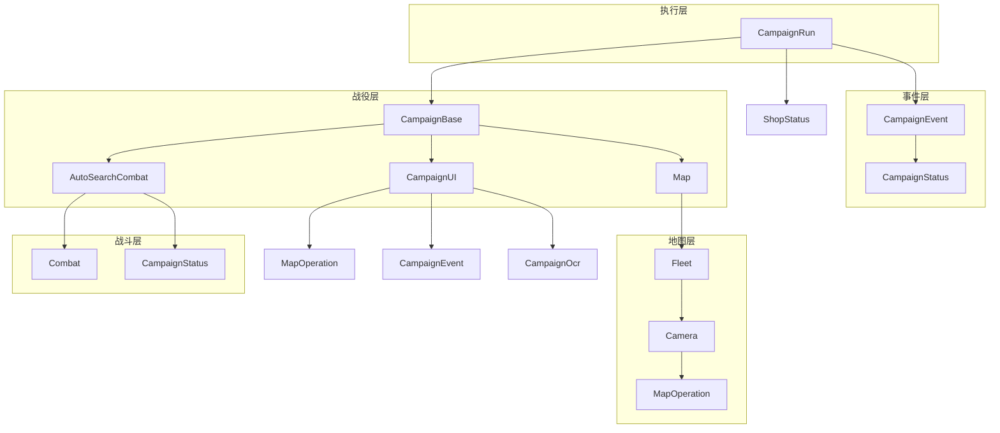

---
description:
alwaysApply: true
---

# 战役执行模块 (module/campaign/) 分析文档

> 生成日期：2026-08-14
> 项目版本：dev 分支（HEAD f992af6c0）
> 最后分析的代码版本：f992af6c0

## 1. 模块概述

**一句话定位**：战役系统的执行引擎，负责战役的 UI 导航、关卡选择、战斗执行和状态管理的完整生命周期。

**角色**：作为游戏自动化战役层，协调战役 UI 操作、地图加载、战斗逻辑、停止条件检测，完成从进入战役到战役结束的全流程控制。

**输入输出**：
- **输入**：战役配置（名称、模式、停止条件）、地图数据、舰队配置
- **输出**：战役结果（成功/失败）、掉落物品、经验值、运行统计

**核心职责**：
1. 战役 UI 导航（章节选择、模式切换、关卡进入）
2. 地图加载与初始化（动态导入地图模块、配置合并）
3. 战斗执行（普通战斗、自动搜索战斗）
4. 停止条件检测（运行次数、等级、石油、金币、事件 PT）
5. 事件处理（活动战役、限时活动、任务平衡器）

---

## 2. 文件清单与逐文件分析

### 2.1 campaign_base.py (307 行)

**导出类型**：类 `CampaignBase`

**导入依赖**：
- `module.base.decorator.Config`、`cached_property`：装饰器
- `module.campaign.campaign_ui.CampaignUI`：战役 UI
- `module.combat.auto_search_combat.AutoSearchCombat`：自动搜索战斗
- `module.exception`：异常定义
- `module.logger.logger`：日志系统
- `module.map.map.Map`：地图类
- `module.map.map_base.CampaignMap`：战役地图

**逐行分析**：

**L23**：`CampaignBase` 类定义，继承自 `CampaignUI`、`Map`、`AutoSearchCombat`。

**L38-39**：类属性：
- `FUNCTION_NAME_BASE`：函数名基础（`'battle_'`）
- `MAP`：战役地图（类型标注 `CampaignMap`，由子类地图文件赋值）

**L41-53**：`battle_default()` 方法，默认战斗：
- 清除敌人
- 记录警告

**L55-67**：`battle_boss()` 方法，BOSS 战斗：
- 暴力清除 BOSS

**L69-96**：`battle_function()` 方法（POOR_MAP_DATA=True）：
- 打破塞壬捕捉
- 清除所有神秘
- 拾取弹药
- 清除 BOSS 或敌人

**L98-135**：`battle_function()` 方法（MAP_CLEAR_ALL_THIS_TIME=True）：
- 清除所有敌人
- 处理弹跳敌人、塞壬、机关
- 清除 BOSS

**L137-160**：`battle_function()` 方法（默认）：
- 动态选择战斗函数
- 根据战斗计数选择函数

**L162-197**：`execute_a_battle()` 方法，执行一场战斗：
- 尝试执行战斗函数
- 处理敌人移动异常
- 错误处理和撤退

**L199-258**：`run()` 方法，战役运行：
- 进入地图
- 地图初始化
- 执行战斗循环
- 异常处理

**L260-295**：`_map_battle` 属性，地图战斗计数：
- 两个版本（L260 普通模式、L279 全清模式）

**L297-307**：`auto_search_execute_a_battle()` 方法，自动搜索战斗执行。

---

### 2.2 campaign_ui.py (607 行)

**导出类型**：类 `CampaignUI`、`ModeSwitch`

**导入依赖**：
- `module.base.timer.Timer`：计时器
- `module.base.utils.area_offset`：区域偏移
- `module.campaign.assets`：战役资源
- `module.campaign.campaign_event.CampaignEvent`：战役事件
- `module.campaign.campaign_ocr.CampaignOcr`：战役 OCR
- `module.exception`：异常定义
- `module.logger.logger`：日志系统
- `module.map.assets`：地图资源
- `module.map.map_operation.MapOperation`：地图操作
- `module.ui.assets`：UI 资源
- `module.ui.switch.Switch`：开关类

**逐行分析**：

**L27-38**：`ModeSwitch` 类（继承 `Switch`，重写 `handle_additional` 检测撤退按钮异常）与 L41-65 各实例：
- `MODE_SWITCH_1`：普通/困难模式切换
- `MODE_SWITCH_2`：困难/EX 模式切换
- `MODE_SWITCH_20241219`：20241219 活动模式切换
- `ASIDE_SWITCH_20241219`：20241219 活动侧边栏切换
- `ASIDE_SWITCH_20260326`：20260326 活动侧边栏切换

**L68-83**：`is_digit_chapter()` 函数，判断是否数字章节。

**L86**：`CampaignUI` 类定义，继承自 `MapOperation`、`CampaignEvent`、`CampaignOcr`。

**L104**：`ENTRANCE` 属性，战役入口按钮。

**L106-154**：`campaign_ensure_chapter()` 方法，确保章节：
- 获取章节索引
- 处理额外情况
- 切换章节

**L156-163**：`handle_chapter_additional()` 方法，处理章节额外情况。

**L165-196**：`campaign_ensure_mode()` 方法，确保模式：
- 处理普通/困难/EX 模式切换

**L198-210**：`campaign_ensure_mode_20241219()` 方法，确保 20241219 活动模式。

**L212-228**：`campaign_ensure_aside_20241219()` 方法，确保 20241219 活动侧边栏。

**L230-242**：`campaign_ensure_aside_20260326()` 方法，确保 20260326 活动侧边栏。

**L244-265**：`campaign_get_mode_names()` 方法，获取模式名称。

**L267-281**：`_campaign_name_is_hard()` 方法，判断是否困难模式。

**L283-311**：`campaign_get_entrance()` 方法，获取战役入口。

**L313-338**：`campaign_set_chapter_main()` 方法，设置主章节。

**L340-364**：`campaign_set_chapter_event()` 方法，设置活动章节。

**L366-384**：`campaign_set_chapter_sp()` 方法，设置 SP 章节。

**L386-485**：`campaign_set_chapter_20241219()` 方法，设置 20241219 活动章节。

**L487-519**：`campaign_set_chapter_20260326()` 方法，设置 20260326 活动章节。

**L521-547**：`campaign_set_chapter()` 方法，设置章节：
- 按优先级尝试：主章节 → 20260326 → 20241219 → 活动 → SP

**L549-564**：`handle_campaign_ui_additional()` 方法，处理战役 UI 额外情况。

**L566-598**：`ensure_campaign_ui()` 方法，确保战役 UI。

**L600-607**：`commission_notice_show_at_campaign()` 方法，委托通知显示。

---

### 2.3 campaign_event.py (316 行)

**导出类型**：类 `CampaignEvent`

**导入依赖**：
- `re`：正则表达式
- `module.campaign.campaign_status.CampaignStatus`：战役状态
- `module.config.config_updater`：配置更新器（`COALITIONS`、`EVENTS`、`GEMS_FARMINGS`、`HOSPITAL`、`MARITIME_ESCORTS`、`RAIDS`）
- `module.config.time_source.now`：当前时间
- `module.config.utils.DEFAULT_TIME`：默认时间
- `module.logger.logger`：日志系统
- `module.notify.handle_notify`：通知处理
- `module.ui.assets`：UI 资源
- `module.ui.page`：页面定义
- `module.war_archives.assets`：作战档案资源

**逐行分析**：

**L33**：`CampaignEvent` 类定义，继承自 `CampaignStatus`。

**L38-52**：`_reset_gems_farming()` 方法，重置钻石 farming：
- 重置为 2-4 关卡

**L54-78**：`_disable_tasks()` 方法，禁用任务：
- 禁用普通活动任务
- 重置钻石 farming
- 重置活动时间限制

**L80-110**：`event_pt_limit_triggered()` 方法，活动 PT 限制触发：
- 获取 PT 值
- 检查限制
- 禁用任务

**L112-142**：`coin_limit_triggered()` 方法，金币限制触发：
- 获取金币值
- 检查限制
- 延迟任务

**L144-169**：`event_time_limit_triggered()` 方法，活动时间限制触发：
- 获取时间限制
- 检查时间
- 禁用任务

**L171-199**：`triggered_task_balancer()` 方法，任务平衡器触发：
- 检查金币限制
- 判断是否平衡器任务

**L201-207**：`handle_task_balancer()` 方法，处理任务平衡器。

**L209-226**：`is_event_entrance_available()` 方法，活动入口是否可用。

**L228-241**：`ui_goto_event()` 方法，前往活动页面。

**L243-256**：`ui_goto_sp()` 方法，前往 SP 页面。

**L258-268**：`ui_goto_coalition()` 方法，前往联动页面。

**L270-287**：`disable_raid_on_event()` 方法，活动期间禁用突袭任务。

**L289-305**：`disable_event_on_raid()` 方法，突袭期间禁用活动任务。

**L307-316**：`stage_is_main()` 静态方法，判断关卡是否主线关卡。

---

### 2.4 campaign_ocr.py (405 行)

**导出类型**：类 `CampaignOcr`

**导入依赖**：
- `collections`：集合工具
- `module.base.base.ModuleBase`：基础模块
- `module.base.decorator`：装饰器
- `module.base.timer.Timer`：计时器
- `module.base.utils`：基础工具
- `module.exception.CampaignNameError`：名称异常
- `module.logger.logger`：日志系统
- `module.map.assets`：地图资源
- `module.ocr.ocr.Ocr`：OCR 类
- `module.template.assets`：模板资源

**逐行分析**：

**L29**：`CampaignOcr` 类定义，继承自 `ModuleBase`。

**L39-42**：类属性：
- `stage_entrance`：关卡入口
- `campaign_chapter`：战役章节
- `_stage_detect_area`：关卡检测区域

**L44-65**：`_campaign_get_chapter_index()` 静态方法，获取章节索引。

**L67-85**：`_campaign_ocr_result_process()` 静态方法，处理 OCR 结果：
- 修正破折号
- 替换错误字符
- 转换格式

**L87-115**：`_campaign_separate_name()` 静态方法，分离名称：
- 处理 SP、EX、数字等格式

**L117-153**：`campaign_match_multi()` 方法，多模板匹配：
- 查找关卡入口
- 提取名称
- 加载颜色

**L156-162**：`_stage_image` 属性（及 `_stage_image_gray`），关卡图像。

**L164-215**：`campaign_extract_name_image()` 方法（EN 服务器）：
- 匹配多种关卡样式

**L217-289**：`campaign_extract_name_image()` 方法（默认）：
- 匹配关卡入口

**L291-311**：`_extract_stage_name()` 静态方法，提取关卡名称。

**L312-363**：`_get_stage_name()` 方法，识别当前页面关卡名称。

**L365-374**：`handle_get_chapter_additional()` 方法，处理章节切换额外情况。

**L376-405**：`get_chapter_index()` 方法，获取当前章节索引。

---

### 2.5 campaign_status.py (207 行)

**导出类型**：类 `CampaignStatus`、`PtOcr`，实例 `OCR_PT`

**导入依赖**：
- `datetime`、`re`、`cv2`、`numpy`：标准库与图像处理
- `module.base.timer.Timer`：计时器
- `module.base.utils`：`color_similar`、`get_color` 工具
- `module.campaign.assets`：战役资源（OCR_COIN、OCR_OIL、OCR_EVENT_PT 等）
- `module.config.server`：服务器选择
- `module.logger.logger`：日志系统
- `module.ocr.ocr.Digit`、`Ocr`：OCR 类
- `module.ui.ui.UI`：UI 基类
- `module.log_res.LogRes`：日志资源记录

**逐行分析**：

**L38-58**：`PtOcr` 类（继承 `Ocr`），活动 PT 专用 OCR，预处理反色去背景；L61 定义全局实例 `OCR_PT`。

**L64**：`CampaignStatus` 类定义，继承自 `UI`。

**L65-94**：`get_event_pt()` 方法，获取活动 PT 数量：
- 优先匹配带 `X` 前缀的格式，回退纯数字
- 通过 `LogRes` 记录 PT 值

**L96-125**：`get_coin()` 方法，获取金币数量：
- OCR 识别金币值与上限
- 记录 `LogRes.Coin`

**L127-148**：`_get_num()` 方法，按 `OCR_OIL_CHECK` 颜色分支选择 OCR 参数（原始/黑色遮罩/默认）。

**L150-183**：`get_oil()` 方法，获取石油数量：
- 检测石油图标，OCR 识别值与上限
- 记录 `LogRes.Oil`

**L185-207**：`is_balancer_task()` 方法，判断当前任务是否为活动任务（Event/Event2/Raid/Coalition/GemsFarming/ThreeOilLowCost）。

---

### 2.6 run.py (550 行)

**导出类型**：类 `CampaignRun`

**导入依赖**：
- `copy`：对象拷贝
- `importlib`：动态导入
- `os`：操作系统
- `random`：随机数
- `module.campaign.campaign_base.CampaignBase`：战役基类
- `module.campaign.campaign_event.CampaignEvent`：战役事件
- `module.shop.shop_status.ShopStatus`：商店状态
- `module.campaign.campaign_ui.MODE_SWITCH_1`：模式切换
- `module.config.config.AzurLaneConfig`：配置管理
- `module.exception`：异常定义
- `module.handler.fast_forward`：快进处理
- `module.logger.logger`：日志系统
- `module.notify.handle_notify`：通知处理
- `module.ui.page.page_campaign`：战役页面

**逐行分析**：

**L31**：`CampaignRun` 类定义，继承自 `CampaignEvent`、`ShopStatus`。

**L52-60**：类属性：
- `folder`：文件夹
- `name`：名称
- `stage`：关卡
- `module`：模块
- `config`：配置
- `campaign`：战役
- `run_count`：运行计数
- `run_limit`：运行限制
- `is_stage_loop`：关卡循环

**L62-103**：`load_campaign()` 方法，加载战役：
- 动态导入地图模块
- 合并配置
- 创建战役实例

**L105-178**：`triggered_stop_condition()` 方法，触发停止条件：
- 运行次数限制
- 等级限制
- 石油限制
- 金币限制
- 自动搜索石油限制
- 获得新舰船
- 活动 PT 限制
- 任务平衡器

**L180-192**：`_triggered_app_restart()` 方法，触发应用重启。

**L194-199**：`handle_app_restart()` 方法，处理应用重启。

**L201-399**：`handle_stage_name()` 方法，处理关卡名称：
- 处理特殊名称
- 处理 GemsFarming 和 ThreeOilLowCost
- 处理活动特殊关卡

**L401-415**：`can_use_auto_search_continue()` 方法，判断是否可使用自动搜索续战。

**L417-419**：`after_campaign_run()` 方法，战役运行后处理。

**L421-434**：`handle_commission_notice()` 方法，处理委托完成通知。

**L436-550**：`run()` 方法，战役运行主循环：
- 加载地图、处理关卡名称
- 循环执行 `campaign.run()` 直至停止条件/任务切换/一次性关卡限制/关卡循环触发

---

### 2.7 gems_farming.py (1175 行)

**导出类型**：类 `GemsFarming`、`GemsEmotion`、`GemsCampaignOverride`、`GemsEquipmentHandler`

**导入依赖**：
- `module.campaign.run.CampaignRun`：战役运行框架
- `module.campaign.campaign_base.CampaignBase`：战役基类（供 `GemsCampaignOverride` 注入）
- `module.equipment.equipment_code.EquipmentCodeHandler`：装备码处理（供 `GemsEquipmentHandler` 继承）
- `module.equipment.fleet_equipment.FleetEquipment`：舰队装备管理
- `module.combat.emotion.Emotion`：情绪管理（供 `GemsEmotion` 继承）
- `module.retire.retirement.Retirement`：退役与船坞管理（MRO 链含 Dock/Equipment/EquipmentCodeHandler）
- `module.config.config.AzurLaneConfig`：配置管理
- `module.exception`：异常定义
- `module.logger.logger`：日志系统

**类结构**：
- `GemsEmotion`（L53）：钻石 farming 专用情绪管理，低情绪时抛 `CampaignEnd` 触发换船
- `GemsCampaignOverride`（L86）：覆写 `handle_combat_low_emotion` / `handle_exp_info`
- `GemsEquipmentHandler`（L154）：装备码导入导出的设备处理
- `GemsFarming`（L248）：主类，继承 `CampaignRun, FleetEquipment, GemsEquipmentHandler, Retirement`，提供换旗舰/先锋、装备装卸、等级 32 限制、情绪监控等

**说明**：钻石 farming 自动化，支持多种关卡和策略（换船逻辑、困难模式适配、装备码自动装卸）。

---

### 2.8 os_run.py (175 行)

**导出类型**：类 `OSCampaignRun`（继承 `OSMapOperation`）

**导入依赖**：
- `module.os.map_operation.OSMapOperation`：大世界地图操作基类（实际导入路径）
- `module.os.config.OSConfig`：大世界配置
- `module.os.operation_siren.OperationSiren`：大世界主类
- `module.os_handler.action_point.ActionPointLimit`：行动力不足异常
- `module.config.utils.get_os_reset_remain`：大世界重置剩余时间
- `module.logger.logger`：日志系统

**类结构**：
- `PREVENT_AP_OVERFLOW_TASK` 常量（L36）：防溢出任务名 `'OpsiPreventActionPointOverflow'`
- `load_campaign()`（L38）：合并 OSConfig 并实例化 `OperationSiren`，执行 `os_init()`
- `delay_opsi_tasks_after_ap_limit()`（L44）：行动力不足时按 `delay_minutes` 延迟任务
- `_run_opsi_task_with_ap_overflow_guard()`（L50）：运行普通大世界任务时临时关闭防溢出任务，结束后恢复调度

**说明**：大世界战役运行。`OSCampaignRun` 提供 **14 个** `opsi_*` 方法：`opsi_explore`、`opsi_shop`、`opsi_voucher`、`opsi_daily`、`opsi_meowfficer_farming`、`opsi_hazard1_leveling`、`opsi_obscure`、`opsi_month_boss`、`opsi_abyssal`、`opsi_archive`、`opsi_stronghold`、`opsi_scheduling`、`opsi_prevent_action_point_overflow`、`opsi_cross_month`，对应 `alas.py` 中的大世界任务入口。其余大世界任务（`opsi_ash_assist`、`opsi_ash_beacon` 在 `module/os_ash/meta.py`；`opsi_daily_delay`、`opsi_daemon` 直接在 `alas.py` 中实现）。

> **注意**：类名是 `OSCampaignRun`，不是 `OpsiRun`（旧文档误标）。

---

### 2.9 ambush_1_1.py (1100 行)

**导出类型**：类 `Ambush11`（继承 `CampaignRun, FleetEquipment, Retirement`，独立实现不依赖 GemsFarming）、`AmbushEmotion`、`AmbushCampaignOverride`

**导入依赖**：
- `module.campaign.run.CampaignRun`：战役运行框架
- `module.campaign.campaign_base.CampaignBase`：战役基类（供 `AmbushCampaignOverride` 注入）
- `module.equipment.fleet_equipment.FleetEquipment`：舰队装备管理
- `module.combat.emotion.Emotion`：情绪管理（供 `AmbushEmotion` 注入）
- `module.retire.retirement.Retirement`：退役与船坞管理（MRO 链含 Dock/Equipment/EquipmentCodeHandler）
- `module.logger.logger`：日志系统

**类结构**：
- `AmbushEmotion`（L44）：1-1 伏击专用情绪管理，低情绪时抛 `CampaignEnd` 触发换船
- `AmbushCampaignOverride`（L74）：覆写 `handle_combat_low_emotion` / `handle_exp_info`
- `Ambush11`（L142）：主类，继承 `CampaignRun, FleetEquipment, Retirement`，专用于 1-1 伏击刷关/钻石 farming

**说明**：专用于 1-1 伏击刷关/钻石 farming 的独立实现，用于 `ambush11` 任务。框架能力来自继承链（船坞、装备码、退役、装备、UI、地图），换船逻辑与 `GemsFarming` 等价但已内联。配置仍复用 `Ambush11.GemsFarming.*` 配置组。重写旗舰更换策略（填充主舰队 3 个后排槽位）。注意不是单纯的战役地图定义文件。

---

### 2.10 assets.py (47 行)

**导出类型**：按钮和模板常量

**导入依赖**：无（资源定义文件）

**说明**：定义战役系统使用的所有 UI 元素常量。

---

### 2.11 campaign/ 地图数据目录（134 个子目录）

**说明**：`campaign/` 目录存放所有战役地图定义文件（**Python 模块，非 YAML**），由 `module/campaign/run.py` 的 `load_campaign()` 通过 `importlib.import_module()` 动态加载。每个地图文件定义 `MAP = CampaignMap()`（shape/camera_data/map_data/spawn_data）、`class Config`（地图参数）与 `class Campaign(CampaignBase)`（战斗函数），由 `dev_tools/map_extractor.py` 生成。

**目录结构**（共 134 个子目录）：

| 类别 | 数量 | 命名规则 | 示例 |
|------|------|---------|------|
| `campaign_main/` | 1 | 主线章节地图（1-16 章，含 base/aircraft/submarine 变体） | `campaign_7_2.py`、`campaign_16_base.py` |
| `campaign_hard/` | 1 | 困难模式地图 | `campaign_12_4.py` |
| `campaign_sos/` | 1 | SOS 信号任务地图 | `campaign_3_5.py`、`campaign_base.py` |
| `campaign_war_archives/` | 1 | 作战档案地图（复用 event 数据） | - |
| `event_YYYYMMDD_<server>/` | 82 | 限时活动地图，按活动开始日期与服务器命名 | `event_20241219_cn/`、`event_20200521_en/` |
| `war_archives_YYYYMMDD_<server>/` | 48 | 作战档案活动地图 | `war_archives_20240725_cn/` |

**加载逻辑**（`run.py:load_campaign`）：`folder` 以 `campaign_` 开头时 `stage = '-'.join(name.split('_')[1:3])`（如 `campaign_7_2` → `7-2`）；以 `event` 或 `war_archives` 开头时 `stage = name`。地图文件缺失时抛 `RequestHumanTakeover` 并提示使用 `dev_tools/map_extractor.py` 自行制作。

---

## 3. 模块内部调用关系



---

## 4. 模块依赖关系

### 4.1 外部依赖
- `copy`：对象拷贝
- `importlib`：动态导入
- `os`：操作系统
- `random`：随机数
- `re`：正则表达式
- `datetime`：日期时间
- `collections`：集合工具

### 4.2 内部依赖
- `module.base.base.ModuleBase`：基础模块
- `module.base.decorator`：装饰器
- `module.base.timer.Timer`：计时器
- `module.base.utils`：基础工具
- `module.config.config.AzurLaneConfig`：配置管理
- `module.config.config_updater`：配置更新器
- `module.config.utils`：配置工具
- `module.exception`：异常定义
- `module.logger.logger`：日志系统
- `module.notify.handle_notify`：通知处理
- `module.ocr.ocr`：OCR 类
- `module.handler.fast_forward`：快进处理
- `module.shop.shop_status.ShopStatus`：商店状态
- `module.ui.assets`：UI 资源
- `module.ui.page`：页面定义
- `module.ui.switch.Switch`：开关类
- `module.map.assets`：地图资源
- `module.map.map.Map`：地图类
- `module.map.map_base.CampaignMap`：战役地图
- `module.map.map_operation.MapOperation`：地图操作
- `module.combat.combat.Combat`：战斗类
- `module.combat.auto_search_combat.AutoSearchCombat`：自动搜索战斗
- `module.campaign.assets`：战役资源
- `module.campaign.campaign_base.CampaignBase`：战役基类
- `module.campaign.campaign_event.CampaignEvent`：战役事件
- `module.campaign.campaign_ocr.CampaignOcr`：战役 OCR
- `module.campaign.campaign_status.CampaignStatus`：战役状态
- `module.campaign.campaign_ui.CampaignUI`：战役 UI
- `module.template.assets`：模板资源
- `module.war_archives.assets`：作战档案资源

---

## 5. 设计模式与架构分析

### 5.1 设计模式

**多重继承组合模式**：
- `CampaignRun` 类通过继承 `CampaignEvent`、`ShopStatus` 组合战役功能
- `CampaignBase` 类通过继承 `CampaignUI`、`Map`、`AutoSearchCombat` 组合战役功能
- `CampaignUI` 类通过继承 `MapOperation`、`CampaignEvent`、`CampaignOcr` 组合 UI 功能

**策略模式**：
- 战斗策略：`battle_default()`、`battle_boss()`、`battle_function()`
- 关卡策略：主章节、活动章节、SP 章节

**工厂模式**：
- `load_campaign()` 方法作为战役对象的工厂
- 根据配置动态加载地图模块

**模板方法模式**：
- `run()` 方法定义了战役运行的完整流程
- 子方法实现具体步骤

**观察者模式**：
- 停止条件通过 `triggered_stop_condition()` 方法检测
- 状态变化通过属性访问器通知

**装饰器模式**：
- `@Config.when` 装饰器实现服务器特定的方法分发
- `@cached_property` 装饰器实现惰性计算和缓存

### 5.2 架构特点

**分层架构**：
- 执行层：`CampaignRun`
- 事件层：`CampaignEvent`、`CampaignStatus`
- 战役层：`CampaignBase`、`CampaignUI`
- 地图层：`Map`、`Fleet`、`Camera`
- 战斗层：`Combat`、`AutoSearchCombat`

**事件驱动**：
- 使用计时器控制操作节奏
- 使用标志位控制状态转换
- 使用异常处理错误情况

**防御性编程**：
- 多重条件检查
- 超时机制
- 异常处理和恢复

**数据驱动**：
- 地图数据通过动态导入加载
- 配置数据通过 JSON 文件管理
- 状态数据通过属性访问器保护

**动态加载**：
- 使用 `importlib.import_module()` 动态加载地图模块
- 支持多种活动和关卡

---

## 6. 类型系统分析

### 6.1 类型注解
- 部分方法有类型注解
- 使用 docstring 说明参数类型
- 使用 `typing` 模块进行复杂类型注解

### 6.2 类型使用
- 基础类型：`bool`、`int`、`float`、`str`
- 容器类型：`list`、`dict`、`tuple`
- 自定义类型：`CampaignRun`、`CampaignBase`、`CampaignUI`、`AzurLaneConfig`

### 6.3 类型安全
- 运行时类型检查为主
- 缺少静态类型检查
- 使用 `isinstance()` 进行类型判断
- 使用 `hasattr()` 进行属性检查

---

## 7. 性能分析

### 7.1 性能瓶颈
1. **动态导入**：`importlib.import_module()` 有性能开销
2. **OCR 识别**：关卡名称识别需要 OCR 处理
3. **模板匹配**：多次模板匹配操作
4. **战斗执行**：战斗时间较长

### 7.2 优化策略
1. **缓存机制**：`@cached_property` 缓存计算结果
2. **早期退出**：检测到目标立即退出
3. **模块缓存**：已加载的模块不再重新加载
4. **并行处理**：多任务并行执行

### 7.3 性能指标
- 模块加载：约 100-500ms
- OCR 识别：约 50-100ms
- 模板匹配：约 50-100ms
- 战斗执行：约 60-180 秒
- 总战役时间：约 2-10 分钟

---

## 8. 安全性分析

### 8.1 输入验证
- 配置参数验证：通过 `AzurLaneConfig` 系统验证
- 关卡名称验证：通过 OCR 和正则表达式验证
- 界面状态验证：通过 `appear()` 方法验证

### 8.2 状态安全
- 计时器防止无限循环
- 标志位防止重复操作
- 超时机制防止卡死
- 异常处理防止崩溃

### 8.3 资源安全
- 截图资源管理：通过 `Device` 类管理
- 内存管理：使用 `copy=False` 减少内存拷贝
- 异常恢复：捕获异常并尝试恢复

### 8.4 数据安全
- 配置数据：通过 JSON 文件持久化
- 状态数据：通过属性访问器保护
- 日志数据：通过 `logger` 系统管理

---

## 9. 代码质量评估

### 9.1 优点
1. **模块化设计**：功能清晰分离，职责单一
2. **代码复用**：通过继承和组合减少重复代码
3. **防御性编程**：多重检查和异常处理
4. **日志完善**：详细的日志记录便于调试
5. **配置灵活**：通过配置系统支持多种场景
6. **动态加载**：支持多种活动和关卡

### 9.2 缺点
1. **继承链过深**：`CampaignRun` 类继承链复杂
2. **方法过长**：部分方法超过 100 行
3. **魔法数字**：部分硬编码数值
4. **注释不足**：部分复杂逻辑缺少注释
5. **类型注解缺失**：大部分方法缺少类型注解
6. **代码重复**：多个活动处理方法有重复逻辑

### 9.3 代码规范
- 遵循 PEP 8 命名规范
- 使用 Google docstring 风格
- 代码缩进一致
- 导入语句组织有序

---

## 10. 潜在问题与改进建议

### 10.1 潜在问题

1. **继承复杂度**：
   - 问题：`CampaignRun` 类继承链过深，可能导致方法冲突
   - 建议：考虑使用组合模式替代多重继承

2. **动态导入风险**：
   - 问题：`importlib.import_module()` 可能导入恶意模块
   - 建议：添加模块白名单验证

3. **错误处理**：
   - 问题：部分异常被捕获后仅记录日志
   - 建议：明确异常处理策略

4. **性能瓶颈**：
   - 问题：OCR 和模板匹配性能开销大
   - 建议：引入缓存机制和增量更新

5. **代码重复**：
   - 问题：多个活动处理方法有重复逻辑
   - 建议：提取公共方法

6. **配置依赖**：
   - 问题：大量配置参数
   - 建议：简化配置，提供默认值

### 10.2 改进建议

1. **引入类型注解**：
   ```python
   def load_campaign(self, name: str, folder: str = 'campaign_main') -> bool:
       ...
   ```

2. **重构长方法**：
   - 将 `run()` 拆分为多个小方法
   - 每个方法职责单一

3. **优化动态导入**：
   ```python
   # 添加模块白名单
   ALLOWED_MODULES = ['campaign_main', 'event_*', 'war_archives_*']

   def is_module_allowed(folder: str) -> bool:
       return any(fnmatch.fnmatch(folder, pattern) for pattern in ALLOWED_MODULES)
   ```

4. **增强错误处理**：
   ```python
   try:
       self.campaign.run()
   except CampaignEnd:
       logger.info('Campaign ended normally')
   except RequestHumanTakeover:
       logger.error('Requesting human takeover')
       raise
   except Exception as e:
       logger.error(f'Unexpected error: {e}')
       raise
   ```

5. **添加单元测试**：
   - 为关键方法编写单元测试
   - 使用 mock 对象模拟设备操作

6. **性能监控**：
   - 添加性能计时器
   - 记录关键操作耗时

7. **文档完善**：
   - 为复杂算法添加详细注释
   - 更新 API 文档

8. **代码重构**：
   - 提取公共活动处理方法
   - 使用配置驱动替代硬编码

---

## 11. 总结

战役执行模块是 AzurPilot 的核心模块之一，通过多层继承组合了战役 UI、地图、战斗等功能。模块设计合理，功能完整，支持多种活动和关卡，但在继承复杂度、动态导入风险、代码重复等方面有改进空间。建议逐步重构，引入更现代的设计模式，提高代码的可维护性和安全性。
