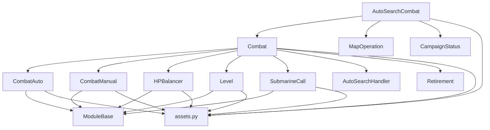

---
description:
alwaysApply: true
---

# 战斗逻辑模块 (module/combat/) 分析文档

**生成日期**: 2026-08-14
**项目版本**: dev 分支
**最后分析的代码版本**: f992af6c0

---

## 1. 模块概述

**一句话定位**：战斗系统的核心执行引擎，负责管理战斗准备、战斗执行、战斗状态处理的完整生命周期。

**角色**：作为游戏自动化框架的战斗核心，协调舰船情绪、血量平衡、潜艇呼叫、自动/手动战斗模式等子系统，完成从进入战斗到战斗结束的全流程控制。

**输入输出**：
- **输入**：战斗配置（auto_mode、submarine_mode）、舰队索引、血量控制参数
- **输出**：战斗结果（胜利/失败）、掉落物品、经验值、舰船获取状态

**核心职责**：
1. 战斗准备阶段的自动化（情绪等待、血量平衡、紧急维修）
2. 战斗执行阶段的控制（自动/手动模式切换、武器释放、潜艇呼叫）
3. 战斗状态的监控与处理（战斗评分、经验信息、掉落物品）
4. 自动搜索战斗的特殊流程处理

---

## 2. 文件清单与逐文件分析

### 2.1 combat.py (780 行)

**导出类型**：主类 `Combat`

**导入依赖**：
- 外部库：`numpy`
- 内部模块：`module.base.timer`、`module.base.utils`、`module.base.api_client`、`module.combat.assets`、`module.combat.combat_auto`、`module.combat.combat_manual`、`module.combat.hp_balancer`、`module.combat.level`、`module.combat.submarine`、`module.combat_ui.assets`、`module.handler.auto_search`、`module.logger`、`module.map.assets`、`module.retire.retirement`、`module.statistics.azurstats`、`module.template.assets`、`module.ui.assets`

**逐行分析**：

**L23-41**：导入语句，引入战斗系统所需的全部依赖（numpy、Timer、图像工具、ApiClient、各子模块类与资源）。

**L44**：`Combat` 类定义，采用多重继承组合以下 7 个功能类：
- `Level`：等级检测
- `HPBalancer`：血量平衡
- `Retirement`：退役处理
- `SubmarineCall`：潜艇呼叫
- `CombatAuto`：自动战斗
- `CombatManual`：手动战斗
- `AutoSearchHandler`：自动搜索处理

**L56-57**：类属性定义：
- `_automation_set_timer`：自动化设置计时器（1秒间隔）
- `battle_status_click_interval`：战斗状态点击间隔

**L59-75**：`combat_appear()` 方法，检测是否进入战斗状态：
- 检查舰队锁定配置
- 检测战斗加载画面
- 检测战斗准备界面（含覆盖层）

**L77-99**：`map_offensive()` 方法，地图进攻流程：
- 点击 `MAP_OFFENSIVE` 按钮
- 处理低情绪状态
- 处理退役场景
- 循环直到战斗出现

**L100-119**：`is_combat_loading()` 方法，检测战斗加载状态：
- 裁剪图像区域 (0, 620, 1280, 690)
- 使用模板匹配检测加载条
- 计算加载进度百分比
- 回退检测：检查战斗执行状态

**L121-184**：`is_combat_executing()` 方法，检测战斗执行状态：
- 支持多种暂停按钮样式（CN/EN/JP/TW）
- 使用颜色匹配、模板匹配、亮度匹配多种方式
- 处理特殊主题按钮（圣诞节、赛博朋克、忍者等）

**L186-259**：`handle_combat_quit()` 方法，处理战斗退出：
- 支持多种退出按钮样式
- 使用计时器防止重复点击

**L261-267**：`handle_combat_quit_reconfirm()` 方法，处理退出确认。

**L269-271**：`ensure_combat_oil_loaded()` 方法，确保石油加载完成。

**L273-284**：`handle_combat_automation_confirm()` 方法，处理自动化确认弹窗。

**L286-343**：`combat_preparation()` 方法，战斗准备流程：
- 参数：`balance_hp`（血量平衡）、`emotion_reduce`（情绪减少）、`auto`（自动模式）、`fleet_index`（舰队索引）
- 流程：情绪等待 → 血量平衡 → 战斗准备界面处理 → 自动化设置 → 退役处理 → 紧急维修 → 故事跳过 → 战斗加载检测

**L345-355**：`handle_battle_preparation()` 方法，处理战斗准备按钮。

**L357-392**：`handle_combat_automation_set()` 方法，设置战斗自动化模式：
- 检测当前自动化状态（ON/OFF）
- 根据配置切换自动化状态

**L394-428**：`handle_emergency_repair_use()` 方法，处理紧急维修：
- 检查配置是否启用
- 等待舰队力量数字稳定
- 根据血量阈值决定是否使用维修

**L430-484**：`combat_execute()` 方法，战斗执行流程：
- 参数：`auto`（战斗模式）、`submarine`（潜艇模式）、`drop`（掉落记录）
- 重置状态计时器
- 处理：自动化确认 → 故事跳过 → 自动战斗 → 手动战斗 → 武器释放 → 潜艇呼叫 → 弹窗处理 → 战斗状态

**L486-540**：`handle_battle_status()` 方法，处理战斗状态：
- 检测战斗评分（S/A/B/C/D）
- 记录掉落物品
- 点击继续

**L542-579**：`handle_get_items()` 方法，处理获得物品：
- 检测三种物品获取界面
- 重置战斗状态计时器

**L581-606**：`handle_exp_info()` 方法，处理经验信息：
- 检测 S/A/B 级经验信息
- 添加短暂延迟

**L608-628**：`handle_get_ship()` 方法，处理获得舰船：
- 检测新舰船
- 设置触发标志

**L630-650**：`handle_combat_mis_click()` 方法，处理战斗误点击：
- 检测弹药库/演习界面
- 点击返回按钮

**L652-737**：`combat_status()` 方法，战斗状态处理：
- 参数：`drop`（掉落记录）、`expected_end`（预期结束条件）
- 处理：故事跳过 → 获得舰船 → 获得物品 → 弹窗确认 → 战斗状态 → 经验信息 → 自动搜索退出 → 误点击处理

**L739-780**：`combat()` 方法，完整战斗流程：
- 参数合并：使用用户配置或传入参数
- 创建掉落记录上下文
- 执行：战斗准备 → 战斗执行 → 战斗状态

---

### 2.2 combat_auto.py (89 行)

**导出类型**：类 `CombatAuto`（继承 `ModuleBase`）

**导入依赖**：
- `module.base.base.ModuleBase`
- `module.base.timer.Timer`
- `module.combat.assets`（COMBAT_AUTO、COMBAT_AUTO_133、COMBAT_AUTO_150、COMBAT_AUTO_SWITCH）
- `module.logger.logger`

**逐行分析**：

**L33-37**：类属性定义：
- `auto_skip_timer`：自动跳过计时器
- `auto_click_interval_timer`：自动点击间隔计时器
- `auto_mode_checked`：自动模式检查标志
- `auto_mode_switched`：自动模式切换标志
- `auto_mode_click_timer`：自动模式点击计时器

**L39-47**：`combat_joystick_appear()` 方法，检测摇杆是否出现（表示手动模式）：
- 检测三种自动按钮样式

**L49-53**：`combat_auto_reset()` 方法，重置自动战斗状态。

**L55-89**：`handle_combat_auto()` 方法，处理自动战斗模式：
- 检查是否已确认
- 检查计时器
- 根据摇杆状态切换自动/手动模式

---

### 2.3 combat_manual.py (118 行)

**导出类型**：类 `CombatManual`（继承 `ModuleBase`）

**导入依赖**：
- `module.base.base.ModuleBase`
- `module.combat.assets`

**逐行分析**：

**L32-34**：类属性定义：
- `auto_mode_checked`：自动模式检查标志
- `auto_mode_switched`：自动模式切换标志
- `manual_executed`：手动执行标志

**L36-37**：`combat_manual_reset()` 方法，重置手动战斗状态。

**L39-56**：`handle_combat_stand_still_in_the_middle()` 方法，处理中间站位：
- 长按向下移动 0.8 秒

**L58-71**：`handle_combat_stand_still_bottom_left()` 方法，处理左下角站位：
- 长按左下移动 3.5-5.5 秒

**L73-86**：`handle_combat_stand_still_upper_left()` 方法，处理左上角站位：
- 长按左上移动 1.5-3.5 秒

**L88-94**：`handle_combat_weapon_release()` 方法，处理武器释放：
- 检测并点击空袭/鱼雷准备按钮

**L96-118**：`handle_combat_manual()` 方法，处理手动战斗：
- 按优先级尝试：中间站位 → 左下角站位 → 左上角站位

---

### 2.4 hp_balancer.py (268 行)

**导出类型**：类 `HPBalancer`

**导入依赖**：
- `module.base.base.ModuleBase`
- `module.base.button`
- `module.base.decorator.Config`
- `module.config.utils.to_list`
- `module.logger.logger`

**逐行分析**：

**L25-29**：侦察位置常量 `SCOUT_POSITION`。

**L46-52**：类属性定义：
- `fleet_current_index`：当前舰队索引
- `fleet_show_index`：显示舰队索引
- `_hp`：血量字典
- `_hp_has_ship`：是否有舰船字典
- `COLOR_HP_GREEN`：绿色血量颜色
- `COLOR_HP_RED`：红色血量颜色

**L54-84**：属性访问器（`hp`、`hp_has_ship`），支持按舰队索引访问血量数据。

**L86-99**：`_calculate_hp()` 方法，根据颜色计算血量：
- 使用 `color_bar_percentage` 函数
- 取红色和绿色血量的最大值

**L101-108**：`_hp_grid()` 方法，获取血量网格位置：
- 根据服务器类型返回不同的按钮网格

**L110-139**：`hp_get()` 方法，获取当前血量：
- 处理中文逗号
- 计算侦察舰船加权血量
- 记录血量日志

**L141-144**：`hp_reset()` 方法，重置血量数据。

**L146-154**：`_scout_position_change()` 方法，交换侦察舰船位置：
- 使用拖拽操作

**L156-191**：`_expected_scout_order()` 方法，计算期望的侦察顺序：
- 根据血量和阈值计算最优位置

**L193-248**：`_gen_exchange_step()` 方法，生成交换步骤：
- 两个版本：minitouch（L193-222）和默认（L224-248）
- 使用 `@Config.when` 装饰器根据设备控制方法分发

**L250-259**：`hp_balance()` 方法，执行血量平衡：
- 检查舰队锁定配置
- 计算目标顺序并执行交换

**L261-268**：`hp_retreat_triggered()` 方法，检测低血量撤退触发。

---

### 2.5 level.py (177 行)

**导出类型**：类 `Level`、`LevelOcr`

**导入依赖**：
- `module.config.server`
- `module.base.base.ModuleBase`
- `module.base.button`
- `module.base.decorator.Config`
- `module.logger.logger`
- `module.ocr.ocr.Digit`

**逐行分析**：

**L26-27**：颜色常量定义（`COLOR_WHITE`、`COLOR_MASKED`）。

**L39-40**：类属性定义：
- `_lv`：当前等级列表
- `_lv_before_battle`：战斗前等级列表

**L42-61**：属性访问器（`lv`）和重置方法（`lv_reset`）。

**L63-73**：`_lv_grid()` 方法，获取等级网格位置（服务器特定：en/jp/其他）。

**L75-97**：`lv_get()` 方法，获取当前等级：
- 使用 OCR 识别等级
- 触发等级检查

**L99-117**：`lv_triggered()` 方法，检测等级触发：
- 检查是否达到目标等级
- 防止异常等级跳跃

**L119-128**：`lv32_triggered()` 方法，检测 LV32 触发。

**L131-177**：`LevelOcr` 类（继承 `Digit`），等级 OCR 处理：
- `pre_process()`（L132-167）：图像预处理
  - 检测遮罩状态
  - 处理蓝色背景
  - 提取 'L' 字符位置
- `after_process()`（L169-177）：结果后处理
  - 修正常见 OCR 错误
  - 转换为整数

---

### 2.6 submarine.py (74 行)

**导出类型**：类 `SubmarineCall`（继承 `ModuleBase`）

**导入依赖**：
- `module.base.base.ModuleBase`
- `module.base.timer.Timer`
- `module.combat.assets`
- `module.logger.logger`

**逐行分析**：

**L33-35**：类属性定义：
- `submarine_call_flag`：潜艇呼叫标志
- `submarine_call_timer`：潜艇呼叫计时器
- `submarine_call_click_timer`：潜艇点击计时器

**L37-40**：`submarine_call_reset()` 方法，重置潜艇呼叫状态。

**L42-74**：`handle_submarine_call()` 方法，处理潜艇呼叫：
- 检查标志和计时器
- 检测潜艇可用状态
- 检测潜艇已呼叫状态
- 点击潜艇准备按钮

---

### 2.7 emotion.py (476 行)

**导出类型**：类 `FleetEmotion`、`Emotion`

**导入依赖**：
- `datetime`
- `time.sleep`
- `numpy`
- `module.base.decorator.cached_property`
- `module.base.utils.random_normal_distribution_int`
- `module.config.config.AzurLaneConfig`
- `module.config.time_source.now`（当前时间源）
- `module.exception`（ScriptEnd、ScriptError、RequestHumanTakeover）
- `module.logger.logger`

**逐行分析**：

**L33-52**：常量定义：
- `DIC_LIMIT`：情绪限制字典
- `DIC_RECOVER`：恢复速度字典
- `DIC_RECOVER_MAX`：最大恢复字典
- `OATH_RECOVER`：誓约恢复
- `ONSEN_RECOVER`：温泉恢复

**L55-210**：`FleetEmotion` 类，单舰队情绪管理：
- 属性：`value`（当前值）、`record`（记录时间）、`recover`（恢复地点）、`control`（控制模式）、`oath`（誓约）、`onsen`（温泉）
- `speed` 属性：计算恢复速度（考虑誓约和温泉加成）
- `limit` 属性：获取控制限制
- `max` 属性：获取最大值
- `update()` 方法：根据时间差更新情绪值
- `get_recovered()` 方法：计算恢复时间

**L212-476**：`Emotion` 类，双舰队情绪管理：
- 属性：`is_calculate`（是否计算）、`is_ignore`（是否忽略）、`using_public`（公海舰队模式）
- `_handle_public()`（L240-255）：处理公海舰队统一情绪管理
- `update()` 方法：更新所有舰队情绪
- `record()` 方法：保存情绪值到配置
- `show()` 方法：显示情绪信息
- `reduce_per_battle` 属性：每场战斗减少值
- `reduce_per_battle_before_entering` 属性：进入战斗前每场减少值
- `reduce_shipwreck` 属性：沉船扣减值
- `_check_reduce()` 方法：检查情绪减少
- `check_reduce()` 方法：战役前检查情绪
- `wait()` 方法：等待情绪恢复
- `reduce()` 方法：减少情绪值
- `bug_threshold` 属性：情绪 bug 触发阈值
- `triggered_bug()` 方法：检测情绪计算 bug

---

### 2.8 auto_search_combat.py (561 行)

**导出类型**：类 `AutoSearchCombat`（继承 `MapOperation + Combat + CampaignStatus`）

**导入依赖**：
- `module.base.timer.Timer`
- `module.campaign.campaign_status.CampaignStatus`
- `module.combat.assets`
- `module.combat.combat.Combat`
- `module.exception`（CampaignEnd、ScriptEnd）
- `module.handler.assets`（AUTO_SEARCH_MAP_OPTION_ON、GET_MISSION）
- `module.logger.logger`
- `module.map.assets`（WITHDRAW、SWITCH_OVER、FLEET_WITHDRAW、FLEET_SWITCH_CONFIRM、FLEET_WITHDRAW_BOSS）
- `module.map.map_operation.MapOperation`

**逐行分析**：

**L44-52**：类属性定义：
- `_auto_search_in_stage_timer`：自动搜索阶段计时器
- `_auto_search_status_confirm`：状态确认标志
- `_withdraw`：撤退标志
- `_defeat_count`：战败次数
- `_shipwreck_emotion_reduced`：沉船心情扣减标志（防止重复扣减）
- `_auto_search_emotion_reduce`：本次战斗是否扣减心情
- `_auto_search_fleet_index`：本次战斗的舰队索引
- `auto_search_oil_limit_triggered`：石油限制触发
- `auto_search_coin_limit_triggered`：金币限制触发

**L54-70**：`_handle_auto_search_menu_missing()` 方法，处理自动搜索菜单缺失 bug。

**L72-98**：`map_offensive_auto_search()` 方法，自动搜索地图进攻。

**L100-126**：`auto_search_watch_fleet()` 方法，监控舰队状态。

**L128-148**：`auto_search_watch_oil()` 方法，监控石油状态。

**L150-175**：`auto_search_watch_coin()` 方法，监控金币状态。

**L177-194**：`_wait_until_in_map()` 方法，等待进入地图。

**L196-237**：`auto_search_moving()` 方法，自动搜索移动：
- 监控舰队、石油、金币
- 处理退役、自动搜索选项、低情绪、故事跳过

**L239-355**：`auto_search_combat_execute()` 方法，自动搜索战斗执行：
- 处理加载阶段
- 执行战斗：潜艇呼叫 → 自动战斗 → 手动战斗 → 武器释放 → 弹窗处理
- 沉船 D 评价、结算确认超时处理

**L357-375**：`_wait_withdraw_stable()` 方法，等待 WITHDRAW 按钮稳定出现。

**L377-400**：`_handle_fleet_switch_over()` 方法，处理舰队切换（撤退战败舰队后切换另一队）。

**L402-544**：`auto_search_combat_status()` 方法，自动搜索战斗状态处理：
- 撤退流程（withdraw_continue / withdraw_stop / switch_fleet）
- 战斗结算、沉船弹窗检测

**L546-561**：`auto_search_combat()` 方法，自动搜索战斗主流程。

---

### 2.9 assets.py (51 行)

**导出类型**：按钮和模板常量

**导入依赖**：
- `module.base.button.Button`：按钮基类
- `module.base.template.Template`：模板基类

**说明**：定义战斗系统使用的所有 UI 元素常量（由 `dev_tools/button_extract.py` 自动生成），包括：
- 战斗准备界面按钮（BATTLE_PREPARATION 及其覆盖层）
- 战斗状态按钮（BATTLE_STATUS_S/A/B/C/D）
- 自动化开关按钮（AUTOMATION_ON/OFF/SWITCH/CONFIRM）
- 自动战斗摇杆按钮（COMBAT_AUTO 及 133/150 偏移变体）
- 退出确认按钮（QUIT_RECONFIRM）
- 潜艇相关按钮（SUBMARINE_READY/CALLED/AVAILABLE_CHECK）
- 紧急维修按钮
- 经验信息按钮（EXP_INFO_S/A/B/C/D）
- 获得物品/舰船按钮（GET_ITEMS、GET_SHIP、NEW_SHIP）
- 移动摇杆按钮（MOVE_DOWN、MOVE_LEFT_DOWN、MOVE_LEFT_UP）
- 战斗加载条（LOADING_BAR）与石油加载检测按钮

（暂停按钮及其主题变体位于 `module/combat_ui/assets.py`，见 COMBAT-UI.md）

---

## 3. 模块内部调用关系



---

## 4. 模块依赖关系

### 4.1 外部依赖
- `numpy`：数值计算
- `datetime`、`time`：时间处理
- `cv2`（通过 `module.base.utils`）：图像处理

### 4.2 内部依赖
- `module.base.base.ModuleBase`：基础模块类
- `module.base.timer.Timer`：计时器
- `module.base.button.Button`、`ButtonGrid`：按钮定义
- `module.base.decorator.Config`：配置装饰器
- `module.base.utils`：工具函数
- `module.config.config.AzurLaneConfig`：配置管理
- `module.config.server`：服务器配置
- `module.config.time_source`：时间源（情绪恢复时间计算）
- `module.logger.logger`：日志系统
- `module.exception`：异常定义
- `module.ocr.ocr.Digit`：OCR 数字识别
- `module.handler.auto_search.AutoSearchHandler`：自动搜索处理
- `module.retire.retirement.Retirement`：退役处理
- `module.statistics.azurstats.DropImage`：掉落统计
- `module.map.assets`：地图资源
- `module.map.map_operation.MapOperation`：地图操作
- `module.campaign.campaign_status.CampaignStatus`：战役状态
- `module.combat.assets`：战斗资源
- `module.combat_ui.assets`：战斗 UI 资源
- `module.template.assets`：模板资源
- `module.ui.assets`：UI 资源

---

## 5. 设计模式与架构分析

### 5.1 设计模式

**多重继承组合模式**：
- `Combat` 类通过继承 7 个功能类，组合了战斗系统的所有功能
- 优点：代码复用、功能模块化
- 缺点：继承链复杂、菱形继承风险

**状态机模式**：
- 战斗流程采用状态机设计：准备 → 执行 → 状态处理
- 每个状态有明确的进入条件和退出条件

**策略模式**：
- 自动/手动战斗模式通过策略模式实现
- `auto_mode` 参数决定使用哪种战斗策略

**装饰器模式**：
- `@Config.when` 装饰器实现服务器特定的方法分发
- `@cached_property` 装饰器实现惰性计算和缓存

**模板方法模式**：
- `combat()` 方法定义了战斗的完整流程模板
- 子方法实现具体步骤

### 5.2 架构特点

**分层架构**：
- 表示层：assets.py（UI 元素定义）
- 业务逻辑层：combat.py、auto_search_combat.py
- 功能层：combat_auto.py、combat_manual.py、hp_balancer.py、level.py、submarine.py、emotion.py
- 基础层：ModuleBase、Timer、Button

**事件驱动**：
- 使用计时器控制操作节奏
- 使用标志位控制状态转换

**防御性编程**：
- 多重条件检查
- 超时机制
- 异常处理和恢复

---

## 6. 类型系统分析

### 6.1 类型注解
- 大部分方法缺少类型注解
- 部分方法有 docstring 说明参数类型
- 使用 `Args:` 和 `Returns:` 标签说明类型

### 6.2 类型使用
- 基础类型：`bool`、`int`、`float`、`str`
- 容器类型：`list`、`dict`、`tuple`
- NumPy 类型：`np.ndarray`、`np.array`
- 自定义类型：`Timer`、`Button`、`ButtonGrid`、`AzurLaneConfig`

### 6.3 类型安全
- 运行时类型检查为主
- 缺少静态类型检查
- 使用 `isinstance()` 进行类型判断

---

## 7. 性能分析

### 7.1 性能瓶颈
1. **截图操作**：每次 `self.device.screenshot()` 约 350ms
2. **模板匹配**：多次模板匹配操作（`appear()`、`appear_then_click()`）
3. **OCR 识别**：等级识别需要 OCR 处理
4. **图像处理**：颜色计算、图像裁剪

### 7.2 优化策略
1. **跳过首次截图**：`skip_first_screenshot=True` 复用上一状态截图
2. **计时器控制**：使用 `interval` 参数防止重复操作
3. **缓存机制**：`@cached_property` 缓存计算结果
4. **早期退出**：检测到目标状态立即退出循环

### 7.3 性能指标
- 战斗准备：约 2-5 秒
- 战斗执行：约 60-180 秒（取决于战斗时长）
- 状态处理：约 2-5 秒
- 总战斗周期：约 70-190 秒

---

## 8. 安全性分析

### 8.1 输入验证
- 配置参数验证：通过 `AzurLaneConfig` 系统验证
- 界面状态验证：通过 `appear()` 方法验证
- 异常值处理：使用 `try-except` 捕获异常

### 8.2 状态安全
- 计时器防止无限循环
- 标志位防止重复操作
- 超时机制防止卡死

### 8.3 资源安全
- 截图资源管理：通过 `Device` 类管理
- 内存管理：使用 `copy=False` 减少内存拷贝
- 异常恢复：捕获异常并尝试恢复

### 8.4 数据安全
- 配置数据：通过 JSON 文件持久化
- 状态数据：通过属性访问器保护
- 日志数据：通过 `logger` 系统管理

---

## 9. 代码质量评估

### 9.1 优点
1. **模块化设计**：功能清晰分离，职责单一
2. **代码复用**：通过继承和组合减少重复代码
3. **防御性编程**：多重检查和异常处理
4. **日志完善**：详细的日志记录便于调试
5. **配置灵活**：通过配置系统支持多种场景

### 9.2 缺点
1. **继承链过深**：`Combat` 类继承 7 个父类，复杂度高
2. **类型注解缺失**：大部分方法缺少类型注解
3. **魔法数字**：部分硬编码数值（如颜色值、阈值）
4. **方法过长**：部分方法（如 `combat_status()`）超过 50 行
5. **注释不足**：部分复杂逻辑缺少注释

### 9.3 代码规范
- 遵循 PEP 8 命名规范
- 使用 Google docstring 风格
- 代码缩进一致
- 导入语句组织有序

---

## 10. 潜在问题与改进建议

### 10.1 潜在问题

1. **继承复杂度**：
   - 问题：`Combat` 类继承链过深，可能导致方法冲突
   - 建议：考虑使用组合模式替代多重继承

2. **状态管理**：
   - 问题：多个标志位分散在不同类中，难以追踪
   - 建议：引入状态管理器统一管理状态

3. **错误处理**：
   - 问题：部分异常被捕获后仅记录日志，未做处理
   - 建议：明确异常处理策略，区分可恢复和不可恢复异常

4. **性能优化**：
   - 问题：多次模板匹配操作，性能开销大
   - 建议：合并相似的模板匹配操作

5. **代码重复**：
   - 问题：`handle_battle_status()` 和 `handle_get_items()` 有重复逻辑
   - 建议：提取公共方法

### 10.2 改进建议

1. **引入类型注解**：
   ```python
   def combat_appear(self) -> bool:
       ...
   ```

2. **提取常量**：
   ```python
   # 将魔法数字提取为常量
   LOADING_BAR_AREA = (0, 620, 1280, 690)
   HP_GREEN_COLOR = (156, 235, 57)
   ```

3. **重构长方法**：
   - 将 `combat_status()` 拆分为多个小方法
   - 每个方法职责单一

4. **引入状态模式**：
   ```python
   class CombatState:
       def handle(self, combat):
           pass

   class PreparationState(CombatState):
       def handle(self, combat):
           ...
   ```

5. **增强错误处理**：
   ```python
   try:
       result = self.battle_function()
   except MapEnemyMoved:
       logger.warning('Enemy moved, retrying')
       continue
   except Exception as e:
       logger.error(f'Unexpected error: {e}')
       raise
   ```

6. **添加单元测试**：
   - 为关键方法编写单元测试
   - 使用 mock 对象模拟设备操作

7. **性能监控**：
   - 添加性能计时器
   - 记录关键操作耗时

8. **文档完善**：
   - 为复杂算法添加详细注释
   - 更新 API 文档

---

## 11. 总结

战斗逻辑模块是 AzurPilot 的核心模块之一，通过多重继承组合了战斗系统的所有功能。模块设计合理，功能完整，但在继承复杂度、类型注解、代码重复等方面有改进空间。建议逐步重构，引入更现代的设计模式，提高代码的可维护性和可测试性。
