---
description:
alwaysApply: true
---

# module/config/ 模块分析

**生成日期**: 2026-08-14
**项目版本**: dev 分支
**最后分析的代码版本**: f992af6c0

## 1. 模块概述

**定位**：配置管理系统，负责加载、合并、验证、持久化和热重载用户配置。

**角色**：定义 `AzurLaneConfig` 核心配置类，提供嵌套字典访问（`deep.py`）、服务器管理（`server.py`）、文件监控（`watcher.py`）、配置工具函数（`utils.py`）、MCP 集成（`mcp_helper.py`）、配置生成引擎（`config_updater.py`）和手动硬编码配置（`config_manual.py`）。

**输入/输出**：
- 输入：`config/{name}.json` 用户配置文件、`args.json` 参数定义、`i18n/*.json` 翻译文件
- 输出：绑定到任务的配置属性、调度队列（`pending_task`/`waiting_task`）

**核心职责**：
1. 加载用户配置并与模板合并（`ConfigUpdater`）
2. 将配置路径绑定到任务属性（`bind()`）
3. 提供高性能嵌套字典访问（`deep_get`/`deep_set`）
4. 管理服务器选择和包名映射（`server.py`）
5. 监控配置文件变更并触发重载（`ConfigWatcher`）
6. 计算任务调度优先级和延迟（`get_next_task()`/`task_delay()`，仍在 `config.py` 中）

## 2. 文件清单与逐文件分析

### 2.1 config.py（907 行）

**导出类型**：类 `AzurLaneConfig`、`Function`、`TaskEnd`、`ConfigBackup`、`MultiSetWrapper`，函数 `name_to_function()`

**导入依赖**：
- 内部：`filter.Filter`、`config_generated.GeneratedConfig`、`config_manual.ManualConfig/OutputConfig`、`config_updater.ConfigUpdater/ensure_time/get_server_next_update/nearest_future`、`deep.deep_get/deep_set`、`time_source.now`（别名 `current_time`）、`utils.DEFAULT_TIME/dict_to_kv/filepath_config/get_os_reset_remain/path_to_arg/is_good_gpu`、`watcher.ConfigWatcher`、`exception.RequestHumanTakeover/ScriptError`、`logger`、`map.map_grids.SelectedGrids`
- 外部：`copy`、`operator`、`os`、`platform`、`sys`、`threading`、`datetime`、`pywebio`

**逐段分析**：

- `L31-37`：`TaskEnd` 异常 — 任务提前结束（如情绪不足）时抛出，由调度循环捕获并安排延迟重试。
- `L40-70`：`Function` 类 — 任务调度函数描述对象，包含 `enable`、`command`、`next_run`。用于调度队列排序。
- `L73-86`：`name_to_function()` — 根据任务名创建 `Function` 实例。
- `L89-121`：`AzurLaneConfig` 类定义 — 四重继承 `ConfigUpdater + ManualConfig + GeneratedConfig + ConfigWatcher`。类属性 `stop_event`、`bound`、`is_hoarding_task`。
- `L123-130`：`__setattr__()` — 重写属性设置，将修改记录到 `modified` 字典，支持自动保存。
- `L132-172`：`__init__()` — 初始化配置。`data`（原始 JSON）、`modified`（修改记录）、`bound`（属性绑定映射）、`overridden`（强制覆盖）、`pending_task`/`waiting_task`（调度队列）。支持模板配置（只读）。
- `L174-187`：`init_task()` — 初始化任务。调用 `load()` → `bind()` → `save()`。
- `L189-194`：`load()` — 读取配置文件，应用覆盖和修改。
- `L196-246`：`bind()` — 核心绑定方法。根据任务列表（`General` + `Alas` + 任务特定组）将配置路径映射到属性名。`visited` 集合防止重复绑定。Opsi/Event/Raid/Coalition 等任务自动注入 `OpsiGeneral`/`EventGeneral`/`TaskBalancer` 组。
- `L249-291`：`ocr_backend`/`ocr_model_version`/`ocr_device` 属性 — 智能 OCR 配置。`auto` 模式自动检测 GPU 能力（DirectML/Vulkan/CoreML/ANE）。
- `L294-310`：`hoarding`/`close_game`/`is_actual_task` 属性 — 囤积时长、等待时关闭游戏、是否为真实任务。
- `L312-342`：`get_next_task()` — 调度核心。遍历所有任务，按 `next_run` 分为 `pending`/`waiting`，使用 `Filter` 按 `SCHEDULER_PRIORITY` 排序。
- `L344-370`：`get_next()` — 获取下一个待运行任务，处理囤积逻辑；无任务时抛出 `RequestHumanTakeover`。
- `L372-390`：`save()`/`update()` — 持久化修改到 JSON 文件。
- `L392-432`：`override()`/`config_override()` — 强制覆盖配置值，重置过期的 `NextRun`（对 Commission/Reward/Research/Opsi 系任务做时限兜底）。
- `L434-445`：`set_record()` — 设置值并自动记录当前时间（`Value` → `Record`）。
- `L447-455`：`multi_set()` — 上下文管理器，批量修改后一次性保存（`MultiSetWrapper`）。
- `L457-478`：`cross_get()`/`cross_set()` — 跨任务配置访问。
- `L480-541`：`task_delay()` — 设置任务延迟。支持成功/失败间隔、服务器更新时间、目标时间、分钟数。取最近的未来时间。
- `L543-665`：`opsi_task_delay()` — 大世界任务专用延迟，处理侦察扫描（27 分钟）、潜艇呼叫（60 分钟）、行动力限制（360 分钟）等。
- `L667-696`：`task_call()` — 调用另一个任务运行（修改其 `NextRun` 并启用）。
- `L697-713`：`task_stop()` — 静态方法，刷新异步执行器后抛出 `TaskEnd` 停止当前任务。
- `L715-733`：`task_switched()` — 检查是否需要切换任务（停止事件/`get_next()` 对比）。
- `L735-747`：`check_task_switch()` — 任务切换时停止当前任务。
- `L749-751`：`is_task_enabled()` — 检查任务是否启用。
- `L752-760`：`campaign_name` 属性 — 掉落记录子目录名。
- `L766-787`：`merge()` — 合并另一个配置对象（兼容旧版本）。
- `L789-836`：兼容属性 — `DEVICE_SCREENSHOT_METHOD`/`DEVICE_CONTROL_METHOD`/`FLEET_1`/`FLEET_2`/`SUBMARINE`/`FLEET_BOSS`。
- `L838-854`：`temporary()` — 临时覆盖设置，返回 `ConfigBackup` 可恢复。
- `L857-858`：`pywebio.output.Output = OutputConfig` — pywebio Output 补丁。
- `L861-886`：`ConfigBackup` — 配置备份/恢复。
- `L888-907`：`MultiSetWrapper` — `multi_set()` 的实现。

### 2.2 deep.py（527 行）

**导出类型**：函数 `deep_get()`、`deep_get_with_error()`、`deep_exist()`、`deep_set()`、`deep_default()`、`deep_pop()`、`deep_iter_depth1()`、`deep_iter_depth2()`、`deep_iter()`、`deep_values()`、`deep_iter_diff()`、`deep_iter_patch()`，常量 `OP_ADD`/`OP_SET`/`OP_DEL`

**导入依赖**：外部 `collections.deque`

**关键函数分析**：

- `L17-19`：`OP_ADD`/`OP_SET`/`OP_DEL` — JSON Patch 风格的操作类型常量。
- `L22-53`：`deep_get()` — 嵌套字典获取。240 + 30*depth ns 性能。`try/except` 比 `if key in dict` 快（key 存在时）。
- `L55-86`：`deep_get_with_error()` — 键不存在时抛 `KeyError` 的变体。
- `L88-115`：`deep_exist()` — 检查键是否存在。
- `L117-169`：`deep_set()` — 嵌套字典设置。150*depth ns。自动创建中间字典。
- `L171-223`：`deep_default()` — 仅在键不存在时设置（`setdefault`）。
- `L225-247`：`deep_pop()` — 嵌套字典弹出。
- `L249-287`：`deep_iter_depth1()`/`deep_iter_depth2()` — 固定深度遍历的简化版本。
- `L289-361`：`deep_iter()` — BFS 遍历嵌套字典。使用 `deque` 优化。支持 `min_depth`/`depth` 控制遍历深度。300us 遍历 530+ 行配置。
- `L363-430`：`deep_values()` — 仅迭代值的变体。
- `L432-481`：`deep_iter_diff()` — 比较两个字典的差异。时间成本与差异数量成正比。
- `L482-527`：`deep_iter_patch()` — 生成 JSON Patch 风格的变更事件（`OP_ADD`/`OP_SET`/`OP_DEL`）。

### 2.3 server.py（211 行）

**导出类型**：全局变量 `server`，常量 `VALID_SERVER`、`VALID_PACKAGE`、`VALID_CHANNEL_PACKAGE`、`DICT_PACKAGE_TO_ACTIVITY`、`SERVER_CHECKER_SERVER_LIST`、`VALID_SERVER_LIST`，类 `ServerInfo`，函数 `get_server_info()`、`set_server()`、`to_server()`、`to_package()`

**导入依赖**：`typing.NamedTuple`

**逐段分析**：

- `L9`：全局 `server = 'cn'` — 默认服务器。
- `L11-72`：常量定义 — `VALID_SERVER`（4 个有效服务器 `['cn', 'en', 'jp', 'tw']`）、`VALID_PACKAGE`（包名→服务器映射）、`VALID_CHANNEL_PACKAGE`（渠道包映射）、`DICT_PACKAGE_TO_ACTIVITY`（包名→Activity）。
- `L75-138`：`ServerInfo` NamedTuple 与 `SERVER_CHECKER_SERVER_LIST` — 服务器检测 API 元数据（按地区分组，配置值按列表下标持久化，不得重排）。
- `L141-144`：`VALID_SERVER_LIST` — 配置生成器和 WebUI 使用的服务器名列表。
- `L147-168`：`get_server_info()` — 将持久化的服务器键（如 `jp-2`）解析为检测元数据，格式无效抛 `ValueError`。
- `L170-181`：`set_server()` — 设置全局服务器并触发 `release_resources()`。
- `L184-196`：`to_server()` — 包名/服务器名转服务器。未知包名默认 `'cn'`。
- `L199-211`：`to_package()` — 服务器名转包名，无效抛 `ValueError`。

### 2.4 watcher.py（38 行）

**导出类型**：类 `ConfigWatcher`

**导入依赖**：
- 内部：`utils.DEFAULT_CONFIG_NAME/filepath_config/DEFAULT_TIME`、`logger`
- 外部：`os`、`datetime`

**逐段分析**：

- `L14-38`：`ConfigWatcher` — 文件修改时间监控。`start_watching()`（L18）记录初始时间，`get_mtime()`（L21）读取修改时间，`should_reload()`（L27）检查文件是否被修改。用于任务间热重载。

### 2.5 utils.py（725 行）

**导出类型**：常量 `LANGUAGES`、`SERVER_TO_LANG`、`LANG_TO_SERVER`、`SERVER_TO_TIMEZONE`、`DEFAULT_TIME`、`DEFAULT_CONFIG_NAME`，函数 `filepath_args()`、`filepath_config()`、`read_file()`、`write_file()`、`parse_value()`、`server_timezone()`、`server_time_offset()`、`get_server_next_update()`、`get_os_next_reset()`、`random_id()`、`is_good_gpu()` 等

**导入依赖**：
- 内部：`config.server`、`deploy.atomic`、`submodule.utils`、`base.decorator.run_once`、`time_source.now/timestamp`、`logger`
- 外部：`json`、`random`、`string`、`datetime`、`yaml`

**关键函数分析**：

- `L32-47`：常量 — `LANGUAGES`（5 种语言）、`SERVER_TO_LANG`/`LANG_TO_SERVER`、`SERVER_TO_TIMEZONE`、`DEFAULT_TIME`、`DEFAULT_CONFIG_NAME`。
- `L61-87`：文件路径函数 — `filepath_args()`、`filepath_argument()`、`filepath_i18n()`、`filepath_config()`、`filepath_code()`。
- `L90-142`：`read_file()`/`write_file()` — JSON/YAML 读写，使用原子操作。
- `L144-167`：`iter_folder()` — 文件夹迭代器。
- `L170-184`：`is_oobe_needed()` — 检查是否需要首次设置向导。
- `L187-202`：`alas_template()` — 获取 Alas 模板实例名称。
- `L205-225`：`alas_instance()` — 获取所有 AzurPilot 实例名称。
- `L228-283`：`parse_value()` — 字符串→类型转换（bool、int、float、datetime）。
- `L355-367`：`server_timezone()`/`server_time_offset()` — 服务器时区计算。
- `L420-449`：`get_os_next_reset()`/`get_os_reset_remain()` — 大世界重置时间。
- `L451-523`：`get_server_next_update()`（L451）/`get_server_last_update()`（L477）/`nearest_future()`（L503） — 服务器更新时间。
- `L575-585`：`random_id()` — 随机实例 ID。
- `L695-721`：`is_good_gpu()` — 检测高性能 GPU（>=1GB 显存，`@run_once`）。

### 2.6 mcp_helper.py（135 行）

**导出类型**：类 `McpConfigHelper`

**导入依赖**：
- 内部：`utils.read_file`、`utils.filepath_args`、`utils.filepath_i18n`
- 外部：`json`、`os`、`typing`

**逐段分析**：

- `L23-135`：`McpConfigHelper` — MCP 集成辅助类。`__init__`（L35）加载 args.json 与 i18n 文件；`get_tasks()`（L40）获取任务列表；`get_task_details()`（L44）获取任务元数据（含 i18n 翻译、参数类型/默认值/选项）；`get_dashboard_resources()`（L102）获取仪表盘资源。

### 2.7 config_updater.py（973 行）

**导出类型**：类 `ConfigGenerator`、`ConfigUpdater`、`Event`，常量 `CONFIG_IMPORT`、`ARCHIVES_PREFIX`、`MAINS`、`EVENTS`、`RAIDS`、`WAR_ARCHIVES`、`COALITIONS` 等

**导入依赖**：
- 内部：`deep.*`、`env.IS_ON_PHONE_CLOUD`、`server.VALID_CHANNEL_PACKAGE/VALID_PACKAGE/VALID_SERVER_LIST/to_package/to_server`、`task_priority.get_scheduler_tasks/merge_task_priority`、`utils.*`、`redirect_utils.utils.*`、`base.timer.timer`、`deploy.utils.DEPLOY_TEMPLATE/poor_yaml_read/poor_yaml_write`
- 外部：`re`、`typing`、`copy.deepcopy`、`cached_property`

**关键分析**：

- `L54-72`：`GeneratedConfig`（模板）与常量 — 各任务类别列表（Main/Event/Raid/WarArchives/Coalition 等）。
- `L75-119`：`Event` — 从 `campaign/Readme.md` 解析活动信息（date、directory、name、各服务器名称）。
- `L124-225`：`ConfigGenerator` 缓存属性 — `argument`（L124）、`task`（L166）、`default`（L178）、`override`（L190）、`gui`（L202）、`dashboard`（L213），加载并标准化各 YAML 定义文件。
- `L226-311`：`args()` — 4 层 YAML 管道核心：`task.yaml + argument.yaml + override.yaml + default.yaml → args.json`。合并默认值、应用覆盖（非 `state`/`lock` 且值非空时附 `display: hide`）、为每个有 `Scheduler.Command` 的 task 写入任务名并隐藏。
- `L314-340`：`generate_code()` — 根据参数定义生成 `config_generated.py`。
- `L343-441`：`generate_i18n(lang)` — 从旧翻译文件读取已有翻译（保留）并生成新文件。
- `L442-467`：`menu()` — 生成菜单定义（menu.json）。
- `L468-560`：`event()`（L468）/`insert_event()`（L508） — 解析活动并插入 args。
- `L561-602`：`generate_deploy_template()` — 生成 `config/deploy.template*.yaml` 系列部署模板。
- `L604-619`：`insert_package()`/`insert_server()` — 注入包名/服务器名选项。
- `L622-634`：`generate()` — 总入口：写出 `args.json`、`menu.json`、`config_generated.py`、`i18n/*.json` 与 deploy 模板。
- `L637-703`：`ConfigUpdater.redirection` — 版本迁移重定向表（`source, target, convert_func` 三元组，大部分历史条目已注释）。
- `L709-808`：`config_update()` — 与 `args.json` 默认值合并，处理活动/关卡默认值、任务优先级迁移、`config_redirect()`。
- `L810-857`：`config_redirect()` — 执行重定向迁移（`redirect_utils/` 中的转换函数）。
- `L859-876`：`_override()` — 云手机覆盖（序列号 `127.0.0.1:5555`、截图 `DroidCast_raw`、控制 `MaaTouch`）。
- `L878-907`：`save_callback()` — 联动更新：Emotion `Value`→`Record`；`OpsiScheduling` 与 `OpsiHazard1Leveling` 的 `OperationCoinsPreserve` 双向同步。
- `L909-952`：`read_file()`/`write_file()`/`update_file()` — 配置读写与更新入口。
- `L955-973`：`__main__` — 命令行入口 `uv run -m module.config.config_updater`：执行 `ConfigGenerator().generate()` 与 `ConfigUpdater().update_file('template')`（生成 `config/template.json`）。

### 2.8 config_manual.py（475 行）

**导出类型**：类 `ManualConfig`、`OutputConfig`

**导入依赖**：
- 内部：`deep.deep_get`、`utils.*`、`task_priority.get_scheduler_tasks/merge_task_priority`、`server`
- 外部：`pywebio.io_ctrl.Output`（可选导入）、`typing`

**关键分析**：

- `L35-136`：`ManualConfig` — 手动维护的硬编码配置基类，通过多重继承被 `AzurLaneConfig` 组合：
  - `SERVER` 属性（L49-51）：读取全局 `server.server`。
  - `_DEFAULT_SCHEDULER_PRIORITY`（L53-80）：默认任务调度优先级文本。
  - `_normalize_scheduler_priority()`（L82-105）：规范化用户自定义优先级（去除行内注释、空行、尾部 `>`）。
  - `SCHEDULER_PRIORITY` 属性（L107-136）：合并用户调整与默认优先级（`merge_task_priority`）。
- `L141-318+`：大量硬编码常量/属性 — `ASSETS_FOLDER`/`ASSETS_RESOLUTION`、`BUTTON_OFFSET`、`STAGE_ENTRANCE`/`STAGE_LOOP_ALIAS`、`LV_TRIGGERED`/`LV32_TRIGGERED`、`DEVICE_OVER_HTTP`/`FORWARD_PORT_RANGE`/`REVERSE_SERVER_PORT`、`ASCREENCAP_FILEPATH_*`、`DROIDCAST_VERSION`/`DROIDCAST_FILEPATH_*`、`MINITOUCH_FILEPATH_*`、`HERMIT_FILEPATH_*`、`SCRCPY_FILEPATH_*`、`MAATOUCH_FILEPATH_*`、`COMMON_CV_FILTER`/`COMMON_DD_FILTER`、`STORY_OPTION`/`STORY_ALLOW_SKIP`、`MAP_*` 地图开关系列、`SCREEN_SIZE`/`DETECTING_AREA`/`DETECTION_BACKEND` 等。
- `L472-475`：`OutputConfig(Output, ManualConfig)` — pywebio Output 补丁类，`config.py` L857-858 将其安装为 `pywebio.output.Output` 与 `pywebio.pin.Output`。

### 2.9 config_generated.py（1040 行）

**导出类型**：类 `GeneratedConfig`（L9）

**说明**：由 `config_updater.generate_code()` 自动生成，内容为 `Group_Argument = value` 形式的配置属性，为 `AzurLaneConfig` 提供 IDE 自动补全。**请勿手动修改**，修改配置定义后运行 `uv run -m module.config.config_updater` 重新生成。

### 2.10 其他文件与子目录

| 文件 | 行数 | 说明 |
|---|---|---|
| `time_source.py` | 224 | NTP 时间校准 `NetworkTimeSource`（L39），提供统一时间源 `now`。被 `config.py`（`from module.config.time_source import now as current_time`）与 `mcp_server_sse.py` 等导入使用 |
| `task_priority.py` | 124 | `parse_task_priority()`（L15）/`merge_task_priority()`（L91）/`task_priority_from_config()`（L120）任务优先级解析与合并，被 `config_updater.py` 与 `config_manual.py` 使用 |
| `code_generator.py` | 309 | 通用 Python 代码生成器（`CodeGenerator` L51 + `TabWrapper` L10，带缩进管理），独立于 `config_updater.generate_code()`（后者直接拼接字符串） |
| `env.py` | 10 | 云手机环境检测 `IS_ON_PHONE_CLOUD` |
| `redirect_utils/` | - | 版本升级的配置迁移重定向函数：`utils.py`（148 行，10 个函数）、`os_handler.py`（20 行）、`shop_filter.py`（91 行），被 `ConfigUpdater.redirection` 引用 |
| `argument/` | - | YAML 源文件：`task.yaml`/`argument.yaml`/`override.yaml`/`default.yaml`/`gui.yaml`/`dashboard.yaml`；生成产物：`args.json`/`menu.json` |
| `i18n/` | - | 五种语言翻译文件（`zh-CN`、`zh-MIAO`、`en-US`、`ja-JP`、`zh-TW`） |

## 3. 内部调用关系

```mermaid
graph TD
    AzurLaneConfig --> ConfigUpdater
    AzurLaneConfig --> ManualConfig
    AzurLaneConfig --> GeneratedConfig
    AzurLaneConfig --> ConfigWatcher
    AzurLaneConfig --> deep_get
    AzurLaneConfig --> deep_set
    AzurLaneConfig --> Filter
    AzurLaneConfig --> Function

    ConfigWatcher --> filepath_config
    set_server --> release_resources
    to_server --> VALID_PACKAGE
    to_server --> VALID_CHANNEL_PACKAGE

    ConfigGenerator --> args_json["args.json / menu.json"]
    ConfigGenerator --> config_generated_py["config_generated.py"]
    ConfigGenerator --> i18n_files["i18n/*.json"]
    ConfigUpdater --> config_redirect
    ConfigUpdater --> redirect_functions["redirect_utils/"]

    McpConfigHelper --> read_file
    McpConfigHelper --> filepath_args
    McpConfigHelper --> filepath_i18n
```

## 4. 模块依赖分析

**外部依赖**：
- `pywebio`：WebUI 框架（仅 `config.py` 导入）
- `yaml`：YAML 解析
- `json`：JSON 解析
- `cached_property`：属性缓存（`config_updater.py` 导入）

**内部依赖**：
- `module.base.filter`：任务优先级过滤
- `module.base.decorator`：`run_once`（`utils.py`）
- `module.config.time_source`：统一时间源 `now`
- `module.config.task_priority`：优先级解析/合并
- `module.config.redirect_utils`：迁移重定向函数
- `module.config.env`：云手机检测
- `module.exception`：`RequestHumanTakeover`、`ScriptError`
- `module.logger`：日志系统
- `module.map.map_grids`：`SelectedGrids`（仅类型引用）
- `deploy.atomic`：原子文件读写
- `deploy.utils`：deploy 模板读写
- `module.submodule.utils`：子模块工具

## 5. 设计模式与架构分析

**设计模式**：
1. **代理模式**：`__setattr__()` 重写，将属性修改代理到 `modified` 字典
2. **观察者模式**：`ConfigWatcher` 监控文件变更
3. **策略模式**：`task_delay()` 支持多种延迟策略
4. **上下文管理器**：`multi_set()` 批量修改
5. **工厂模式**：`name_to_function()` 创建 `Function` 实例
6. **生成器模式**：`ConfigGenerator` 负责 YAML 定义 → 各类产物的生成

**架构特点**：
- 四重继承：`ConfigUpdater` + `ManualConfig` + `GeneratedConfig` + `ConfigWatcher`
- 配置路径格式：`<Task>.<Group>.<Argument>` → 属性名 `<Group>_<Argument>`
- 嵌套字典是核心数据结构，`deep.py` 提供高性能访问
- 全局服务器变量 `server` 影响所有资源加载
- 4 层 YAML 管道：`task.yaml + argument.yaml + override.yaml + default.yaml → args.json`，再由 `config_updater` 生成其余产物

## 6. 类型系统分析

- `Function` 类使用 `deep_get` 从字典提取属性，类型安全性依赖运行时检查
- `deep_*` 函数使用 `type(keys) is str` 而非 `isinstance()` 进行类型判断（性能优化）
- `AzurLaneConfig` 的属性通过 `bind()` 动态添加，无静态类型保证；静态属性来自 `GeneratedConfig`/`ManualConfig`
- `McpConfigHelper` 使用 `typing` 注解（`Dict`、`List`、`Optional`）
- `server.py` 的 `ServerInfo` 为 `NamedTuple`，`SERVER_CHECKER_SERVER_LIST` 有 `dict[str, tuple[ServerInfo, ...]]` 注解

## 7. 性能分析

- `deep_get()`：240 + 30*depth ns，使用 `try/except` 而非 `if key in dict`
- `deep_set()`：150*depth ns，自动创建中间字典
- `deep_iter()`：300us 遍历 530+ 行配置（depth=3），使用 `deque` BFS
- `deep_iter_diff()`：时间成本与差异数量成正比，相等时几乎零成本
- `bind()` 使用 `visited` 集合避免重复绑定
- `get_next_task()` 遍历所有任务，O(n) 复杂度

## 8. 安全分析

- `filepath_config()` 使用相对路径，可能存在路径遍历风险
- `read_file()` 使用 `atomic_read_bytes/text` 原子读取，防止部分写入
- `write_file()` 使用 `atomic_write` 原子写入
- `server.py` 的 `to_server()` 未知包名默认 `'cn'`，可能误判

## 9. 代码质量评估

**优点**：
- `deep.py` 性能优化极致，注释详细说明了性能特征
- `task_delay()` 支持多种延迟方式，灵活性强
- `multi_set()` 上下文管理器避免频繁写入
- `ConfigWatcher` 实现简洁，满足热重载需求
- `config_updater.py` 将 YAML 定义与生成逻辑集中管理，规则清晰

**问题**：
- `config.py` 过于庞大（907 行），调度逻辑（`get_next_task`/`task_delay`/`opsi_task_delay`）仍集中在其中
- `AzurLaneConfig` 四重继承增加理解和维护难度
- `Function` 类使用 `deep_get` 而非直接属性访问，类型安全性差
- `server.py` 使用全局变量，测试困难
- `utils.py` 的 `is_good_gpu()` 使用 `@run_once` 装饰器，但 `subprocess.run` 可能失败
- `config_manual.py` 中大量硬编码属性与 `GeneratedConfig` 并存，部分属性可能过时

## 10. 潜在问题与改进建议

1. **config.py 拆分**：调度逻辑（`get_next_task`/`task_delay`/`opsi_task_delay`，L312/L480/L543）仍在 `config.py` 中，可考虑提取到独立模块（如 `scheduler.py`）
2. **服务器管理重构**：将 `server.py` 的全局变量改为配置类属性，支持依赖注入
3. **类型安全增强**：为 `bind()` 生成的属性添加类型注解（可通过 `config_generated.py` 实现）
4. **deep.py 测试**：添加边界条件测试（空字典、非字典输入、深度为 0 等）
5. **配置验证**：在 `load()` 后添加 schema 验证，及早发现配置错误
6. **MCP 集成增强**：`McpConfigHelper` 缺少配置写入能力，仅支持只读访问
