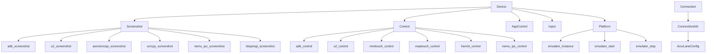

---
description:
alwaysApply: true
---

# module/device/ 模块分析

**生成日期**: 2026-08-14
**项目版本**: dev 分支
**最后分析的代码版本**: f992af6c0

## 1. 模块概述

**定位**：设备连接层，封装 ADB/uiautomator2 与安卓模拟器的交互。

**角色**：定义 `Device` 统一设备接口（截图、控制、应用管理）、`Connection` ADB 连接层、`ConnectionAttr` 连接属性和模拟器检测。支持多种截图/控制后端和模拟器平台。

**输入/输出**：
- 输入：配置（`AzurLaneConfig`）、模拟器序列号
- 输出：截图（`np.ndarray`）、点击/滑动操作、ADB 命令执行

**核心职责**：
1. 提供统一的截图接口：`ADB`、`ADB_nc`、`uiautomator2`、`aScreenCap`、`aScreenCap_nc`、`DroidCast`、`DroidCast_raw`、`scrcpy`、`nemu_ipc`、`ldopengl`
2. 提供统一的控制接口：`ADB`、`uiautomator2`、`minitouch`、`Hermit`、`MaaTouch`、`nemu_ipc`
3. 检测和管理模拟器连接（MuMu、LDPlayer、BlueStacks、Nox、VMOS、WSA、MEmu）
4. 卡死检测和点击频率控制
5. 应用启动/停止/重启管理

## 2. 文件清单与逐文件分析

### 2.1 device.py（505 行）

**导出类型**：类 `Device`，模块级函数 `show_function_call()`

**导入依赖**：
- 内部：`env`（`IS_WINDOWS`/`IS_MACINTOSH`）、`pkg_resources`（`get_distribution`）、`timer.Timer`、`config.time_source`（`now`）、`config.utils`（`get_server_next_update`）、`app_control.AppControl`、`control.Control`、`input.Input`、`platform.Platform`、`screenshot.Screenshot`、`exception.*`、`handler.assets`（`GET_MISSION`）、`logger`
- 外部：`collections`、`sys`、`contextlib`、`cv2`、`lxml.etree`

**逐段分析**：

- `L34-71`：`show_function_call()` — 输出当前函数调用栈（卡死/点击异常时辅助诊断）。
- `L74-88`：`Device` 类定义 — 多重继承：`Screenshot + Control + AppControl + Input`。类属性：`click_record`（`deque(maxlen=15)`）、`stuck_timer`（60s）、`stuck_timer_long`（195s）、`_stuck_image_timer`（30s）、`stuck_long_wait_list`。
- `L90-144`：`Device.__init__()` — 4 次重试启动模拟器（`EmulatorNotRunningError` 时 `emulator_start()`）。自动填充模拟器信息、Mac 优先级提升、`screenshot_interval_set()`、`method_check()`；截图方式/OCR 设备为 `auto` 时运行基准测试；提前初始化 MaaTouch/minitouch。
- `L146-163`：`platform` 属性 — 惰性创建 `Platform` 实例。`connect=False` 避免在模拟器离线时触发完整 ADB 连接。
- `L165-185`：`emulator_instance`/`emulator_start`/`emulator_stop` — 委托给平台特定实现。
- `L187-221`：`run_simple_screenshot_benchmark()`/`run_simple_ocr_benchmark()` — 截图方式与 OCR 设备自动基准测试（`auto` 配置时）。
- `L223-255`：`method_check()` — 验证截图/控制方法组合。`Hermit` 仅限 VMOS；`ldopengl` 截图需配 `MaaTouch`；`nemu_ipc` 仅限 MuMu、`ldopengl` 仅限 LDPlayer/BlueStacks 家族，否则回退 `auto`；非 Windows 回退 `auto`。
- `L257-279`：`handle_night_commission()` — 处理夜间委托弹窗。
- `L281-304`：`screenshot()` — 重写截图方法。添加卡死检测、夜间委托处理、aScreenCap 不可用时回退基准测试。
- `L306-328`：`dump_hierarchy()`/`release_during_wait()`/`get_orientation()` — 层次结构、等待期间释放 scrcpy/nemu_ipc 资源、方向变化回调。
- `L330-365`：`stuck_record_add()`/`stuck_record_clear()`/`stuck_timeout_override()` — 卡死记录与超时临时覆盖（上下文管理器）。
- `L367-386`：`_check_image_stuck()` — 图像指纹检测。将截图缩放到 16x16 并计算哈希，30 秒无变化判定卡死。
- `L388-414`：`stuck_record_check()` — 卡死检测。60 秒常规超时、195 秒长超时（战斗/登录期间）。
- `L416-467`：点击记录 — `handle_control_check()`/`click_record_add()`/`click_record_clear()`/`click_record_remove()`/`click_record_check()`。最近 15 次点击中，单按钮 >=12 次或双按钮各 >=6 次触发 `GameTooManyClickError`。
- `L469-479`：`disable_stuck_detection()` — 禁用卡死检测（半自动/调试模式）。
- `L481-505`：`app_start()`/`app_stop()` — 应用管理（含 `Error_HandleError` 检查、游戏设置应用）。

### 2.2 connection.py（1297 行）

**导出类型**：类 `Connection`、`AdbDeviceWithStatus`

**导入依赖**：
- 内部：`base.decorator`（`Config`/`cached_property`/`del_cached_property`/`run_once`）、`base.timer.Timer`、`base.utils.ensure_time`、`config.deep`、`config.server`（`VALID_PACKAGE`/`VALID_CHANNEL_PACKAGE`/`set_server`）、`connection_attr.ConnectionAttr`、`env`（`IS_LINUX`/`IS_MACINTOSH`/`IS_WINDOWS`）、`method.pool`（`WORKER_POOL`）、`method.remove_warning`（`remove_shell_warning`）、`method.utils.*`、`exception.*`、`logger`、`map.map_grids`
- 外部：`ipaddress`、`json`、`logging`、`re`、`socket`、`subprocess`、`time`、`functools`、`uiautomator2`、`adbutils`

**逐段分析**：

- `L34-95`：`retry()` 装饰器 — ADB 操作重试（最多 `RETRY_TRIES` 次）。处理 `ConnectionResetError`、`AdbError`、`PackageNotInstalled`；重试全部失败统一抛 `EmulatorNotRunningError`。
- `L98-121`：`AdbDeviceWithStatus` — 扩展 `AdbDevice`，添加 `status` 与 `port`/`may_mumu12_family` 缓存属性。
- `L124-147`：`Connection.__init__()` — 继承 `ConnectionAttr`。`detect_device()`、`adb_connect(wait_device=False)`、包名检测、MuMu 应用保活检查。
- `L149-191`：`adb_command()` — ADB 命令执行（`@Config.when(DEVICE_OVER_HTTP=False)` 子进程执行；HTTP 模式下不可用，抛 `RequestHumanTakeover`）。`subprocess_run()`（L164）子进程执行。
- `L193-201`：`adb_start_server()` — 通过 `adb devices` 启动 ADB 服务。
- `L203-275`：`adb_shell()` — ADB shell 命令。支持流式输出（`recv_all`）。HTTP 模式通过 u2 shell 执行。
- `L277-285`：`adb_getprop()` — 系统属性查询。
- `L288-381`：缓存属性 — `cpu_abi`（L290）、`sdk_ver`（L303）、`is_avd`（L315）、`is_waydroid`（L326）、`is_bluestacks_air`（L333）、`is_mumu_pro`（L351）、`nemud_app_keep_alive`（L362）、`nemud_player_version`（L369）、`nemud_player_engine`（L377）。
- `L383-431`：MuMu 应用保活 — `check_mumu_app_keep_alive()`（L383）、`is_mumu_over_version_400`（L403）、`is_mumu_over_version_356`（L412）。
- `L432-601`：高速传输 — `_nc_server_host_port`（L433）、`reverse_server`（L485）、`nc_command`（L501）、`adb_shell_nc()`（L544）、`adb_exec_out()`（L601）。
- `L605-740`：端口转发 — `adb_forward()`（L605）、`adb_reverse()`（L659）、`adb_forward_remove()`（L680）、`adb_reverse_remove()`（L705）、`adb_push()`（L729）。逆向服务器用于快速数据传输。
- `L742-960`：连接管理 — `_wait_device_appear()`（L742）、`adb_connect()`（L776/L912 双分支）、`adb_brute_force_connect()`（L860）、`check_mumu_bridge_network()`（L878）、`release_resource()`（L916）、`adb_disconnect()`（L923）、`adb_restart()`（L929）、`adb_reconnect()`（L940/L957 双分支）。处理 MuMu 特殊端口映射。
- `L963-1016`：uiautomator2 安装维护 — `install_uiautomator2()`（L963）、`uninstall_minicap()`（L978）、`restart_atx()`（L985/L996 双分支）、`sleep()`（L1003）。
- `L1019-1078`：`get_orientation()`（L1020）、`list_device()`（L1053）。
- `L1080-1230`：`detect_device()` — 扫描可用设备、匹配序列号。
- `L1231-1297`：包名检测 — `list_package()`（L1232）、`list_known_packages()`（L1252）、`detect_package()`（L1265）。

### 2.3 connection_attr.py（480 行）

**导出类型**：类 `ConnectionAttr`，模块级函数 `platform_tools_url()`

**导入依赖**：
- 内部：`base.decorator.cached_property`、`config.AzurLaneConfig`、`config.env`（`IS_ON_PHONE_CLOUD`）、`config.deep`（`deep_iter`）、`method.utils.get_serial_pair`、`exception.RequestHumanTakeover`、`logger`
- 外部：`os`、`re`、`shutil`、`stat`、`sys`、`urllib.request`、`zipfile`、`pathlib`、`adbutils`、`uiautomator2`

**逐段分析**：

- `L23-33`：`platform_tools_url()` — 当前平台对应的 Android platform-tools 下载地址。
- `L40-45`：`adb_binary_list` — ADB 候选路径列表。
- `L47-111`：`download_adb_binary()` — 本地无 ADB 时自动下载官方 platform-tools 并安装。
- `L113-142`：`ConnectionAttr.__init__()` — 初始化 ADB 客户端（`AdbClient` 缓存）。移除代理环境变量（防止 uiautomator2 走代理）。解析序列号。
- `L144-185`：`revise_serial()` — 序列号修正。处理中文标点、端口映射、模拟器名称等。
- `L187-220`：`serial_check()` — 序列号检查。BlueStacks Hyper-V 动态端口、WSA 强制 uiautomator2、HTTP 连接方法限制。
- `L222-293`：设备系列检测缓存属性 — `is_bluestacks4_hyperv`（L223）、`is_bluestacks5_hyperv`（L227）、`is_bluestacks_hyperv`（L231）、`is_wsa`（L235）、`port`（L239）、`is_mumu12_family`（L249）、`is_mumu_family`（L254）、`is_ldplayer_bluestacks_family`（L260）、`is_nox_family`（L266）、`is_vmos`（L270）、`is_emulator`（L274）、`is_network_device`（L278）、`is_local_network_device`（L282）、`is_over_http`（L286）、`is_chinac_phone_cloud`（L290，云手机）。
- `L295-372`：`find_bluestacks4_hyperv()`/`find_bluestacks5_hyperv()` — 从注册表读取动态 ADB 端口。
- `L374-425`：`adb_binary` — ADB 可执行文件路径（deploy.yaml → 候选列表 → Python 环境 → PATH → 自动下载）。
- `L427-441`：`adb_client` — `AdbClient(host, port)`，支持 `ANDROID_ADB_SERVER_PORT` 环境变量。
- `L443-450`：`adb` — `AdbDevice` 实例。
- `L452-479`：`u2` — uiautomator2 设备实例。HTTP 设备用 `u2.connect()`，本地模拟器用 `u2.connect_usb()`。命令超时设为 7 天保持长连接。

### 2.4 screenshot.py / control.py / input.py / app_control.py

这些文件定义了 `Device` 的各个功能面：

- `screenshot.py`（373 行）：`Screenshot(Adb, WSA, DroidCast, AScreenCap, Scrcpy, NemuIpc, LDOpenGL)`（L34）。`screenshot_methods`（L58）映射 10 种截图后端（`ADB`/`ADB_nc`/`uiautomator2`/`aScreenCap`/`aScreenCap_nc`/`DroidCast`/`DroidCast_raw`/`scrcpy`/`nemu_ipc`/`ldopengl`）。`screenshot()`（L87）根据 `Emulator_ScreenshotMethod` 分发；`resize_screenshot_to_720p()`（L126）归一化分辨率；`save_screenshot()`（L190）、`check_screen_size()`（L287）、`check_screen_black()`（L330）。内置后台编码线程供 WebUI 实时预览。
- `control.py`（241 行）：`Control(Hermit, Minitouch, Scrcpy, MaaTouch, NemuIpc)`（L19）。`click_methods`（L31）映射 6 种控制后端（`ADB`/`uiautomator2`/`minitouch`/`Hermit`/`MaaTouch`/`nemu_ipc`）。`click()`（L47）、`multi_click()`（L67）、`long_click()`（L85）、`swipe()`（L113）、`swipe_vector()`（L159）、`drag()`（L185）、`island_swipe_hold()`（L227）。
- `input.py`（48 行）：`Input(Uiautomator2)`（L12）。输入抽象层。`ime_shown()`（L22）、`text_input_and_confirm()`（L31）。
- `app_control.py`（199 行）：`AppControl(Adb, WSA, Uiautomator2)`（L20）。应用管理。`app_current()`（L36）、`app_is_running()`（L55）、`app_is_running_bounded()`（L67）、`app_start()`（L112）、`app_stop()`（L128）、`app_clear()`（L140）、`dump_hierarchy()`（L173）、`xpath_to_button()`（L189）。

### 2.5 method/ 目录

包含各种截图/控制后端的实现（实际文件清单，括号内为行数）：

- `adb.py`（452）：`Adb(Connection)`（L136）。ADB 截图/控制/应用管理。**ADB_nc 无压缩变体为 `Adb.screenshot_adb_nc()`（L204）方法，无独立文件**。
- `uiautomator_2.py`（584）：`Uiautomator2(Connection)`（L135）。uiautomator2 截图/控制。
- `ascreencap.py`（239）：`AScreenCap(Connection)`（L93）。aScreenCap 截图，含 `screenshot_ascreencap()`（L228）与 `screenshot_ascreencap_nc()`（L234）两个后端。
- `droidcast.py`（363）：`DroidCast(Uiautomator2)`（L111）。提供 `screenshot_droidcast()`（L208）与 `screenshot_droidcast_raw()`（L242）两个后端，即 **DroidCast 与 DroidCast_raw 均由 DroidCast 类提供，无独立 DroidCast_raw 类**。
- `scrcpy/`（子包）：`scrcpy.py`（175，`Scrcpy(ScrcpyCore, Uiautomator2)` L93）、`core.py`（240，`ScrcpyCore` L28 服务端管理）、`options.py`（135，`ScrcpyOptions`）、`control.py`（269，`ControlSender` 控制协议）、`const.py`（326，协议常量）、`__init__.py`。
- `nemu_ipc.py`（656）：`NemuIpc(Platform)`（L488）。MuMu 12 IPC 截图/控制（最快）。
- `ldopengl.py`（356）：`LDOpenGL(Platform)`（L296）。LDPlayer OpenGL 截图。
- `wsa.py`（157）：`WSA(Connection)`（L70）。WSA（Windows 子系统 for Android）截图/控制。
- `pool.py`（568）：`WorkerPool`（L285）并行截图线程池。
- `remove_warning.py`（142）：`remove_shell_warning()`/`remove_screenshot_warning()` — ADB shell 警告移除。
- `minitouch.py`（743）：`Minitouch(Connection)`（L477）+ `Command`/`CommandBuilder`。minitouch 控制。
- `maatouch.py`（409）：`MaaTouch(Connection)`（L147）+ `MaatouchBuilder`。MaaTouch 控制。
- `hermit.py`（248）：`Hermit(Adb)`（L95）。Hermit 控制（VMOS）。
- `utils.py`（563）：`get_serial_pair()`（L338）、`handle_adb_error()`（L257）、`HierarchyButton`（L438）、`Device`（u2 子类，L425）、`PackageNotInstalled`/`ImageTruncated` 异常等。

### 2.6 platform/ 目录

模拟器平台管理（实际文件清单，括号内为行数）：

- `platform_base.py`（432）：`PlatformBase(Connection, EmulatorManagerBase)`（L54）统一模拟器管理接口。`emulator_start()`（L76）、`emulator_stop()`（L84）、`run_remote_ssh_command()`（L90，SSH 远程模拟器）、`emulator_instance`（L236）、`find_emulator_instance()`（L278）。`EmulatorInfo`（L20，BaseModel）。
- `platform_windows.py`（568）：`PlatformWindows(PlatformBase, EmulatorManager)`（L120）。Windows 模拟器检测与管理（通过注册表 MUI Cache/UserAssist/安装路径/卸载注册表 + 进程扫描）。
- `platform_mac.py`（384）：`PlatformMac(PlatformBase, EmulatorManagerMac)`（L23）。Mac 模拟器（BlueStacksAir、MuMuPro），含进程优先级提升。
- `emulator_base.py`（343）：`EmulatorInstanceBase`（L62）、`EmulatorBase`（L163）、`EmulatorManagerBase`（L281）— 各平台模拟器实例管理基类。
- `emulator_windows.py`（679）：`EmulatorInstance`（L75）、`Emulator`（L87）、`EmulatorManager`（L387）。类型识别支持：夜神（NoxPlayer/NoxPlayer64）、蓝叠（BlueStacks4/5）、雷电（LDPlayer3/4/9/14）、MuMu（MuMuPlayer/MuMuPlayerX/MuMuPlayer12）、MEmu（MEmuPlayer）。
- `emulator_mac.py`（358）：`EmulatorInstanceMac`（L21）、`EmulatorMac`（L33）、`EmulatorManagerMac`（L269）。
- `utils.py`（57）：`cached_property`、`iter_folder`。
- `__init__.py`（10）：平台选择入口。

> **注意**：SSH 远程模拟器工具位于 `module/base/ssh.py`（86 行），不在本目录下；`PlatformBase.run_remote_ssh_command()`（platform_base.py L90）调用其工具函数。

## 3. 内部调用关系

## 4. 模块依赖分析

**外部依赖**：
- `adbutils`：ADB 客户端
- `uiautomator2`：uiautomator2 客户端
- `cv2`：图像处理
- `lxml`：XML 解析（层次结构）
- `numpy`：数组操作
- `PIL`：图像处理（screenshot.py）

**内部依赖**：
- `module.config`：配置系统
- `module.base`：基础工具（`Timer`、`cached_property`、`ensure_time`）
- `module.exception`：异常定义
- `module.logger`：日志系统
- `module.handler.assets`：UI 资源
- `module.map.map_grids`：地图网格

## 5. 设计模式与架构分析

**设计模式**：
1. **多重继承**：`Device = Screenshot + Control + AppControl + Input`
2. **策略模式**：截图/控制方法通过配置选择不同后端
3. **装饰器模式**：`@retry` 重试、`@Config.when` 配置分发
4. **代理模式**：`Platform` 代理模拟器管理
5. **缓存属性**：`cached_property` 延迟初始化 ADB 客户端和设备

**架构特点**：
- `Device` 是外观类，组合多个功能面
- `Connection` 继承 `ConnectionAttr`，提供 ADB 操作
- 截图/控制后端通过配置动态选择
- 模拟器平台通过 `Platform` 统一管理

## 6. 类型系统分析

- `ConnectionAttr` 使用 `cached_property` 延迟初始化
- `Device.click_record` 使用 `collections.deque(maxlen=15)` 限制大小
- `AdbDeviceWithStatus` 扩展 `AdbDevice` 添加状态
- `@Config.when` 装饰器根据配置分发不同实现

## 7. 性能分析

- 截图延迟约 350ms（主要瓶颈）
- `nemu_ipc` 截图最快（IPC 直连）
- `ldopengl` OpenGL 截图较快
- `_check_image_stuck()` 使用 16x16 哈希，计算开销极小
- `click_record_check()` 使用 `Counter.most_common()`，O(n) 复杂度

## 8. 安全分析

- `adb_shell()` 移除 shell 警告（`remove_shell_warning`）
- `ConnectionAttr` 移除代理环境变量，防止 uiautomator2 流量代理
- 序列号修正防止用户输入错误
- HTTP 连接模式下 `adb_command()` 禁用，防止安全风险

## 9. 代码质量评估

**优点**：
- 支持多种截图/控制后端，灵活性强
- 模拟器检测覆盖全面（MuMu、LDPlayer、BlueStacks、Nox、VMOS、WSA、MEmu）
- 卡死检测机制完善（时间+点击+图像指纹）
- `@retry` 装饰器统一处理 ADB 错误

**问题**：
- `connection.py` 过于庞大（1297 行），应拆分
- 多重继承增加理解难度
- `@Config.when` 装饰器导致同名方法有两个实现，IDE 支持差
- 部分方法缺少类型注解

## 10. 潜在问题与改进建议

1. **connection.py 拆分**：将 ADB 连接、设备检测、高级功能分离到独立文件
2. **截图后端抽象**：定义 `ScreenshotBackend` 接口，替代当前的条件分发
3. **控制后端抽象**：同上，定义 `ControlBackend` 接口
4. **类型注解增强**：为 `adb_shell()`、`screenshot()` 等方法添加精确类型
5. **测试覆盖**：卡死检测、点击记录等核心逻辑缺少单元测试
6. **Platform 重构**：将模拟器管理逻辑从 `ConnectionAttr` 移到 `Platform`
