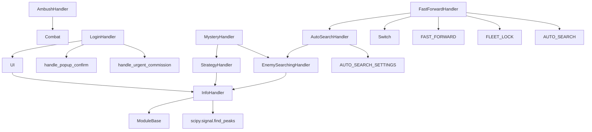

---
description:
alwaysApply: true
---
> **文档元信息**：生成日期 2026-08-14 ｜ 项目分支 `dev` ｜ 最后分析的代码版本 `f992af6c0`

# module/handler/ 模块分析

## 1. 模块概述

**定位**：游戏处理器层，负责处理游戏中的各种弹窗、对话框、登录流程和战斗准备。

**角色**：定义 `InfoHandler` 弹窗处理基类、`LoginHandler` 登录流程、`AutoSearchHandler` 自动搜索、`FastForwardHandler` 快进/清除模式、`EnemySearchingHandler` 敌人搜索、`StrategyHandler` 策略面板、`MysteryHandler` 神秘格子、`AmbushHandler` 伏击/空袭、`SensitiveInfo` 敏感信息脱敏。

**继承关系（两条分支 + 多继承）**：
- `ModuleBase → InfoHandler → UI（module/ui/ui.py）→ LoginHandler`
- `ModuleBase → InfoHandler → EnemySearchingHandler → AutoSearchHandler → FastForwardHandler`
- `ModuleBase → InfoHandler → StrategyHandler`；`MysteryHandler` 多继承 `StrategyHandler + EnemySearchingHandler`
- `Combat → AmbushHandler`（继承战斗系统）
- `sensitive_info.py` 无类，提供模块级脱敏函数

**输入/输出**：
- 输入：截图（`np.ndarray`）、游戏状态
- 输出：弹窗处理结果（`bool`）、地图信息

**核心职责**：
1. 检测和关闭各种弹窗/对话框
2. 处理登录流程和应用重启
3. 管理自动搜索设置
4. 处理快进/清除模式
5. 检测地图信息（清除率、星级、威胁等级）
6. 策略面板、神秘格子、伏击/空袭等地图事件处理
7. 截图与日志的敏感信息脱敏

## 2. 文件清单与逐文件分析

> 实际文件清单（共 10 个 `.py` 文件）：`info_handler.py`、`login.py`、`auto_search.py`、`fast_forward.py`、`enemy_searching.py`、`ambush.py`、`mystery.py`、`strategy.py`、`sensitive_info.py`、`assets.py`（`dev_tools/button_extract.py` 自动生成的资源定义，勿手动修改）。

### 2.1 info_handler.py（659 行）

**导出类型**：类 `InfoHandler`，函数 `info_letter_preprocess()`

**导入依赖**：
- 内部：`base.base`、`base.button`、`base.timer`、`base.utils.*`、`exception.GameNotRunningError`、`handler.assets.*`、`logger`、`os_handler.assets`（`CLICK_SAFE_AREA`）、`ui_white.assets`（白色主题弹窗按钮）
- 外部：`scipy.signal`

**逐段分析**：

- `L32-47`：`info_letter_preprocess()` — 信息栏文字图像预处理（对比度调整）。
- `L68-117`：信息栏检测 — `info_bar_count()` 使用 `scipy.signal.find_peaks` 检测顶部蓝色线条；`wait_until_info_bar_disappear()` 等待消失；`handle_info_bar()`/`ensure_no_info_bar()` 确保无信息栏。
- `L122-177`：弹窗处理 — `_popup_offset` 类变量默认偏移；`handle_popup_confirm()`（确认弹窗）、`handle_popup_cancel()`（取消弹窗）、`handle_popup_single()`（单按钮弹窗）、`handle_popup_single_white()`（白色主题单按钮）。支持白色主题变体。
- `L179-214`：`handle_urgent_commission()` — 紧急委托处理。点击确认后 3~6 秒内检查游戏客户端是否被热更新杀死，检测到则抛 `GameNotRunningError`。
- `L216-286`：其他弹窗 — `handle_combat_low_emotion()`（低情绪确认）、`handle_use_data_key()`（数据钥匙）、`handle_vote_popup()`（投票，已移除仅返回 False）、`handle_get_skin()`（皮肤）、`handle_get_items_ship()`（获得舰船）。
- `L292-326`：大舰队与任务弹窗 — `handle_guild_popup_confirm()`/`handle_guild_popup_cancel()`、`handle_mission_popup_go()`/`handle_mission_popup_ack()`。
- `L331-585`：剧情处理 — 剧情状态计时器（`story_popup_timeout` 等）；`_story_option_buttons()`/`_story_option_buttons_2()` 使用信号处理峰值检测剧情选项（旧版小选项/新版大白色选项）；`_identify_siren_device_option()` 识别塞壬研究装置选项；`story_skip()`/`handle_story_skip()` 跳过剧情；`ensure_no_story()`；`handle_map_after_combat_story()`。
- `L591-611`：`handle_game_tips()` — 游戏提示弹窗处理。
- `L617-659`：小黄鸡加载动画 — `manjuu_count()`（模板匹配计数）、`wait_until_manjuu_disappear()`、`handle_manjuu()`。

### 2.2 login.py（453 行）

**导出类型**：类 `LoginHandler`

**导入依赖**：
- 内部：`device.pkg_resources`、`config.server`、`base.button`、`base.timer`、`base.utils`、`config.deep`（`deep_get`）、`handler.assets.*`、`logger`、`map.assets`、`ui.assets`、`ui.page`（`page_campaign_menu`）、`ui.ui`
- 外部：`time`、`numpy`、`scipy.signal.find_peaks`、`uiautomator2`（`UiObject`/`XPath`/`XPathSelector`）

**逐段分析**：

- `L46-50`：应用重启策略常量 — `RESTART_TRIES = 3`、首次等待 30 秒、后续 20 秒、观察阶段 180 秒（间隔 15 秒）。
- `L65-147`：`_handle_app_login()` — 完整登录流程，从任意页面回到主界面。
  - `Pages: in: 任意页面, out: page_main`
  - 循环处理：登录检查（`LOGIN_CHECK`）、屏幕旋转监测、Android 无响应、公告、活动列表、维护、更新、CN 用户协议、回归玩家、主界面弹窗、始终尝试返回主界面。1.5 秒确认计时器。
- `L149-179`：`handle_cn_user_agreement()` — CN 用户协议处理。通过 `image_color_button` 检测蓝色确认按钮（右半屏有、左半屏无），在协议中间滑动两次后点击确认。
- `L181-206`：`_login_wait_timeout()` — 读取跨任务配置 `Restart.Restart.LoginWaitTimeout`（默认 30 秒，上限 3600 秒），用于登录等待阶段放宽卡死检测。
- `L208-242`：`handle_app_login()`/`app_stop()`/`app_start()` — 登录入口和应用管理。
- `L252-311`：`app_restart()` — 智能重启。**3 次尝试**，首次等待 30 秒、后续 20 秒；每次用带超时的 `app_is_running_bounded()` 验证应用运行；连续失败后进入 180 秒观察阶段（支持 `Restart_ClearCache` 清缓存）；观察阶段仍未恢复则抛 `EmulatorNotRunningError`，由上层调度器触发模拟器重启。
- `L313-351`：`ensure_no_unfinished_campaign()` — 确保无未完成战役（有则撤退）。
  - `Pages: in: page_main, out: page_main`
- `L353-403`：`handle_user_agreement()` — uiautomator2 xpath 方式的用户协议处理（国服 SDK 协议弹窗，滑动到底部后点击同意）。
- `L405-448`：`handle_user_login()`/`get_for_any_ele()`/`get_cn_xp_hierarchy()` — xpath 元素查找辅助。
- `L451-453`：`XPS` 类 — 继承 `XPathSelector`。

### 2.3 auto_search.py（289 行）

**导出类型**：类 `AutoSearchHandler`

**导入依赖**：
- 内部：`base.button`（`ButtonGrid`）、`base.decorator`（`Config`）、`base.timer`、`handler.assets.*`、`handler.enemy_searching`、`logger`、`map.assets`（`FLEET_PREPARATION_CHECK`）
- 外部：`numpy`

**逐段分析**：

- `L25-44`：常量定义 — `AUTO_SEARCH_SETTINGS`（6 种设置：道中/Boss/全出击/待命/潜艇自动/潜艇待命）和名称↔索引双向映射字典。
- `L47-140`：`AutoSearchHandler` 继承 `EnemySearchingHandler`。`_fleet_sidebar()` 侧边栏检测（EN/其他服务器不同布局，`@Config.when(SERVER=...)` 分发）；`_fleet_preparation_get()` 获取当前侧边栏索引；`fleet_preparation_sidebar_ensure()` 确保侧边栏索引。
- `L142-203`：`_auto_search_set_click()`/`auto_search_setting_ensure()` — 自动搜索设置。检测活跃设置（绿色 `(156, 255, 82)`），点击目标设置。
- `L205-289`：自动搜索地图选项 — `is_auto_search_running()`、`handle_auto_search_map_option()`、`is_in_auto_search_menu()`、`handle_auto_search_continue()`、`handle_auto_search_exit()`、`ensure_auto_search_exit()`。
  - `ensure_auto_search_exit()` 的 `Pages: in: is_in_auto_search_menu, out: page_campaign 或 page_event 或 page_sp`

### 2.4 fast_forward.py（651 行）

**导出类型**：类 `FastForwardHandler`，函数 `map_files()`、`to_map_input_name()`、`to_map_file_name()`

**导入依赖**：
- 内部：`base.timer`、`base.utils`（`color_bar_percentage`）、`handler.assets.*`、`handler.auto_search`、`logger`、`ui.switch`
- 外部：`os`、`re`

**逐段分析**：

- `L14-28`：Switch 定义 — `FAST_FORWARD`（快进开关）、`FLEET_LOCK`（舰队锁定）、`AUTO_SEARCH`（自动搜索，4 种 ON 状态 + 4 种 OFF 状态）。
- `L31-97`：地图文件工具 — `map_files()` 列出活动目录下的地图文件（排除 `campaign_base`）；`to_map_input_name()`/`to_map_file_name()` 名称转换。
- `L100-186`：`FastForwardHandler` 继承 `AutoSearchHandler`。地图状态属性：`map_clear_percentage`、`map_achieved_star_*`、`map_is_100_percent_clear`、`map_is_3_stars`、`map_is_threat_safe`、`map_has_clear_mode`、`map_is_clear_mode`、`map_is_auto_search`、`map_is_2x_book`；`STAGE_INCREASE` 关卡递增定义；`map_get_info()`/`map_show_info()` 获取并记录地图信息。
- `L188-270`：`handle_fast_forward()` — 快进处理。设置清除模式、自动搜索、2x 书，并联动重置地图特性配置（`MAP_HAS_AMBUSH` 等）；`_is_map_star_active()`；`handle_map_fleet_lock()` 舰队锁定；`map_wait_auto_search()` 等待自动搜索开关动画出现。
- `L272-340`：`handle_auto_search()`/`_auto_search_set()` — 自动搜索开关。仅在状态已知时点击，防止 `unknown` 状态下误触（`Pages: in: MAP_PREPARATION`）。
- `L342-374`：`handle_auto_search_setting()` — 自动搜索设置（`Pages: in: FLEET_PREPARATION`），失败时对 GemsFarming 任务触发通知并 `AutoSearchSetError`。
- `L376-405`：`is_call_submarine_at_boss` 属性、`handle_auto_submarine_call_disable()` — 禁用自动潜艇呼叫（`Pages: in: FLEET_PREPARATION`）。
- `L407-422`：`handle_auto_search_continue()` — 覆盖 `AutoSearchHandler` 的定义，处理二倍经验书设置。
- `L424-437`：`get_map_clear_percentage()` — 进度条百分比计算（`Pages: in: MAP_PREPARATION`）。
- `L439-528`：`campaign_name_increase()` 关卡推进（支持 `STAGE_INCREASE_AB`/`STAGE_INCREASE_CUSTOM` 配置）、`triggered_map_stop()`/`handle_map_stop()` 停止条件。
- `L530-605`：`_set_2x_book_status()`/`handle_2x_book_setting()` — 二倍经验书设置（prep/auto 两种模式）。
- `L607-651`：`handle_2x_book_popup()`、`handle_submarine_support_popup()`（占位）、`handle_map_walk_speedup()` 地图行走加速、`handle_submarine_cost_popup()`。

### 2.5 enemy_searching.py（287 行）

**导出类型**：类 `EnemySearchingHandler`

**导入依赖**：
- 内部：`base.decorator`（`del_cached_property`）、`base.timer`、`exception.CampaignEnd`、`handler.assets.*`、`handler.info_handler`、`logger`、`map.assets.*`、`ui.assets`（`CAMPAIGN_CHECK`/`EVENT_CHECK`/`SP_CHECK`）
- 外部：无

**逐段分析**：

- `L20-42`：`EnemySearchingHandler` 继承 `InfoHandler`，处理地图移动后的敌人搜索（侦察）动画。类常量：`MAP_ENEMY_SEARCHING_OVERLAY_TRANSPARENCY_THRESHOLD`、`MAP_ENEMY_SEARCHING_TIMEOUT_SECOND`、`in_stage_timer`、`stage_entrance`。
- `L44-65`：`enemy_searching_color_initial()`（颜色参考初始化钩子）、`enemy_searching_appear()`（模板匹配 + 亮度分析检测搜索动画）。
- `L67-73`：`handle_enemy_flashing()` — 等待敌人图标闪烁结束（固定 1.2s 延时）。
- `L75-143`：关卡页面检测 — `handle_in_stage()`（确认回到关卡页面后抛 `CampaignEnd`）、`is_in_stage_page()`、`is_stage_page_has_entrance()`（OCR 关卡名验证页面加载完成）、`is_in_stage()`。
- `L145-168`：`is_in_map()`、`is_event_animation()`（占位）、`handle_auto_search_exit()`（占位，由 `AutoSearchHandler` 覆盖）。
- `L170-239`：`handle_in_map_with_enemy_searching()` — 地图中搜索动画出现时的主循环，处理战斗加载、自动搜索退出、剧情、大舰队、紧急委托等弹窗。
- `L241-287`：`handle_in_map_no_enemy_searching()` — 地图中无搜索动画时的等待循环。

### 2.6 其他处理器

- **ambush.py（160 行）**：类 `AmbushHandler(Combat)` — 伏击回避/迎击和空袭等待。通过红色覆盖层透明度检测事件（`red_overlay_transparency`）。`TEMPLATE_AMBUSH_EVADE_SUCCESS`/`FAILED`/`MAP_WALK_OUT_OF_STEP` 复用 `info_letter_preprocess` 预处理。`handle_ambush()` 统一入口、`handle_walk_out_of_step()` 步数不足提示。被 `module/map/fleet.py` 的 `Fleet` 使用。
- **mystery.py（133 行）**：类 `MysteryHandler(StrategyHandler, EnemySearchingHandler)` — 神秘格子事件处理。`handle_mystery()` 统一入口，返回事件类型字符串（`'get_item'`/`'get_ammo'`/`'get_carrier'`）；`handle_mystery_items()`（道具）、`handle_mystery_ammo()`（弹药，信息栏检测）、`handle_mystery_carrier()`（航母支援）。被 `module/map/map_operation.py` 的 `MapOperation` 使用。
- **strategy.py（326 行）**：类 `StrategyHandler(InfoHandler)` — 战斗策略面板。Switch 定义：`FORMATION`（3 种阵型）、`SUBMARINE_HUNT`、`SUBMARINE_VIEW`。`strategy_open()`/`strategy_close()`/`strategy_set_execute()`（`Pages: in: STRATEGY_OPENED`）、`handle_strategy()`、`_strategy_get_from_map_buff()`；潜艇移动（enter/confirm/cancel）与普通舰队移动（enter/cancel）、空袭（enter/cancel）流程。
- **sensitive_info.py（67 行）**：无类，模块级函数 — `handle_sensitive_image()`（`Mask` 遮罩，模板 `MASK_MAIN`/`MASK_MAIN_WHITE`/`MASK_PLAYER`）、`handle_sensitive_text()`（路径脱敏）、`handle_sensitive_logs()`。被 `alas.py` 的截图保存流程调用。
- **assets.py（112 行）**：`dev_tools/button_extract.py` 自动生成的 `Button`/`Template` 资源定义（如 `POPUP_CONFIRM`、`AUTO_SEARCH_*`、`STORY_SKIP_3`、`MANJUU` 等），勿手动修改。

## 3. 内部调用关系

## 4. 模块依赖分析

**外部依赖**：
- `scipy.signal`：峰值检测（信息栏、剧情选项）
- `numpy`：数组操作
- `uiautomator2`：xpath 元素查找（用户协议）

**内部依赖**：
- `module.base`：`ModuleBase`、`Button`、`ButtonGrid`、`Timer`、`Mask`、`utils`
- `module.ui`：`UI`、`Switch`、`Page`
- `module.config.server`：服务器配置
- `module.config.deep`：`deep_get` 跨任务配置读取
- `module.exception`：`GameNotRunningError`、`CampaignEnd`、`EmulatorNotRunningError`、`AutoSearchSetError`
- `module.handler.assets`：UI 资源
- `module.map.assets`：地图资源
- `module.ui.assets`：UI 资源
- `module.ui_white.assets`：白色主题资源
- `module.combat`：`Combat`（`AmbushHandler` 继承）
- `module.template.assets`：伏击/阵型模板资源
- `module.os_handler.assets`：大世界点击安全区域

## 5. 设计模式与架构分析

**设计模式**：
1. **模板方法**：`InfoHandler` 定义弹窗处理骨架，子类重写特定处理
2. **策略模式**：`@Config.when` 根据服务器选择不同实现
3. **状态模式**：`Switch` 管理快进/锁定/自动搜索/阵型/潜艇状态
4. **责任链**：`ui_additional()` 按优先级处理多种弹窗

**架构特点**：
- 两条继承链：`ModuleBase → InfoHandler → UI → LoginHandler`（登录/导航）与 `ModuleBase → InfoHandler → EnemySearchingHandler → AutoSearchHandler → FastForwardHandler`（地图/战斗准备）
- `InfoHandler` 是所有弹窗处理的基础，`UI`（module/ui/ui.py）也继承它
- `MysteryHandler` 通过多继承组合 `StrategyHandler` + `EnemySearchingHandler`；`AmbushHandler` 直接继承战斗系统 `Combat`
- `FastForwardHandler` 是地图处理器中的最顶层处理器，组合了所有功能

## 6. 类型系统分析

- `InfoHandler._popup_offset` 使用类变量定义默认偏移
- `FastForwardHandler` 使用类变量定义地图状态
- `Switch.state_list` 使用字典列表
- `AUTO_SEARCH_SETTINGS` 使用全局 Button 列表
- `LoginHandler` 使用 `bool | tuple` 联合类型注解（`get_for_any_ele()`）

## 7. 性能分析

- `info_bar_count()` 使用 `scipy.signal.find_peaks`，O(n) 复杂度
- `_story_option_buttons()` 使用信号处理峰值检测
- `get_map_clear_percentage()` 使用颜色条百分比计算
- `handle_urgent_commission()` 3-6 秒后检查游戏客户端
- `manjuu_count()` 使用 `Template.match_multi()` 一次匹配多个小黄鸡

## 8. 安全分析

- `handle_urgent_commission()` 检测热更新杀死游戏客户端
- `app_restart()` 3 次重试 + 180 秒观察阶段，防止永久失败，最终由上层触发模拟器重启
- `handle_cn_user_agreement()` 处理 CN 用户协议
- `sensitive_info.py` 遮罩截图中的敏感信息并对日志路径脱敏（`C:\fakepath\...`）

## 9. 代码质量评估

**优点**：
- 弹窗处理覆盖全面（20+ 种类型）
- 智能重启逻辑（3 次尝试 + 观察阶段）
- 信号处理用于峰值检测
- 服务器特定处理（`@Config.when`）

**问题**：
- `info_handler.py` 过于庞大（659 行），应拆分
- `fast_forward.py` 的 `STAGE_INCREASE` 硬编码
- 继承链较深（最长 5 层：`ModuleBase → InfoHandler → EnemySearchingHandler → AutoSearchHandler → FastForwardHandler`）
- 部分方法缺少类型注解

## 10. 潜在问题与改进建议

1. **info_handler.py 拆分**：将弹窗处理、信息栏检测、剧情处理分离
2. **继承链扁平化**：使用组合替代多层继承
3. **地图配置化**：`STAGE_INCREASE` 移到配置文件
4. **类型注解增强**：为 `handle_popup_confirm()` 等方法添加精确类型
5. **测试覆盖**：弹窗处理、登录流程等核心逻辑缺少单元测试
6. **重构 Switch**：`AUTO_SEARCH` 的 8 种状态定义过于复杂，应简化
