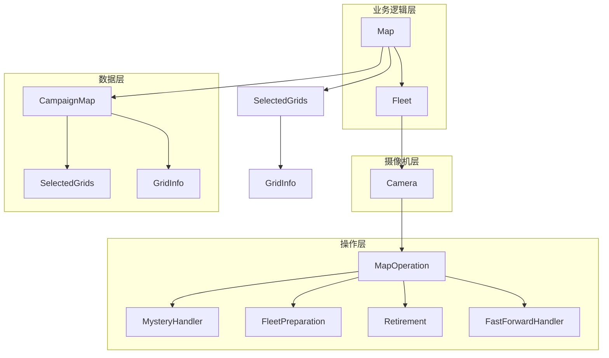

---
description:
alwaysApply: true
---

# 地图处理模块 (module/map/) 分析文档

**生成日期**: 2026-08-14
**项目版本**: dev 分支
**最后分析的代码版本**: f992af6c0

---

## 1. 模块概述

**一句话定位**：游戏地图的核心处理引擎，负责地图数据管理、舰队控制、摄像机操作和地图导航的完整生命周期。

**角色**：作为游戏自动化的地图层，管理地图网格数据、舰队位置、摄像机视角，提供路径规划、敌人清除、BOSS 战等高级地图操作。

**输入输出**：
- **输入**：地图配置（spawn_data、camera_data）、舰队配置、敌人优先级
- **输出**：战斗结果、地图状态更新、路径规划

**核心职责**：
1. 地图数据管理（网格、权重、连接关系）
2. 舰队位置控制（移动、切换、等待）
3. 摄像机操作（平移、聚焦、边缘检测）
4. 敌人清除策略（普通敌人、精英、BOSS、塞壬）
5. 路径规划与优化

---

## 2. 文件清单与逐文件分析

### 2.1 map.py (764 行)

**导出类型**：类 `Map`

**导入依赖**：
- `itertools`：迭代器工具
- `re`：正则表达式
- `module.base.filter.Filter`：过滤器
- `module.exception.MapEnemyMoved`：敌人移动异常
- `module.logger.logger`：日志系统
- `module.map.fleet.Fleet`：舰队类
- `module.map.map_grids.RoadGrids`、`SelectedGrids`：网格集合
- `module.map_detection.grid_info.GridInfo`：网格信息

**逐行分析**：

**L31**：`ENEMY_FILTER` 常量，敌人过滤器。

**L34**：`Map` 类定义，直接继承自 `Fleet`。地图整体功能通过继承链组合：
`Map → Fleet（舰队）→ Camera（摄像机）→ MapOperation（地图操作）`，
即 `Map` 组合了 `MapOperation`（地图操作）+ `Camera`（摄像机）+ `Fleet`（舰队）三部分能力。
（`Fleet` 还继承 `AmbushHandler`，见 2.4 节）

**L40-61**：`clear_chosen_enemy()` 方法，清除选定敌人：
- 参数：`grid`（目标网格）、`expected`（预期战斗类型）
- 流程：显示舰队 → 情绪等待 → 前往目标 → 全图扫描 → 路径规划

**L63-72**：`clear_chosen_mystery()` 方法，清除神秘格子。

**L74-97**：`pick_up_ammo()` 方法，拾取弹药：
- 检查弹药数量和可达性
- 计算恢复量（最多 3）
- 更新弹药计数

**L99-125**：`clear_mechanism()` 方法，清除机关：
- 检查地图是否有陆基机关
- 选择可触发的机关
- 前往并触发机关

**L127-183**：`select_grids()` 静态方法，网格选择：
- 参数：`nearby`（附近）、`is_accessible`（可达）、`scale`（规模）、`genre`（类型）、`strongest`（最强）、`weakest`（最弱）、`sort`（排序）、`ignore`（忽略）
- 支持多条件组合筛选

**L185-194**：`show_select_grids()` 静态方法，显示选中网格。

**L196-214**：`clear_all_mystery()` 方法，清除所有神秘格子。

**L216-239**：`clear_enemy()` 方法，清除敌人：
- 根据敌人优先级配置选择目标
- 支持 S3/S1 优先模式

**L241-343**：路障清除方法族：
- `clear_roadblocks()`（L241-269）：清除路障
- `clear_potential_roadblocks()`（L271-299）：清除潜在路障
- `clear_first_roadblocks()`（L301-322）：清除首个路障
- `clear_grids_for_faster()`（L324-343）：清除网格以加速

**L345-369**：`clear_boss()` 方法，清除 BOSS：
- 检测 BOSS 位置
- 移动潜艇到 BOSS 附近
- 清除 BOSS

**L371-396**：`capture_clear_boss()` 方法，大征服地图清除 BOSS。

**L398-432**：`clear_potential_boss()` 方法，清除潜在 BOSS：
- 遍历所有可能的 BOSS 生成点
- 尝试清除每个点

**L434-458**：`brute_clear_boss()` 方法，暴力清除 BOSS：
- 使用两支舰队
- 暴力寻找路障

**L460-473**：`brute_fleet_meet()` 方法，暴力舰队会合。

**L475-501**：`clear_siren()` 方法，清除塞壬。

**L503-531**：`clear_any_enemy()` 方法，清除任意敌人。

**L533-568**：`fleet_2_step_on()` 方法，舰队 2 踩点：
- 减少伏击频率
- 处理路障

**L570-591**：`fleet_2_break_siren_caught()` 方法，舰队 2 打破塞壬捕捉。

**L593-627**：`fleet_2_push_forward()` 方法，舰队 2 推进：
- 减少 BOSS 舰队被堵风险

**L629-650**：`fleet_2_rescue()` 方法，舰队 2 救援。

**L652-683**：`fleet_2_protect()` 方法，舰队 2 保护：
- 清除接近的塞壬

**L685-724**：`clear_filter_enemy()` 方法，过滤清除敌人：
- 使用敌人过滤器
- 保留最弱敌人用于无弹药战斗

**L726-764**：`clear_bouncing_enemy()` 方法，清除弹跳敌人：
- 处理固定路线弹跳的敌人
- 最多尝试 12 次

---

### 2.2 map_base.py (1083 行)

**导出类型**：类 `CampaignMap`

**导入依赖**：
- `copy`：对象拷贝
- `module.base.utils.location2node`、`node2location`：位置转换
- `module.logger.logger`：日志系统
- `module.map.map_grids.SelectedGrids`：网格集合
- `module.map.utils`：工具函数
- `module.map_detection.grid_info.GridInfo`：网格信息

**逐行分析**：

**L23-56**：`CampaignMap` 类文档与属性说明：
- `name`：地图名称
- `grid_class`：网格类（默认 `GridInfo`）
- `grids`：网格字典
- `_shape`：地图形状
- `_map_data` / `_map_data_loop`：默认/快进模式地图数据
- `_weight_data`：权重数据
- `_wall_data`：墙壁数据
- `_portal_data`：传送门数据
- `_land_based_data`：陆基数据
- `_maze_data` / `maze_round`：迷宫数据
- `_fortress_data`：要塞数据
- `_bouncing_enemy_data`：弹跳敌人数据
- `_spawn_data` / `_spawn_data_stack` / `_spawn_data_loop` / `_spawn_data_use_loop`：敌人刷新数据
- `_camera_data` / `_camera_data_spawn_point`：摄像机数据
- `_map_covered`：地图覆盖
- `_ignore_prediction`：忽略预测
- `poor_map_data`：地图数据是否不完整
- `camera_sight`：摄像机视野
- `grid_connection`：网格连接

**L58-84**：`__init__()` 方法，初始化地图对象并解析数据。

**L86-114**：迭代器和访问器方法（`__iter__`、`__getitem__`、`__contains__`）。

**L115-130**：`_parse_text()` 静态方法，解析文本数据。

**L131-157**：`shape` 属性，设置地图形状：
- 创建网格
- 生成摄像机数据
- 设置默认权重

**L158-214**：`map_data` 属性族与加载方法：
- `map_data`（L158-173）、`map_data_loop`（L174-186）
- `load_map_data()`（L187-199）、`_load_map_data()`（L200-214）

**L215-229**：`wall_data` 属性，墙壁数据。

**L230-251**：`portal_data` 属性，传送门数据。

**L252-286**：`land_based_data` 属性，陆基数据：
- 设置机关触发器和阻挡器

**L287-316**：`maze_data` 属性，迷宫数据。

**L317-348**：`fortress_data` 属性，要塞数据。

**L349-370**：`bouncing_enemy_data` 属性，弹跳敌人数据。

**L371-392**：`load_mechanism()` 方法，加载机关。

**L393-448**：`grid_connection_initial()` 方法，初始化网格连接：
- 生成基本连接
- 应用墙壁数据
- 创建传送门链接

**L449-471**：`fixup_submarine_fleet()` 方法，修复潜艇舰队。

**L472-483**：`show()` 方法，显示地图。

**L484-525**：`update()` 方法，更新地图：
- 合并网格信息
- 处理预测错误

**L526-535**：`reset()` / `reset_fleet()` 方法，重置地图。

**L536-568**：`camera_data` / `camera_data_spawn_point` 属性，摄像机数据。

**L569-636**：`spawn_data` 属性族与加载方法：
- `spawn_data`（L569-583）、`spawn_data_loop`（L584-596）、`spawn_data_stack`（L597-605）
- `load_spawn_data()`（L606-620）、`_load_spawn_data()`（L621-636）

**L637-653**：`weight_data` 属性，权重数据。

**L654-672**：`map_covered` 属性，地图覆盖。

**L673-731**：预测与展示方法：
- `ignore_prediction()`（L673-685）、`ignore_prediction_match()`（L686-701）
- `is_map_data_poor` 属性（L702-714）
- `show_cost()`（L715-722）、`show_connection()`（L723-731）

**L732-940**：路径规划方法：
- `find_path_initial()`（L732-773）：初始化路径
- `find_path_initial_multi_fleet()`（L774-789）：多舰队路径初始化
- `_find_path()`（L790-824）：内部路径查找
- `_find_route_node()`（L825-881）：路由节点查找
- `find_path()`（L882-924）：路径查找
- `grid_covered()`（L925-940）：网格覆盖

**L941-1048**：缺失预测方法：
- `missing_get()`（L941-995）：获取缺失
- `missing_is_none()`（L996-1019）：缺失为空
- `missing_predict()`（L1020-1048）：缺失预测

**L1049-1077**：`select()`（L1049-1067）、`to_selected()`（L1068-1077）方法，网格选择。

**L1078-1083**：`flatten()` 方法，展平网格。

---

### 2.3 camera.py (626 行)

**导出类型**：类 `Camera`（继承 `MapOperation`）

**导入依赖**：
- `copy`：对象拷贝
- `numpy`：数值计算
- `module.base.timer.Timer`：计时器
- `module.base.utils.area_offset`：区域偏移
- `module.combat.assets`：战斗资源
- `module.exception`：异常定义
- `module.handler.assets`：处理器资源
- `module.logger.logger`：日志系统
- `module.map.assets`：地图资源
- `module.map.map_base.CampaignMap`、`location2node`：地图基类
- `module.map.map_operation.MapOperation`：地图操作
- `module.map.utils`：工具函数
- `module.map_detection.grid.Grid`：网格类
- `module.map_detection.utils`：检测工具
- `module.map_detection.view.View`：视图类
- `module.os.assets`：大世界资源
- `module.os_handler.assets`：大世界处理器资源
- `module.os_shop.assets`：大世界商店资源
- `module.ui.assets`：UI 资源

**逐行分析**：

**L56-61**：`Camera` 类属性：
- `view`：视图对象
- `map`：地图对象
- `camera`：摄像机位置
- `grid_class`：网格类
- `_prev_view`：前一个视图
- `_prev_swipe`：前一次滑动

**L63-98**：`_map_swipe()` 方法，地图滑动：
- 计算滑动距离
- 优化滑动路径
- 执行滑动操作
- 更新视图

**L100-115**：`map_swipe()` 方法，地图滑动（相对位置）。

**L117-132**：`focus_to_grid_center()` 方法，聚焦到网格中心。

**L134-136**：`_view_init()` 方法，初始化视图。

**L138-242**：`_update_view()` 方法，更新视图：
- 检测是否在地图中
- 处理各种异常情况（信息栏、物品获取、故事跳过等）
- 处理大世界地图
- 处理游戏死亡

**L243-279**：`_update_view_data()` 方法，更新视图数据：
- 滑动预测
- 更新摄像机位置
- 边缘校正

**L280-365**：`update()` 方法，更新地图图像：
- 处理滑动等待
- 重试机制
- 错误处理

**L366-369**：`predict()` 方法，预测。

**L370-372**：`show_camera()` 方法，显示摄像机位置。

**L373-418**：`ensure_edge_insight()` 方法，确保边缘可见：
- 滑动到左下角直到两个边缘可见
- 支持反向滑动

**L419-436**：`focus_to()` 方法，聚焦到位置。

**L437-478**：`full_scan()` 方法，全图扫描：
- 扫描整个地图
- 提前停止条件
- 缺失预测

**L479-505**：`in_sight()` 方法，确保位置在视野中。

**L506-532**：`convert_global_to_local()` 方法，全局转局部。

**L533-560**：`convert_local_to_global()` 方法，局部转全局。

**L561-581**：`full_scan_find_boss()` 方法，全图扫描找 BOSS。

**L582-626**：`get_swipe_area_opt()` 方法，获取滑动区域优化。

---

### 2.4 fleet.py (1268 行)

**导出类型**：类 `Fleet`

**导入依赖**：
- `itertools`：迭代器工具
- `numpy`：数值计算
- `module.base.timer.Timer`：计时器
- `module.exception`：异常定义
- `module.handler.ambush.AmbushHandler`：伏击处理
- `module.logger.logger`：日志系统
- `module.map.camera.Camera`：摄像机类
- `module.map.map_base.SelectedGrids`、`location2node`、`location_ensure`：地图基类
- `module.map.utils.match_movable`：移动匹配

**逐行分析**：

**L37**：`Fleet` 类定义，继承自 `Camera` + `AmbushHandler`。

**L55-62**：`Fleet` 类属性：
- `fleet_1_location`：舰队 1 位置
- `fleet_2_location`：舰队 2 位置
- `fleet_submarine_location`：潜艇位置
- `battle_count`：战斗计数
- `mystery_count`：神秘计数
- `siren_count`：塞壬计数
- `fleet_ammo`：舰队弹药
- `ammo_count`：弹药计数

**L64-133**：舰队属性访问器：
- `fleet_1`：舰队 1
- `fleet_2`：舰队 2
- `fleet_submarine`：潜艇
- `fleet_current`：当前舰队
- `fleet_boss`：BOSS 舰队
- `fleet_boss_index`：BOSS 舰队索引
- `fleet_step`：舰队步数

**L136-148**：`fleet_ensure()` 方法，确保舰队。

**L150-154**：`switch_to()` 方法，切换到（空实现）。

**L156-191**：回合管理：
- `round_next()`：下一回合
- `round_battle()`：战斗回合
- `round_reset()`：重置回合

**L192-209**：`round_enemy_turn` 属性，敌人移动回合。

**L210-229**：`round_is_new` 属性，是否新回合。

**L230-256**：`round_wait` 属性，等待时间。

**L257-290**：`round_maze_changed` 属性与 `maze_active_on()` 方法，迷宫回合处理。

**L291-511**：`_goto()` 方法，内部地图行走（核心行走逻辑，处理伏击/空袭/神秘/塞壬等事件）。

**L512-553**：`goto()` 方法，地图行走入口。

**L554-585**：`find_path_initial()`、`show_fleet()`、`show_submarine()` 方法，路径初始化与舰队显示。

**L586-644**：全图扫描方法族：
- `full_scan()`（L586-607）
- `full_scan_carrier()`（L608-615）
- `full_scan_movable()`（L616-644）

**L645-744**：`track_movable()` 方法，可移动敌人追踪。

**L745-877**：舰队与潜艇定位：
- `find_all_fleets()`（L745-758）
- `find_current_fleet()`（L759-822）
- `find_all_submarines()`（L823-834）
- `find_submarine()`（L835-877）

**L878-987**：地图与战斗初始化：
- `map_init()`（L878-887）
- `map_data_init()`（L888-920）
- `map_control_init()`（L921-942）
- `handle_clear_mode_config_cover()`（L943-953）
- `_expected_end()`（L954-978）
- `_submarine_mode()`（L979-987）

**L988-1073**：可达性与路障：
- `fleet_at()`（L988-1003）
- `check_accessibility()`（L1004-1031）
- `brute_find_roadblocks()`（L1032-1073）

**L1074-1129**：摄像机与 Boss 处理：
- `catch_camera_repositioning()`（L1074-1099）
- `handle_boss_appear_refocus()`（L1100-1124）
- `fleet_checked_reset()`（L1125-1129）

**L1130-1268**：潜艇移动：
- `_submarine_goto()`（L1130-1192）
- `submarine_goto()`（L1193-1218）
- `submarine_move_near_boss()`（L1219-1268）

---

### 2.5 map_operation.py (519 行)

**导出类型**：类 `MapOperation`

**导入依赖**：
- `cv2`：OpenCV
- `module.base.timer.Timer`：计时器
- `module.exception`：异常定义
- `module.handler.fast_forward.FastForwardHandler`：快进处理
- `module.handler.mystery.MysteryHandler`：神秘处理
- `module.logger.logger`：日志系统
- `module.map.assets`：地图资源
- `module.map.map_fleet_preparation.FleetPreparation`：舰队准备
- `module.retire.retirement.Retirement`：退役处理
- `module.ui.assets`：UI 资源

**逐行分析**：

**L30**：`MapOperation` 类定义，继承自 `MysteryHandler`、`FleetPreparation`、`Retirement`、`FastForwardHandler`。

**L44-52**：类属性：
- `map_cat_attack_timer`：猫咪攻击计时器
- `map_clear_percentage_prev`：清除百分比
- `map_clear_percentage_timer`：清除百分比计时器
- `fleet_show_index`：显示舰队索引
- `fleet_current_index`：当前舰队索引

**L54-88**：舰队索引获取方法：
- `get_fleet_show_index()`（L54-74）：获取显示舰队
- `get_fleet_current_index()`（L75-88）：获取当前舰队

**L89-135**：`fleet_set()` 方法，设置舰队。

**L136-283**：`enter_map()` 方法，进入地图：
- 错误检查
- 地图准备
- 舰队准备
- 自动搜索继续
- 退役处理
- 数据密钥使用

**L284-312**：`enter_map_cancel()` 方法，取消进入地图。

**L313-349**：`handle_map_mode_switch()` 方法，地图难度模式切换（普通/困难）。

**L350-403**：困难模式检测方法族：
- `_is_mod_switch_hard_appear()`（L350-381）
- `_is_mod_switch_hard_active()`（L382-403）

**L404-442**：`handle_map_preparation()` 方法，地图准备阶段处理。

**L443-471**：`withdraw()` 方法，撤退操作。

**L472-492**：`handle_map_cat_attack()` 方法，猫猫攻击跳过。

**L493-498**：`fleets_reversed` 属性，舰队顺序是否反转。

**L499-519**：`handle_fleet_reverse()` 方法，舰队顺序反转处理。

---

### 2.6 map_grids.py (496 行)

**导出类型**：类 `SelectedGrids`、`RoadGrids`

**导入依赖**：
- `operator`：操作符
- `typing`：类型注解

**逐行分析**：

**L15-397**：`SelectedGrids` 类，网格集合：
- `__init__()`（L26-29）：初始化
- `__iter__()`（L30-37）：迭代器
- `__getitem__()`（L38-51）：索引访问
- `__contains__()`（L52-62）：包含检查
- `__str__()`（L63-71）：字符串表示
- `__len__()`（L72-79）：长度
- `__bool__()`（L80-90）：布尔值
- `location` 属性（L91-99）：位置列表
- `cost` 属性（L100-108）：代价列表
- `weight` 属性（L109-117）：权重列表
- `count` 属性（L118-126）：计数
- `select()`（L127-148）：选择
- `create_index()`（L149-172）：创建索引
- `indexed_select()`（L173-183）：索引选择
- `left_join()`（L184-211）：左连接
- `filter()`（L212-222）：过滤
- `set()`（L223-232）：设置属性
- `get()`（L233-243）：获取属性
- `call()`（L244-255）：调用方法
- `first_or_none()`（L256-266）：首个或空
- `add()`（L267-277）：添加
- `add_by_eq()`（L278-295）：按相等添加
- `intersect()`（L296-306）：交集
- `intersect_by_eq()`（L307-322）：按相等交集
- `delete()`（L323-334）：删除
- `sort()`（L335-351）：排序
- `sort_by_camera_distance()`（L352-369）：按摄像机距离排序
- `sort_by_clock_degree()`（L370-397）：按钟表角度排序

**L398-496**：`RoadGrids` 类，路径路障：
- `__init__()`（L408-419）
- `__str__()`（L420-427）
- `roadblocks()`（L428-441）：路障
- `potential_roadblocks()`（L442-460）：潜在路障
- `first_roadblocks()`（L461-478）：首个路障
- `combine()`（L479-496）：组合路线

---

### 2.7 map_fleet_preparation.py (453 行)

**导出类型**：类 `FleetOperator`、`FleetPreparation`（继承 `InfoHandler`）

**导入依赖**：
- `numpy`：数值计算
- `scipy.signal`：信号处理
- `module.base.button.Button`：按钮定义
- `module.base.timer.Timer`：计时器
- `module.base.utils`：基础工具
- `module.exception.HardNotSatisfied`：困难模式未满足异常
- `module.handler.assets`：处理器资源（AUTO_SEARCH_SET_MOB/BOSS/ALL/STANDBY/SUB_AUTO/SUB_STANDBY）
- `module.handler.info_handler.InfoHandler`：信息处理器基类
- `module.logger.logger`：日志系统
- `module.map.assets`：地图资源

**说明**：处理舰队准备界面的逻辑：
- `FleetOperator`（L31-330）：单个舰队槽位的操作器（舰队条解析、状态检测、选择/推荐/清空/开关操作）
- `FleetPreparation`（L331-453）：舰队准备流程（`fleet_preparation()` 处理舰队选择、潜艇设置、自动搜索设置等）

---

### 2.8 utils.py (244 行)

**导出类型**：工具函数

**导入依赖**：
- `numpy`：数值计算
- `module.base.utils`（node2location）：基础工具
- `module.map_detection.grid_info.GridInfo`：网格信息

**说明**：提供地图处理相关的工具函数：
- `location_ensure()`（L18-38）：统一坐标格式（GridInfo 对象/节点名/元组）
- `camera_1d()`（L40-60）：一维相机位置序列
- `camera_2d()`（L62-80）：二维相机位置网格
- `get_map_active_area()`（L82-103）：地图活动区域边界
- `camera_spawn_point()`（L106-125）：出生点附近最近相机位置
- `random_direction()`（L128-152）：方向描述转随机方向向量
- `combine()`（L155-174）：排列候选索引组合
- `match_movable()`（L177-244）：可移动敌人（塞壬）移动匹配

---

### 2.9 assets.py (50 行)

**导出类型**：按钮和模板常量

**导入依赖**：
- `module.base.button.Button`：按钮基类
- `module.base.template.Template`：模板基类

**说明**：定义地图系统使用的所有 UI 元素常量（由 `dev_tools/button_extract.py` 自动生成），
包括舰队选择（FLEET_1/2_*）、出击（MAP_OFFENSIVE）、撤退（WITHDRAW）、
模式切换（MAP_MODE_SWITCH_*）、地图准备（MAP_PREPARATION）、猫猫攻击等按钮。

---

## 3. 模块内部调用关系



---

## 4. 模块依赖关系

### 4.1 外部依赖
- `numpy`：数值计算
- `cv2`：OpenCV 图像处理
- `itertools`：迭代器工具
- `operator`：操作符
- `typing`：类型注解
- `copy`：对象拷贝

### 4.2 内部依赖
- `module.base.timer.Timer`：计时器
- `module.base.button.Button`、`ButtonGrid`：按钮定义
- `module.base.decorator.Config`：配置装饰器
- `module.base.filter.Filter`：过滤器
- `module.base.scroll.Scroll`：滚动条
- `module.base.utils`：工具函数
- `module.exception`：异常定义
- `module.logger.logger`：日志系统
- `module.handler.ambush.AmbushHandler`：伏击处理
- `module.handler.fast_forward.FastForwardHandler`：快进处理
- `module.handler.mystery.MysteryHandler`：神秘处理
- `module.retire.retirement.Retirement`：退役处理
- `module.ui.assets`：UI 资源
- `module.map.assets`：地图资源
- `module.map_detection.grid.Grid`：网格类
- `module.map_detection.grid_info.GridInfo`：网格信息
- `module.map_detection.utils`：检测工具
- `module.map_detection.view.View`：视图类
- `module.combat.assets`：战斗资源
- `module.os.assets`：大世界资源
- `module.os_handler.assets`：大世界处理器资源
- `module.os_shop.assets`：大世界商店资源

---

## 5. 设计模式与架构分析

### 5.1 设计模式

**多重继承组合模式**：
- `Map` 类通过继承 `Fleet` 组合地图和舰队功能
- `Fleet` 类通过继承 `Camera` + `AmbushHandler` 组合舰队、摄像机和伏击处理功能
- `Camera` 类通过继承 `MapOperation` 组合摄像机和操作功能
- 完整继承链：`Map → Fleet → Camera → MapOperation`（其中 `MapOperation` 组合 `MysteryHandler`、`FleetPreparation`、`Retirement`、`FastForwardHandler`）

**策略模式**：
- 敌人清除策略：`clear_enemy()`、`clear_siren()`、`clear_boss()` 等
- 路径规划策略：`find_path()`、`brute_clear_boss()` 等

**观察者模式**：
- 地图状态变化通过 `update()` 方法通知
- 摄像机位置变化通过 `predict()` 方法预测

**模板方法模式**：
- `run()` 方法定义了地图操作的完整流程
- 子方法实现具体步骤

**工厂模式**：
- `CampaignMap` 类作为地图对象的工厂
- 根据配置创建不同的网格和连接

### 5.2 架构特点

**分层架构**：
- 数据层：`CampaignMap`、`SelectedGrids`、`GridInfo`
- 操作层：`MapOperation`、`FleetPreparation`、`Retirement`
- 摄像机层：`Camera`
- 业务层：`Fleet`、`Map`

**事件驱动**：
- 使用计时器控制操作节奏
- 使用标志位控制状态转换
- 使用异常处理错误情况

**防御性编程**：
- 多重条件检查
- 超时机制
- 异常处理和恢复

**数据驱动**：
- 地图数据通过 YAML 文件定义
- 生成数据通过配置管理
- 权重数据动态计算

---

## 6. 类型系统分析

### 6.1 类型注解
- 部分方法有类型注解
- 使用 `typing` 模块进行复杂类型注解
- 使用 docstring 说明参数类型

### 6.2 类型使用
- 基础类型：`bool`、`int`、`float`、`str`
- 容器类型：`list`、`dict`、`tuple`、`set`
- NumPy 类型：`np.ndarray`、`np.array`
- 自定义类型：`Timer`、`Button`、`ButtonGrid`、`CampaignMap`、`SelectedGrids`

### 6.3 类型安全
- 运行时类型检查为主
- 缺少静态类型检查
- 使用 `isinstance()` 进行类型判断
- 使用 `__getattribute__()` 进行动态属性访问

---

## 7. 性能分析

### 7.1 性能瓶颈
1. **路径规划**：Dijkstra 算法复杂度 O(V^2)
2. **全图扫描**：需要多次截图和图像处理
3. **模板匹配**：多次模板匹配操作
4. **网格更新**：大量网格数据更新

### 7.2 优化策略
1. **早期退出**：检测到目标立即退出
2. **缓存机制**：缓存路径计算结果
3. **增量更新**：只更新变化的网格
4. **并行处理**：多舰队并行操作

### 7.3 性能指标
- 路径规划：约 10-50ms
- 全图扫描：约 2-5 秒
- 舰队移动：约 1-3 秒
- 战斗执行：约 60-180 秒

---

## 8. 安全性分析

### 8.1 输入验证
- 地图数据通过 YAML 文件定义，格式固定
- 配置参数通过 `AzurLaneConfig` 系统验证
- 界面状态通过 `appear()` 方法验证

### 8.2 状态安全
- 计时器防止无限循环
- 标志位防止重复操作
- 超时机制防止卡死
- 异常处理防止崩溃

### 8.3 资源安全
- 截图资源管理：通过 `Device` 类管理
- 内存管理：使用 `copy=False` 减少内存拷贝
- 异常恢复：捕获异常并尝试恢复

### 8.4 数据安全
- 地图数据：通过 YAML 文件持久化
- 状态数据：通过属性访问器保护
- 日志数据：通过 `logger` 系统管理

---

## 9. 代码质量评估

### 9.1 优点
1. **模块化设计**：功能清晰分离，职责单一
2. **代码复用**：通过继承和组合减少重复代码
3. **防御性编程**：多重检查和异常处理
4. **日志完善**：详细的日志记录便于调试
5. **配置灵活**：通过配置系统支持多种场景

### 9.2 缺点
1. **继承链过深**：`Map` 类继承链复杂
2. **方法过长**：部分方法超过 100 行
3. **魔法数字**：部分硬编码数值
4. **注释不足**：部分复杂逻辑缺少注释
5. **类型注解缺失**：大部分方法缺少类型注解

### 9.3 代码规范
- 遵循 PEP 8 命名规范
- 使用 Google docstring 风格
- 代码缩进一致
- 导入语句组织有序

---

## 10. 潜在问题与改进建议

### 10.1 潜在问题

1. **继承复杂度**：
   - 问题：`Map` 类继承链过深，可能导致方法冲突
   - 建议：考虑使用组合模式替代多重继承

2. **性能瓶颈**：
   - 问题：路径规划和全图扫描性能开销大
   - 建议：引入缓存机制和增量更新

3. **错误处理**：
   - 问题：部分异常被捕获后仅记录日志
   - 建议：明确异常处理策略

4. **代码重复**：
   - 问题：多个清除方法有重复逻辑
   - 建议：提取公共方法

5. **状态管理**：
   - 问题：多个标志位分散在不同类中
   - 建议：引入状态管理器统一管理

### 10.2 改进建议

1. **引入类型注解**：
   ```python
   def clear_enemy(self, **kwargs) -> bool:
       ...
   ```

2. **重构长方法**：
   - 将 `enter_map()` 拆分为多个小方法
   - 每个方法职责单一

3. **引入缓存机制**：
   ```python
   @cached_property
   def path_cache(self):
       return {}
   ```

4. **优化路径规划**：
   - 使用 A* 算法替代 Dijkstra
   - 引入启发式搜索

5. **增强错误处理**：
   ```python
   try:
       result = self.battle_function()
   except MapEnemyMoved:
       logger.warning('Enemy moved, retrying')
       continue
   except Exception as e:
       logger.error(f'Unexpected error: {e}')
       raise
   ```

6. **添加单元测试**：
   - 为关键方法编写单元测试
   - 使用 mock 对象模拟设备操作

7. **性能监控**：
   - 添加性能计时器
   - 记录关键操作耗时

8. **文档完善**：
   - 为复杂算法添加详细注释
   - 更新 API 文档

---

## 11. 总结

地图处理模块是 AzurPilot 的核心模块之一，通过多层继承组合了地图数据管理、舰队控制、摄像机操作等功能。模块设计合理，功能完整，但在继承复杂度、性能优化、代码重复等方面有改进空间。建议逐步重构，引入更现代的设计模式，提高代码的可维护性和性能。
