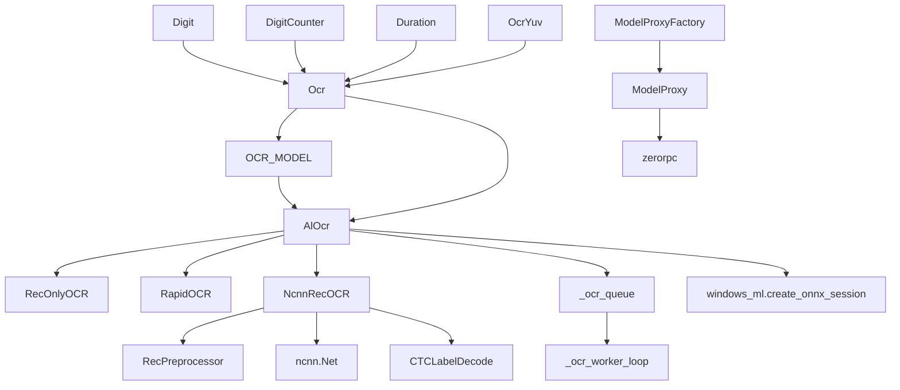

---
description:
alwaysApply: true
---

# module/ocr/ 模块分析

> **文档信息**：生成日期 2026-08-14 ｜ 项目版本 dev 分支 ｜ 最后分析的代码版本 f992af6c0

## 1. 模块概述

**定位**：OCR 文字识别系统，负责从游戏截图中提取文本信息。

**角色**：定义 `Ocr` 基类和数字/计数器/时长子类、`AlOcr` RapidOCR 后端、`NcnnRecOCR` ncnn 后端、`ModelProxyFactory` RPC 代理。支持 ONNX Runtime（默认）和 ncnn 双后端；Windows 下经 `windows_ml.py` 精确选择 DirectML/QNN/OpenVINO 推理设备，macOS 支持 CoreML ANE 加速，ncnn 支持 Vulkan GPU 加速。

**输入/输出**：
- 输入：截图（`np.ndarray`）、识别区域（`Button`/`tuple`）
- 输出：识别文本（`str`）、数字（`int`）、计数器（`tuple`）、时长（`timedelta`）

**核心职责**：
1. 提供通用 OCR 文本识别（`Ocr`）
2. 提供数字识别（`Digit`）、计数器识别（`DigitCounter`）、时长识别（`Duration`）
3. 支持多种 OCR 后端（ONNX Runtime、ncnn、RPC）
4. 支持多语言（EN、CN、JP、TW）
5. 支持 GPU 加速（DirectML、CoreML、Vulkan）
6. 统一使用通用 PP-OCRv6 识别模型，各逻辑模型仅字典不同

## 2. 文件清单与逐文件分析

`module/ocr/` 实际文件：`ocr.py`、`al_ocr.py`、`ncnn_ocr.py`、`models.py`、`windows_ml.py`、`rpc.py`（6 个）。

### 2.1 ocr.py（266 行）

**导出类型**：类 `Ocr`、`OcrYuv`、`Digit`、`DigitYuv`、`DigitCounter`、`DigitCounterYuv`、`Duration`、`DurationYuv`

**导入依赖**：
- 内部：`config.server`、`base.button`、`base.decorator`、`base.utils.*`、`logger`、`ocr.rpc`、`webui.setting`
- 外部：`time`、`datetime`、`typing`

**逐段分析**：

- `L19-22`：根据 `State.deploy_config.UseOcrServer` 选择 `OCR_MODEL`（本地 `OcrModel` 或 `ModelProxyFactory` RPC 代理）。
- `L25-120`：`Ocr` 基类 — `__init__()` 接受 `buttons`（识别区域）、`lang`（语言）、`letter`（字母颜色）、`threshold`（阈值）、`alphabet`（白名单）。`lang='azur_lane'` 且日服运行时自动改为 `azur_lane_jp`（L46-47）。`cnocr` 属性（L49-51）经 `OCR_MODEL` 惰性取模型。`pre_process()`（L64-75）使用 `extract_letters()` 提取字母。`ocr()`（L88-120）裁剪→预处理→`crop_to_text()`→`atomic_ocr_for_single_lines()`→`after_process()`。
- `L123-145`：`OcrYuv` — YUV 色彩空间变体。`pre_process()` 使用 `rgb2luma()` 提取 Y 通道差异（`letter_y` 缓存）。
- `L148-169`：`Digit` — 数字识别。`after_process()` 修正 OCR 错误（I→1、D→0、S→5、B→8）。返回 `int`。
- `L172-173`：`DigitYuv` — YUV 数字识别。
- `L176-210`：`DigitCounter` — 计数器识别（如 `14/15`）。`ocr()` 正则解析，返回 `(current, remain, total)`。
- `L213-214`：`DigitCounterYuv` — YUV 计数器识别。
- `L217-262`：`Duration` — 时长识别（如 `01:30:00`）。`parse_time()`（L246-262）正则解析。返回 `timedelta`。
- `L265-266`：`DurationYuv` — YUV 时长识别。

### 2.2 al_ocr.py（759 行）

**导出类型**：类 `AlOcr`、`RecOnlyOCR`、`DetOnlyOCR`，函数 `handle_ocr_error()`、`release_ocr_models()`、`reset_ocr_model()`

**导入依赖**：
- 内部：`exception.RequestHumanTakeover`、`logger`、`config.AzurLaneConfig`、`config.utils.DEFAULT_CONFIG_NAME`、`ocr.ncnn_ocr`、`ocr.windows_ml`
- 外部：`os`、`queue`、`threading`、`time`、`pathlib.Path`、`numpy`、`cv2`、`PIL.Image`、`rapidocr`

**逐段分析**：

- `L38-58`：`handle_ocr_error()` — OCR 依赖加载失败统一处理，提示安装 VC++ 运行库并抛出 `RequestHumanTakeover`。
- `L61-71`：导入 RapidOCR 依赖与 `NcnnRecOCR`/`supports_ncnn_model`。失败时调用 `handle_ocr_error()`。
- `L74-142`：模型路径常量与 `ONNX_MODEL_PARAMS` — 6 个逻辑模型（azur_lane、azur_lane_jp、ppocr_v6、cn、jp、tw）各含 lite/standard/pro 三档 PP-OCRv6 模型 + 旧版 AlOCR 专用模型（alocr_en_v2_6/alocr_cn_v3）；`DEFAULT_ONNX_MODEL_VERSION` 对英文和简体中文默认使用对应旧版模型，其余语言默认 standard 档。azur_lane/azur_lane_jp 使用受限 en 字典。
- `L145-177`：`RecOnlyOCR` — 仅加载识别模型，跳过检测和分类（`_initialize()` 重写）。
- `L180-181`：全局配置加载（`AzurLaneConfig`）。
- `L184-243`：OCR 工作队列 — `_OcrJob`（任务封装）、`_ocr_queue`（队列）、`_ocr_worker_loop()`（后台线程 `AlOcrQueue`）、`_ensure_ocr_worker()`、`_run_ocr_queued()`（将 OCR 操作排队到单线程执行，避免并发问题）。
- `L246-276`：`_resolve_onnx_model_version()`/`_get_onnx_model_params()` — 按配置选择 ONNX 识别模型版本。
- `L279-308`：`_configure_windows_ml_sessions()` — 将 RapidOCR 创建的 CPU session 替换为 `windows_ml.create_onnx_session()` 选定的设备。
- `L311-345`：`_create_ocr()` — 创建 OCR 实例，支持 ncnn/ONNX 后端分支。
- `L349-366`：`_model_cache` + `_model_cache_key()` + `_get_model()` — 惰性加载，按 (名称, 后端, 设备, 版本) 组合键缓存。
- `L369-467`：检测模型 — `DetOnlyOCR`（仅检测）、`_create_det_ocr_for_onnx()`（ONNX 全流程）、`_create_det_ocr_for_ncnn()`（ncnn 检测）、`_get_det_model()` 惰性加载。
- `L470-497`：`release_ocr_models()` — 在 OCR 工作线程中释放模型缓存；`reset_ocr_model()` 重置所有 OCR 模型，释放内存。
- `L500-759`：`AlOcr` 类 — `__init__()` 惰性初始化（L516-525）。`init()`/`_ensure_loaded()` 加载模型（L527-533）。`_save_debug_image()` 调试保存，限制 100 个文件（L540-587）。`ocr()` 文本识别（L589-606）。`det()` 检测+识别，返回 `(text, box, score)` 列表（L608-713），ncnn 后端用 RapidOCR 检测 + ncnn 识别，ONNX 后端一次调用完整流水线。`ocr_for_single_lines()` 批量识别（L718-736）。`set_cand_alphabet()`/`atomic_ocr()` 系列带字母白名单过滤（L738-759）。

### 2.3 ncnn_ocr.py（394 行）

**导出类型**：类 `NcnnRecOCR`、`RecPreprocessor`、`NcnnRecModelSpec`，函数 `has_ncnn_vulkan_gpu()`、`get_ncnn_vulkan_gpu_count()`、`normalize_model_name()`、`supports_ncnn_model()`

**导入依赖**：
- 内部：`logger`
- 外部：`atexit`、`math`、`threading`、`time`、`dataclasses`、`pathlib`、`cv2`、`numpy`、`rapidocr`

**逐段分析**：

- `L34-40`：常量 — `MODEL_ROOT`（`bin/ocr_models/ncnn`）、输入 shape `REC_IMAGE_SHAPE=(3,48,320)`、输入/输出 blob 名 `in0`/`out0`。
- `L43-71`：`NcnnRecModelSpec` 数据类（`@dataclass(frozen=True)`）+ 6 个规格实例（lite/standard/pro 及 en 受限字典变体）。
- `L73-112`：`MODEL_SPECS` — 6 个逻辑模型（azur_lane、azur_lane_jp、ppocr_v6、cn、jp、tw）统一使用通用 PP-OCRv6 的 ncnn 转换版（`bin/ocr_models/ncnn/ppocr_v6_{lite,standard,pro}.param/bin`，字典在 `bin/ocr_models/ppocr-v6/`）；`MODEL_ALIASES` 别名映射（cnocr→cn、en→azur_lane 等）。
- `L121-143`：`normalize_model_name()`/`supports_ncnn_model()`/`_load_ncnn()` — ncnn 惰性导入。
- `L149-175`：`_destroy_gpu_instance()`（atexit 清理）/`_ensure_gpu_instance()` — 创建 ncnn Vulkan GPU 实例。
- `L178-219`：GPU 工具 — `get_ncnn_vulkan_gpu_count()`、`has_ncnn_vulkan_gpu()`、`_resolve_gpu_index()`、`_gpu_info_value()`。
- `L222-243`：`RecPreprocessor` — 图像预处理。`resize_norm_img()` 缩放+归一化+填充（CHW 48×320）。
- `L246-394`：`NcnnRecOCR` — ncnn OCR 类。`__init__()` 加载模型（L247-267）；`_check_model_files()` 校验模型文件（L269-278）；`_create_net()` 构建网络，支持 Vulkan GPU 设备（L280-318）；`__call__()` 识别：加载图像→缩放→预处理→推理→CTC 解码（L328-344）；`_infer()` ncnn 推理（L346-366）；`_to_ncnn_mat()` NumPy→ncnn.Mat（L368-377）；`_normalize_output()` 输出形状标准化（L379-394）。

### 2.4 models.py（65 行）

**导出类型**：类 `OcrModel`，全局实例 `OCR_MODEL`

**导入依赖**：
- 内部：`decorator.cached_property`、`ocr.al_ocr.AlOcr`

**逐段分析**：

- `L26-61`：`OcrModel` — **6 个**缓存属性：`azur_lane`（游戏 UI 数字/字母，受限 en 字典）、`azur_lane_jp`（日服）、`ppocr_v6`（通用）、`cnocr`（中文，实际 `AlOcr(name='cn')`）、`jp`（日文）、`tw`（繁体中文）。均惰性创建 `AlOcr` 实例，统一使用通用 PP-OCRv6 识别模型。
- `L64-65`：`OCR_MODEL = OcrModel()` — 全局共享实例，所有模块通过此对象访问 OCR。

### 2.5 windows_ml.py（350 行）

**导出类型**：函数 `create_onnx_session()`，内部辅助函数 `_prepare_vendor_execution_providers()`、`_ensure_and_register_provider()`、`_iter_preferred_devices()`、`_vendor_execution_provider_names()`、`_is_discrete_gpu()` 等

**导入依赖**：内部 `logger`；外部 `os`、`re`、`threading`（onnxruntime 在调用方导入）

**逐段分析**：

- `L29-63`：EP 常量与核显黑名单（AMD HD/Vega/RDNA 系列、Intel 集显名称）。
- `L69-128`：`create_onnx_session()` — 为 ONNX Runtime 选择执行提供程序并创建推理会话。`auto` 模式下按 QNN NPU → OpenVINO NPU → OpenVINO GPU → DirectML GPU → OpenVINO CPU 的候选顺序尝试（DirectML 是 GPU 首选 EP，QNN/OpenVINO 为厂商 EP），最终 CPU 兜底。被 `al_ocr.py` 的 `_configure_windows_ml_sessions()` 调用，支持 Windows 上 DirectML GPU 加速。
- `L131-189`：厂商 EP 自动安装/注册 — 通过 `windowsml`（Windows ML Runtime）枚举 EP，`ensure_ready_async()` 就绪后注册到 onnxruntime。
- `L192-227`：`_iter_preferred_devices()` — 按 `device_preference`（auto/gpu/cpu/npu）枚举候选设备，独显校验（`_is_discrete_gpu`）。
- `L245-344`：GPU 识别辅助 — 通过 `Discrete` 元数据、已知核显名称、DXGI 显存大小区分独显/集显。

### 2.6 rpc.py（424 行）

**导出类型**：类 `ModelProxy`、`ModelProxyFactory`，函数 `start_ocr_server()`、`start_ocr_server_process()`、`stop_ocr_server_process()`、`alive()`（`OCRServer` 为 `start_ocr_server()` 内部类，非模块级导出）

**导入依赖**：
- 内部：`logger`、`webui.setting`
- 外部：`argparse`、`multiprocessing`、`pickle`（`zerorpc`、`zmq` 在函数内导入）

**逐段分析**：

- `L17-205`：`ModelProxy` — RPC 代理。`init()` 连接 zerorpc 服务器（默认 `127.0.0.1:22268`），`close()` 断开。提供 `ocr()`、`ocr_for_single_line(s)`、`set_cand_alphabet()`、`atomic_ocr()` 系列、`debug()` 远程调用；服务器不可用时自动回退到本地 `OCR_MODEL`。
- `L208-233`：`ModelProxyFactory` — 动态代理工厂。`__getattribute__()` 对 6 个语言属性（azur_lane、ppocr_v6、cnocr、jp、tw、azur_lane_jp）返回 `ModelProxy` 实例。
- `L236-378`：`start_ocr_server()` — 启动 zerorpc 服务器。内部定义 `OCRServer`（继承 `OcrModel`，支持全部语言模型），提供 hello/ocr/atomic_ocr 等 RPC 方法，图像经 pickle 序列化。
- `L381-411`：`start_ocr_server_process()`/`stop_ocr_server_process()`/`alive()` — 子进程生命周期管理。
- `L414-424`：`__main__` 入口 — 支持 `--port` 参数独立启动服务器。

## 3. 内部调用关系

## 4. 模块依赖分析

**外部依赖**：
- `rapidocr`：RapidOCR 框架
- `ncnn`：ncnn 推理框架（可选）
- `onnxruntime`：ONNX Runtime（可选）
- `onnxruntime-directml`：DirectML GPU 加速（Windows，可选）
- `numpy`、`cv2`：图像处理
- `zerorpc`：RPC 框架（可选）

**内部依赖**：
- `module.base`：`Button`、`cached_property`、`utils`
- `module.config`：`AzurLaneConfig`、`server`
- `module.exception`：`RequestHumanTakeover`
- `module.logger`：日志系统
- `module.webui.setting`：部署配置（`UseOcrServer`、`OcrClientAddress`、`OcrServerPort`）

## 5. 设计模式与架构分析

**设计模式**：
1. **工厂模式**：`_create_ocr()`/`_get_model()` 创建 OCR 实例
2. **代理模式**：`ModelProxy`/`ModelProxyFactory` RPC 代理
3. **模板方法**：`Ocr.ocr()` 定义识别骨架，子类重写 `after_process()`
4. **生产者-消费者**：`_ocr_queue` 单线程工作队列
5. **享元模式**：`OCR_MODEL` 全局共享模型实例

**架构特点**：
- 双后端架构：ONNX Runtime（默认）和 ncnn（更快）
- 惰性加载：首次使用时才加载模型，按 (名称, 后端, 设备, 版本) 缓存
- 单线程队列：避免并发问题
- 多语言支持：EN、CN、JP、TW，统一 PP-OCRv6 模型 + 字典区分
- Windows 下由 Windows ML 显式选择推理设备（DirectML/CPU）

## 6. 类型系统分析

- `Ocr` 使用 `TYPE_CHECKING` 避免循环导入
- `NcnnRecModelSpec` 使用 `@dataclass(frozen=True)` 不可变数据类
- `AlOcr` 推理在专用后台线程（`AlOcrQueue`）中串行执行，避免阻塞主循环
- `RecPreprocessor` 使用 NumPy 数组类型
- `_OcrJob` 封装任务、参数与异常信息，`done` 事件同步

## 7. 性能分析

- OCR 推理时间：ONNX ~100-180ms，ncnn ~50-100ms
- 模型加载时间：首次 ~1-2s
- 单线程队列避免并发开销
- `RecPreprocessor.resize_norm_img()` 使用 NumPy 向量化
- GPU 加速：DirectML（Windows）、CoreML（macOS）、Vulkan（ncnn）

## 8. 安全分析

- `handle_ocr_error()` 提示安装 VC++ 运行库
- `_save_debug_image()` 限制文件数量（100 个）
- `reset_ocr_model()` 释放模型内存
- RPC 模式客户端默认连接本地地址（127.0.0.1）

## 9. 代码质量评估

**优点**：
- 双后端架构灵活，ncnn 更快，ONNX 更通用
- 惰性加载减少启动时间
- 单线程队列保证线程安全
- 多语言支持完善

**问题**：
- `al_ocr.py` 过于庞大（759 行），应拆分
- OCR 工作队列使用全局变量，测试困难
- `models.py` 的语言映射硬编码
- RPC 模式缺少认证机制

## 10. 潜在问题与改进建议

1. **al_ocr.py 拆分**：将检测模型、识别模型、工作队列分离
2. **后端抽象**：定义 `OcrBackend` 接口，统一 ONNX/ncnn/RPC
3. **语言配置化**：将语言映射移到配置文件
4. **测试覆盖**：OCR 识别准确率测试
5. **RPC 安全**：添加认证和加密
6. **模型预热**：启动时预加载常用模型
