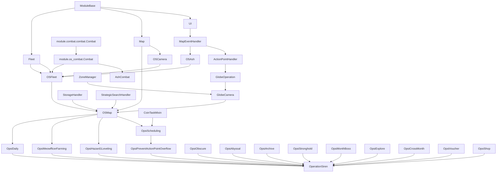
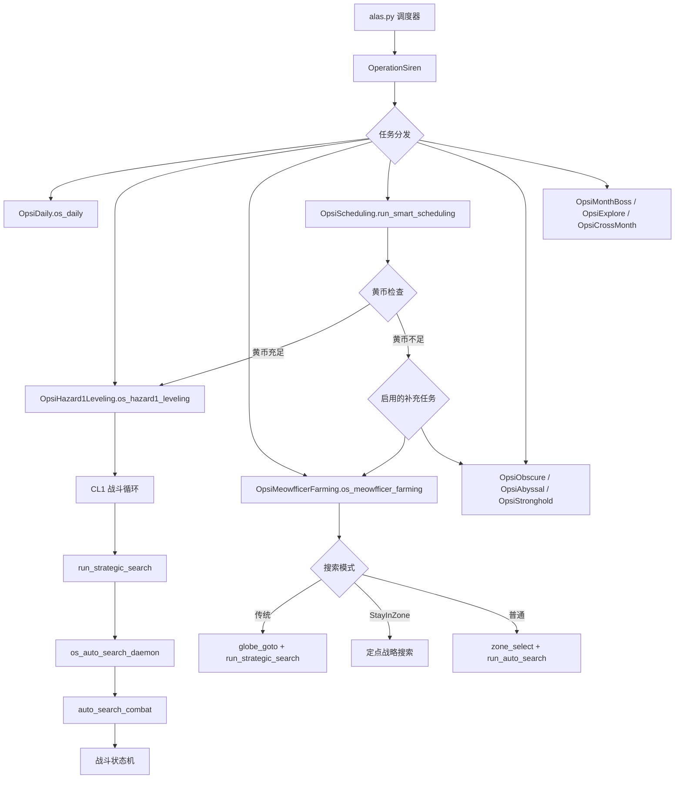
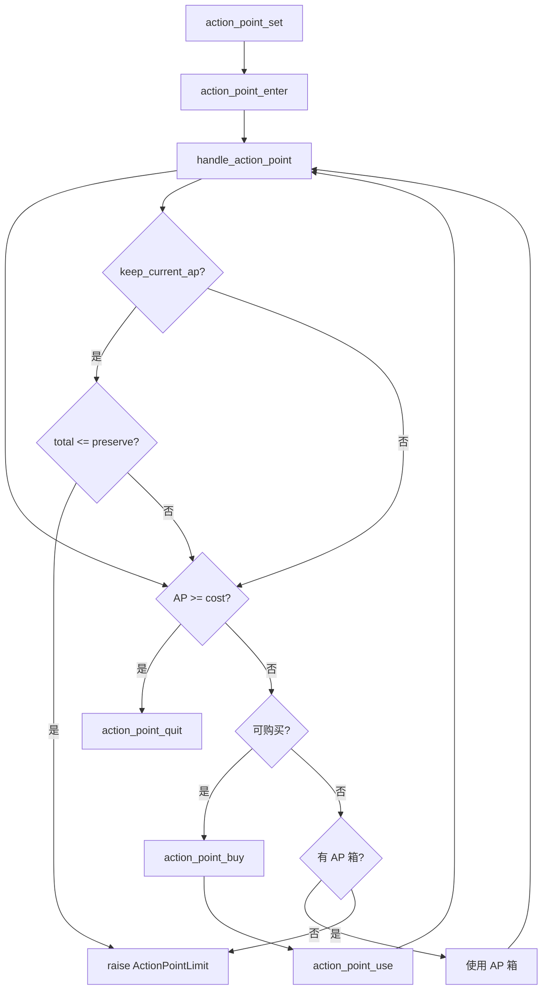
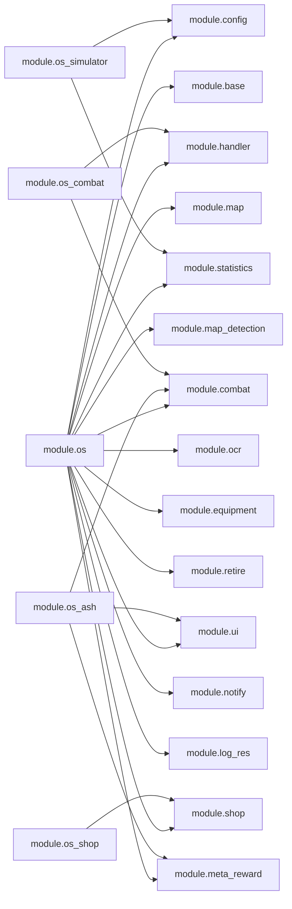

---
description:
alwaysApply: true
---

# 大世界（Operation Siren）系统综合分析

> 分析日期：2026-08-14
> 项目版本：dev 分支（HEAD f992af6c0）
> 分析范围：`module/os/`、`module/os_combat/`、`module/os_handler/`、`module/os_ash/`、`module/os_shop/`、`module/os_simulator/`
> 总代码量：18,147 行（64 个 Python 文件）

---

## 一、系统总览

### 1.1 一句话定位

大世界系统是 AzurPilot 中最复杂的子系统，实现了碧蓝航线 "大世界"（Operation Siren）模式的全自动化，包括全球地图导航、海域探索、舰队管理、战斗执行、资源补给、任务调度和蒙特卡洛模拟。

### 1.2 核心职责

| 模块 | 定位 | 核心职责 |
|------|------|---------|
| `module/os/` | 大世界核心 | 全球地图导航、海域管理、舰队控制、自动寻敌、雷达检测、港口操作 |
| `module/os_combat/` | 大世界战斗 | 战斗状态机、连续战斗处理、自动搜索战斗、战斗计时 |
| `module/os_handler/` | 事件处理 | 行动力管理、地图事件、港口交互、任务系统、补给仓库、策略搜索 |
| `module/os_ash/` | 余烬/信标 | META 信标攻击、档案攻击、协助攻击、奖励收取 |
| `module/os_shop/` | 大世界商店 | 港口商店购买、明石商店交互、物品过滤与数量管理 |
| `module/os_simulator/` | 蒙特卡洛模拟器 | 资源消耗预测、CL1/短猫策略优化、Numba 并行模拟 |

### 1.3 代码规模统计

| 目录 | 文件数 | 总行数 | 最大文件 |
|------|--------|--------|---------|
| `module/os/` | 35 | 11,533 | `map.py` (2162行), `fleet.py` (1151行), `tasks/scheduling.py` (1518行) |
| `module/os_combat/` | 2 | 577 | `combat.py` (569行) |
| `module/os_handler/` | 12 | 2,910 | `action_point.py` (611行), `storage.py` (447行) |
| `module/os_ash/` | 3 | 1,058 | `meta.py` (798行) |
| `module/os_shop/` | 8 | 1,332 | `shop.py` (433行) |
| `module/os_simulator/` | 4 | 737 | `simulator.py` (521行) |

---

## 二、模块逐文件分析

### 2.1 `module/os/` — 大世界核心

#### 2.1.1 `map.py`（2162 行）— 大世界地图总控

**导出类型**：类 `OSMap`
**继承链**：`OSMap(OSFleet, Map, GlobeCamera, StorageHandler, StrategicSearchHandler)`

**核心职责**：
- 大世界初始化（`os_init`）：UI 切换、区域初始化、HP 重置、自动搜索
- 全球地图导航（`globe_goto`）：跨区域移动、区域类型选择、刷新机制
- 舰队修理系统（`fleet_repair`、`handle_fleet_repair`、`handle_storage_fleet_repair`）：港口修理、维修箱修理、多阈值控制
- 舰队士气管理（`fleet_resolve`、`handle_fleet_resolve`）：低士气检测与治愈
- EMP 减益处理（`handle_fleet_emp_debuff`）：切换舰队消除 EMP
- 迷雾 bug 处理（`handle_fog_block`）：重启游戏恢复
- 自动搜索守护进程（`os_auto_search_daemon`）：战斗循环、退役处理、地图事件
- 地图重扫（`map_rescan`、`map_rescan_current`）：探索奖励、明石商店、扫描装置、舰队机关
- 塞壬研究装置处理（`clear_question`）：雷达问号移动、敌人/资源模式分支
- 强制巡逻扫描（`_execute_fixed_patrol_scan`）：多舰队定点移动、视角复位、全图重扫
- 短猫任务指标（`meow_search_metrics_start/end`）：战斗计时、行动力消耗记录
- CL1 战斗统计（`on_auto_search_battle_count_add`）：每月战斗计数、遥测提交
- 行动力月底策略（`cl1_ap_preserve`）：CL1 的 AP 保留值属性（按 5 的倍数与 `OperationCoinsPreserve` 联动），原 `get_action_point_limit` 已移除

**关键设计模式**：
- 状态循环模式：所有 UI 交互使用截图-检查循环，不使用 sleep-wait
- 异常驱动控制流：`RewardUncollectedError`、`MapWalkError`、`CampaignEnd` 用于流程控制
- 临时配置覆盖：`self.config.temporary()` 临时修改配置并在退出时恢复
- 统计集成：通过 `module/statistics/opsi_runtime` 记录战斗计时和资源消耗

**导入依赖**（外部）：`time`、`sys.maxsize`、`inflection`
**导入依赖**（内部）：`module.base.timer`、`module.config.config`、`module.config.utils`、`module.exception`、`module.handler.login`、`module.logger`、`module.map.map`、`module.os.assets`、`module.os.fleet`、`module.os.globe_camera`、`module.os.globe_operation`、`module.os_handler.*`、`module.statistics.*`、`module.ui.*`

---

#### 2.1.2 `fleet.py`（1151 行）— 舰队控制

**导出类型**：类 `OSFleet`、`BossFleet`、`PercentageOcr`，函数 `limit_walk`
**继承链**：`OSFleet(OSCamera, Combat, Fleet, OSAsh)`

**核心职责**：
- 移动逻辑（`_goto`）：带雷达预测和余烬信标检查的移动
- 血量检测（`hp_get`、`storage_hp_get`）：HP 条读取、维修图标检测
- 港口导航（`port_goto`）：基于雷达的港口定位与步行
- 舰队切换（`fleet_set`、`storage_fleet_set`）：编队切换与摄像机稳定等待
- 步行稳定等待（`wait_until_walk_stable`）：处理移动中遇到的事件、战斗、明石商店
- Boss 战（`boss_clear`、`run_abyssal`）：多舰队轮换攻击、潜艇呼叫
- 要塞百分比（`get_stronghold_percentage`）：OCR 识别清除进度
- 雷达最近物体点击（`click_nearest_object`）：EMP 减益下的步长限制

**关键设计**：
- `BossFleet` 数据类封装舰队索引和待命位置
- `PercentageOcr` 继承 `Ocr` 做百分比识别后处理
- `wait_until_walk_stable` 是最复杂的状态循环，处理 10+ 种意外情况

---

#### 2.1.3 `globe_camera.py`（406 行）— 全球地图摄像机

**导出类型**：类 `GlobeCamera`
**继承链**：`GlobeCamera(GlobeOperation, ZoneManager)`

**核心职责**：
- 全球地图更新（`globe_update`）：截图、GlobeDetection 加载、摄像机位置记录
- 滑动操作（`globe_swipe`）：设备适配（minitouch/MaaTouch/ADB）的向量滑动
- 坐标转换（`globe2screen`、`screen2globe`）：全球坐标与屏幕坐标互转
- 区域聚焦（`globe_focus_to`）：滑动使目标区域可见、点击选中、等待固定
- 要塞搜索（`find_siren_stronghold`）：按区域顺序扫描红色漩涡 HSV 颜色

---

#### 2.1.4 `globe_operation.py`（496 行）— 全球地图操作

**导出类型**：类 `GlobeOperation`、异常 `OSExploreError`、`RewardUncollectedError`
**继承链**：`GlobeOperation(ActionPointHandler)`

**核心职责**：
- 区域固定/取消固定（`get_zone_pinned`、`handle_zone_pinned`、`ensure_no_zone_pinned`）
- 区域类型选择（`zone_type_select`）：DANGEROUS/SAFE/OBSCURE/ABYSSAL/STRONGHOLD/ARCHIVE
- 全球-地图切换（`os_globe_goto_map`、`os_map_goto_globe`）
- 区域进入（`globe_enter`）：锁定检测、行动力处理、弹窗确认

---

#### 2.1.5 `globe_detection.py`（195 行）— 全球地图检测

**导出类型**：类 `GlobeDetection`
**核心职责**：基于单应性变换的全球地图位置检测，加载全球地图模板并计算摄像机中心坐标。

---

#### 2.1.6 `globe_zone.py`（224 行）— 区域数据管理

**导出类型**：类 `Zone`、`ZoneManager`
**核心职责**：
- `Zone`：区域数据类，包含 `zone_id`、`name`、`location`、`hazard_level`、`region`、`shape`、`is_port` 等属性
- `ZoneManager`：区域管理器，提供 `name_to_zone()`、`zone_nearest_azur_port()`、`zone_select()` 等方法
- 区域数据从 `campaign/os/` YAML 文件加载

---

#### 2.1.7 `radar.py`（437 行）— 雷达系统

**导出类型**：类 `RadarGrid`、`Radar`
**核心职责**：
- `RadarGrid`：雷达格子预测，通过颜色检测判断敌人/资源/感叹号/问号/明石/港口/档案
- `Radar`：雷达管理器，圆形网格生成、批量预测、港口定位（内外位置）、最近物体选择
- `predict_question`：检测问号标记（用于清除海域事件）
- `nearest_object`：找到最近的可交互物体

---

#### 2.1.8 `camera.py`（183 行）— 大世界摄像机

**导出类型**：类 `OSCamera`
**继承链**：`OSCamera(OSMapOperation, Camera)`
**核心职责**：大世界专用摄像机控制，包括 `update_os()` 更新视图和雷达、`convert_radar_to_local()` 坐标转换。

---

#### 2.1.9 `map_base.py`（65 行）— 地图基类

**导出类型**：类 `OSCampaignMap`
**继承链**：`OSCampaignMap(CampaignMap)`
**核心职责**：大世界地图数据结构，覆盖 `shape` 属性使用区域形状。

---

#### 2.1.10 `map_operation.py`（364 行）— 地图操作

**导出类型**：类 `OSMapOperation`
**继承链**：`OSMapOperation(MapOrderHandler, MissionHandler, PortHandler, StorageHandler, OSFleetSelector)`
**核心职责**：地图上的移动、点击、等待操作。`wait_until_walk_stable` 的辅助实现。

---

#### 2.1.11 `map_fleet_selector.py`（241 行）— 舰队选择器

**导出类型**：类 `FleetSelector`、`StorageFleetSelector`、`OSFleetSelector`
**核心职责**：大世界舰队编队的切换和选择。`FleetSelector`（L19）基础选择器、`StorageFleetSelector`（L209）支持存储页面的舰队选择、`OSFleetSelector`（L234，继承 `MapEventHandler`）地图事件集成版本。

---

#### 2.1.12 `map_data.py`（97 行）— 地图数据

**导出类型**：字典 `DIC_OS_MAP`（无 `OSMapData` 类）
**核心职责**：大世界地图网格数据字典，由 `dev_tools/os_extract.py` 自动生成。

---

#### 2.1.13 `config.py`（73 行）— 大世界配置

**导出类型**：类 `OSConfig`
**核心职责**：大世界专用配置项，如 `OS_ACTION_POINT_PRESERVE`、`OS_GLOBE_SWIPE_MULTIPLY` 等。

---

#### 2.1.14 `assets.py`（45 行）— 大世界资源

**导出类型**：`Button`、`Template` 常量
**核心职责**：定义大世界 UI 元素的按钮和模板匹配资源。

---

#### 2.1.15 `operation_siren.py`（115 行）— 大世界入口

**导出类型**：类 `OperationSiren`
**继承链**：`OperationSiren(OpsiDaily, OpsiShop, OpsiVoucher, OpsiMeowfficerFarming, OpsiHazard1Leveling, OpsiFleetAutoChange, OpsiPreventActionPointOverflow, OpsiObscure, OpsiAbyssal, OpsiArchive, OpsiStronghold, OpsiMonthBoss, OpsiExplore, OpsiCrossMonth)`

**核心职责**：大世界功能的总聚合类，组合所有任务模块。提供 `os_target_receive()`、`_os_target()`、`server_support_os_target()` 用于成就收集，`os_daily()` 供每日任务调用。

---

#### 2.1.16 `ship_exp.py`（106 行）/ `ship_exp_data.py`（141 行）— 舰船经验

**核心职责**：OCR 读取舰船等级和经验，提供经验数据表 `LIST_SHIP_EXP`。

---

#### 2.1.17 `sea_miles_ocr.py`（37 行）— 海里数 OCR

**核心职责**：定义 `OCR_SEA_MILES_DIGIT` 用于识别大世界海里数。

---

#### 2.1.18 `dock_mixin.py`（51 行）— 船坞 Mixin

**导出类型**：类 `DockMixin`
**核心职责**：船坞交互的 Mixin，提供 `dock_favourite_set()` 和 `dock_select_ship_at_grid()` 方法。

---

#### 2.1.19 `tasks/` 子目录（16 个文件）

| 文件 | 行数 | 导出类 | 核心职责 |
|------|------|--------|---------|
| `scheduling.py` | 1518 | `OpsiScheduling`（`CoinTaskMixin, OSMap`），`CoinTaskMixin` | 智能调度引擎：黄币/行动力阈值、任务切换、虚拟资产计算、推送通知、短猫提前开始算法（原 `smart_scheduling_utils.py` 已并入本文件） |
| `hazard_leveling.py` | 856 | `OpsiHazard1Leveling`（`CoinTaskMixin, OSMap`） | 侵蚀1练级：CL1 战斗循环、黄币检查、舰船经验检测、海里数记录、遥测提交 |
| `fleet_auto_change.py` | 618 | `OpsiFleetAutoChange`（`CoinTaskMixin, DockMixin, OSMap`） | 自动配队：满经验检测、船坞选船、舰队部署、冷却管理 |
| `meowfficer_farming.py` | 379 | `OpsiMeowfficerFarming`（`MeowfficerTargetZoneMixin, CoinTaskMixin, OSMap`）、`MeowfficerTargetZoneMixin` | 短猫相接：传统/StayInZone/普通搜索三种模式、行动力管理 |
| `daily.py` | 235 | `OpsiDaily`（`OSMap`） | 每日任务：港口任务、任务完成、调谐样本使用 |
| `cross_month.py` | 197 | `OpsiCrossMonth`（`MeowfficerTargetZoneMixin, OSMap`） | 月末行动力清理 |
| `prevent_action_point_overflow.py` | 231 | `OpsiPreventActionPointOverflow`（`OpsiScheduling`） | 月末自动清理行动力（2026-07 新增，可配置触发天数与保留值，自动执行短猫相接、商店采购、隐秘海域和深渊坐标任务消耗） |
| `abyssal.py` | 190 | `OpsiAbyssal`（`CoinTaskMixin, OSMap`） | 深渊海域 |
| `stronghold.py` | 159 | `OpsiStronghold`（`CoinTaskMixin, OSMap`） | 塞壬要塞 |
| `explore.py` | 152 | `OpsiExplore`（`OSMap`） | 大世界探索 |
| `month_boss.py` | 125 | `OpsiMonthBoss`（`OSMap`） | 月度 Boss |
| `obscure.py` | 70 | `OpsiObscure`（`CoinTaskMixin, OSMap`） | 隐秘海域 |
| `shop.py` | 111 | `OpsiShop`（`OSMap`） | 大世界商店任务 |
| `voucher.py` | 40 | `OpsiVoucher`（`OSMap`） | 凭证兑换 |
| `archive.py` | 49 | `OpsiArchive`（`OSMap`） | 作战档案 |
| `coin_task_mixin.py` | 14 | - | 黄币任务 Mixin 占位（实际实现位于 `scheduling.py`） |

---

### 2.2 `module/os_combat/` — 大世界战斗

#### 2.2.1 `combat.py`（569 行）

**导出类型**：类 `Combat`、异常 `ContinuousCombat`
**继承链**：`Combat(Combat_, MapEventHandler)`

**核心职责**：
- 战斗出现检测（`combat_appear`）：战斗加载、战斗执行、战斗准备、塞壬准备
- 战斗准备（`combat_preparation`）：自动化设置、退役处理、故事跳过
- 战斗状态处理（`handle_battle_status`）：S/A/B/C/D 评级点击、延迟自动点击 S 评级
- 经验信息处理（`handle_exp_info`）：S/A/B/C/D 经验页面点击
- 物品获取（`handle_get_items`）：使用 `CLICK_SAFE_AREA` 安全区域点击
- 连续战斗处理（`combat`）：检测塞壬扫描装置的连续战斗（最多 3 次）
- 自动搜索战斗（`auto_search_combat`）：完整的自动搜索战斗流程，含 CL1 超时检测（5 分钟）
- 战斗计时集成：通过 `start_battle_timer`/`finish_battle_timer` 记录战斗时长

**关键设计**：
- `ContinuousCombat` 异常用于连续战斗的控制流
- `_handle_auto_battle_status_s` 实现延迟 20 秒后才点击 S 评级（让自动搜索自行推进）
- 战斗计时区分 CL1 和短猫数据源，防止统计数据混淆

#### 2.2.2 `assets.py`（8 行）

**核心职责**：大世界战斗专用资源定义（`SIREN_PREPARATION` 等）。

---

### 2.3 `module/os_handler/` — 事件处理

#### 2.3.1 `action_point.py`（611 行）— 行动力管理

**导出类型**：类 `ActionPointHandler`、`ActionPointLimit`、`ActionPointItem`、`ActionPointBuyCounter`
**继承链**：`ActionPointHandler(UI, MapEventHandler)`

**核心职责**：
- 行动力 OCR（`action_point_update`）：读取当前 AP、油量、AP 箱数量
- AP 安全获取（`action_point_safe_get`）：带超时和重试的 AP 数值读取
- AP 购买（`action_point_buy`）：油量购买 AP，每周 5 次上限，月末购买屏蔽
- AP 使用（`action_point_use`）：自动使用 AP 箱
- AP 设置（`action_point_set`）：完整的 AP 检查-购买-使用流程
- AP 成本计算（`action_point_get_cost`）：根据区域类型和侵蚀等级计算 AP 消耗
- AP 保留检查（`handle_action_point`）：检查保留阈值、今日剩余 AP 恢复量
- 月底购买屏蔽（`_is_in_month_end_purchase_block_week`）：服务器时间计算

**关键常量**：
- `ACTION_POINTS_COST`：各侵蚀等级的 AP 消耗（1-6 级：5/10/15/20/30/40）
- `ACTION_POINTS_COST_OBSCURE`：隐秘海域 AP 消耗
- `ACTION_POINTS_COST_ABYSSAL`：深渊海域 AP 消耗（80/80/80/80/100/100）
- `ACTION_POINTS_BUY`：AP 购买价格（4000/2000/2000/1000/1000 油）
- `ACTION_POINT_BOX`：AP 箱容量（0/20/50/100）

---

#### 2.3.2 `map_event.py`（332 行）— 地图事件处理

**导出类型**：类 `MapEventHandler`
**核心职责**：处理大世界地图上的各种事件，包括故事跳过、物品获取、弹窗确认、地图锁定等。

---

#### 2.3.3 `storage.py`（447 行）— 补给仓库

**导出类型**：类 `StorageHandler`、枚举 `RepairResult`
**核心职责**：仓库页面交互，维修箱使用，物品获取，舰队选择。

---

#### 2.3.4 `port.py`（207 行）— 港口操作

**导出类型**：类 `PortHandler`
**核心职责**：港口进入/退出、港口任务接受、修理、补给。

---

#### 2.3.5 `mission.py`（291 行）— 任务系统

**导出类型**：类 `MissionHandler`
**核心职责**：大世界任务的接受、完成、奖励领取。

---

#### 2.3.6 `target.py`（230 行）— 目标/成就系统

**导出类型**：类 `OSTargetHandler`
**核心职责**：大世界成就目标的查看和奖励领取。

---

#### 2.3.7 `strategic.py`（154 行）— 策略搜索

**导出类型**：类 `StrategicSearchHandler`
**核心职责**：策略搜索模式的启动和管理。

---

#### 2.3.8 `os_status.py`（190 行）— 状态检测

**导出类型**：类 `OSStatus`
**核心职责**：大世界各种页面状态的检测（地图、全球、港口、仓库等）。

---

#### 2.3.9 `enemy_searching.py`（34 行）— 敌人搜索

**核心职责**：敌人搜索动画检测。

---

#### 2.3.10 `map_order.py`（164 行）— 地图指令

**导出类型**：类 `MapOrderHandler`
**核心职责**：潜艇呼叫、侦察扫描等地图指令的执行。

---

#### 2.3.11 `target_data.py`（83 行）— 目标数据

**核心职责**：大世界成就目标的数据定义。

---

#### 2.3.12 `assets.py`（167 行）— 资源定义

**核心职责**：所有大世界处理器的 Button/Template 资源定义。

---

### 2.4 `module/os_ash/` — 余烬/信标系统

#### 2.4.1 `ash.py`（220 行）— 余烬基础

**导出类型**：类 `AshCombat`、`OSAsh`、`DailyDigitCounter`、异常 `AshBeaconFinished`
**继承链**：`AshCombat(Combat)`、`OSAsh(UI, MapEventHandler)`

**核心职责**：
- `AshCombat`：余烬专用战斗处理，覆盖 `handle_battle_status` 和 `handle_exp_info`
- `OSAsh`：余烬信标状态检测（`ash_collect_status`）、信标攻击触发（`handle_ash_beacon_attack`）
- 信标收集状态 OCR：区分亮色/灰色/遮挡状态，每日上限 200、总上限 200

---

#### 2.4.2 `meta.py`（798 行）— META 系统

**导出类型**：类 `OpsiAshBeacon`、`AshBeaconAssist`、`Meta`、`MetaDigitCounter`、枚举 `MetaState`
**继承链**：`Meta(UI, MapEventHandler)`、`OpsiAshBeacon(Meta)`、`AshBeaconAssist(Meta)`

**核心职责**：
- META 状态机（`MetaState`）：INIT → ATTACKING → COMPLETE → UNDEFINED
- 信标攻击（`_attack_meta`）：循环处理 META 攻击事件
- 伤害检测（`_get_meta_damage`）：OCR 读取 META 伤害值
- 一击模式（`OneHitMode`）：已造成伤害则延迟 30 分钟
- 求助功能（`_ask_for_help`）：向好友/舰队/世界求助
- 档案自动攻击（`_dossier_auto_attack`）：CN/EN 服务器专属
- 等级选择（`_ensure_meta_level`）：选择满足等级要求的信标
- 奖励收取（`_handle_ash_beacon_reward`）：信标奖励领取
- 协助攻击（`AshBeaconAssist`）：协助他人攻击 META

---

#### 2.4.3 `assets.py`（40 行）— 资源定义

**核心职责**：余烬/信标系统的 Button/Template 资源。

---

### 2.5 `module/os_shop/` — 大世界商店

#### 2.5.1 `shop.py`（433 行）— 商店主逻辑

**导出类型**：类 `OSShop`
**继承链**：`OSShop(PortShop, AkashiShop)`

**核心职责**：
- 商店购买执行（`os_shop_buy_execute`）：购买确认、数量设置、物品获取
- 批量购买（`os_shop_buy`）：循环选择并购买物品，记录明石 AP 购买
- 数量处理（`shop_buy_amount_handler`）：OCR 读取可购买数量、最大化购买策略
- 港口补给购买（`handle_port_supply_buy`）：扫描物品、过滤、逐个购买
- 明石商店购买（`handle_akashi_supply_buy`）：地图上明石位置的交互购买
- 货币管理（`get_currency_coins`）：黄币/紫币的保留值计算

---

#### 2.5.2 `port_shop.py`（196 行）— 港口商店

**导出类型**：类 `PortShop`
**核心职责**：港口商店的页面导航、物品扫描、标签切换。

---

#### 2.5.3 `akashi_shop.py`（123 行）— 明石商店

**导出类型**：类 `AkashiShop`
**核心职责**：明石（喵喵）商店的物品获取和购买过滤。

---

#### 2.5.4 `selector.py`（141 行）— 物品选择器

**导出类型**：类 `Selector`
**核心职责**：商店物品的扫描、模板匹配、价格 OCR。

---

#### 2.5.5 `item.py`（206 行）— 物品数据

**导出类型**：类 `OSShopItem`、`OSShopItemGrid`
**核心职责**：商店物品的数据结构，包含名称、价格、货币类型、数量。

---

#### 2.5.6 `ui.py`（182 行）— 商店 UI

**导出类型**：类 `OSShopUI`
**核心职责**：商店页面的 UI 交互，滚动条、标签导航。

---

#### 2.5.7 `preset.py`（37 行）— 预设过滤

**核心职责**：商店购买过滤预设。

---

#### 2.5.8 `assets.py`（14 行）— 资源定义

**核心职责**：商店系统的 Button/Template 资源。

---

### 2.6 `module/os_simulator/` — 蒙特卡洛模拟器

#### 2.6.1 `simulator.py`（521 行）— 模拟器主逻辑

**导出类型**：类 `OSSimulator`

**核心职责**：
- 蒙特卡洛模拟（`simulate`）：Numba 并行模拟 CL1/短猫资源消耗
- 状态机模拟（`_simulate_one`）：CL1 → MEOW → CRASHED → DONE 状态转换
- 参数获取（`get_paras`）：从配置和数据库获取模拟参数
- 结果处理（`_handle_result`）：统计 CL1 次数、短猫次数、坠机概率、最终资源
- 单样本/多样本绘图：通过 `OSSimulatorPlotter` 生成可视化图表
- 后台线程运行：`start()`/`interrupt()` 支持异步执行

**关键 Numba 函数**：
- `_akashi_sample`：不放回采样 6 个明石奖励
- `_handle_akashi`：明石遭遇处理（概率触发 + 确定性模式）
- `_simulate_one`：单样本核心循环
- `_simulate_batch_kernel`：并行批量模拟内核

---

#### 2.6.2 `constants.py`（27 行）— 模拟常量

**核心职责**：定义状态码（STATUS_CL1/MEOW/CRASHED/DONE）、AP 消耗表、明石奖励表。

---

#### 2.6.3 `plotter.py`（143 行）— 绘图器

**导出类型**：类 `OSSimulatorPlotter`
**核心职责**：使用 matplotlib 生成单样本轨迹图和多样本统计图。

---

#### 2.6.4 `logger.py`（46 行）— 模拟日志

**导出类型**：类 `OSSLogger`、`TqdmToLogger`
**核心职责**：模拟器专用日志系统，支持 tqdm 进度条重定向。

---

## 三、模块内部调用关系

### 3.1 核心继承链（Mermaid）



### 3.2 任务调度流程



### 3.3 行动力管理流程



---

## 四、模块依赖关系

### 4.1 外部依赖

| 依赖库 | 使用位置 | 用途 |
|--------|---------|------|
| `numpy` | 全局 | 数组计算、坐标变换、向量运算 |
| `numba` | `os_simulator/simulator.py` | JIT 编译蒙特卡洛模拟内核 |
| `inflection` | `map.py`、`fleet.py` | 驼峰/下划线命名转换 |
| `tqdm` | `os_simulator/simulator.py` | 进度条 |
| `matplotlib` | `os_simulator/plotter.py` | 绘图 |
| `cv2` (opencv) | `globe_camera.py` | HSV 颜色空间转换 |
| `threading` | `os_simulator/simulator.py` | 后台线程模拟 |

### 4.2 内部依赖图（关键路径）



---

## 五、设计模式与架构分析

### 5.1 设计模式

| 模式 | 应用 | 说明 |
|------|------|------|
| **菱形继承（Mixin）** | `CoinTaskMixin`、`DockMixin` | 通过 Mixin 注入横切关注点，避免代码重复 |
| **状态循环模式** | 所有 UI 交互方法 | `while 1` + `screenshot()` + `appear/appear_then_click` + `interval` 防抖 |
| **模板方法** | `combat()`、`run_auto_search()` | 定义算法骨架，子类覆盖特定步骤 |
| **策略模式** | `zone_type_select()`、`parse_fleet_filter()` | 通过配置动态选择行为策略 |
| **观察者模式** | `ConfigWatcher` | 任务间检测配置文件变更 |
| **异常驱动控制流** | `ContinuousCombat`、`ActionPointLimit`、`CampaignEnd` | 使用异常跳出深层调用栈 |
| **Numba JIT** | `_simulate_one`、`_simulate_batch_kernel` | 蒙特卡洛模拟的高性能计算 |
| **并行批处理** | `_simulate_batch_kernel` | `nb.prange` 实现数据并行 |
| **临时状态覆盖** | `self.config.temporary()` | RAII 风格的配置临时修改 |

### 5.2 架构特点

1. **深度菱形继承**：`OSMap` 继承 5 个父类，总继承深度约 8 层。这使得代码复用率高但理解成本大。
2. **任务-处理器分离**：`tasks/` 目录下的任务类负责调度逻辑，`module/os/` 负责底层操作。
3. **智能调度系统**：`OpsiScheduling` 实现了黄币/行动力/虚拟资产三维资源管理，支持 4 种黄币补充任务的动态切换。
4. **统计集成**：通过 `module/statistics/` 记录战斗时长、资源消耗、明石遭遇等数据，支持仪表盘展示和遥测提交。
5. **推送通知**：`CoinTaskMixin.notify_push()` 支持启动器推送和 OnePush 双通道通知。

---

## 六、类型系统分析

### 6.1 类型注解使用

- **整体情况**：类型注解使用较少，大部分方法参数和返回值缺乏类型标注
- **较好示例**：
  - `scheduling.py` 中 `_get_scheduling_action_point(self) -> tuple[int, int]`（L811）
  - `scheduling.py` 中 `run_smart_scheduling_once(self)`（L979）、`_run_month_end_cleanup(...)`（L1395）的文档化参数
  - `simulator.py` 中 `_simulate_one` 的完整参数类型
- **缺失示例**：
  - `map.py` 中大多数方法缺少返回类型标注
  - `fleet.py` 中 `port_goto`、`boss_clear` 等复杂方法无类型标注
  - `radar.py` 中 `RadarGrid.predict()` 系列方法无返回类型

### 6.2 数据类使用

- `Zone`（`globe_zone.py`）：使用 `__slots__` 的轻量数据类
- `BossFleet`（`fleet.py`）：简单数据类，包含 `fleet_index`、`fleet`、`standby_loca`
- `RadarGrid`（`radar.py`）：状态丰富的数据类，使用布尔标志位
- `ActionPointLimit`（`action_point.py`）：异常类兼数据载体，包含 `current`、`total`、`cost`、`preserve`

### 6.3 枚举使用

- `MetaState`（`meta.py`）：META 状态枚举（INIT/ATTACKING/COMPLETE/UNDEFINED）
- `RepairResult`（`storage.py`）：修理结果枚举（SUCCESS/PACK_INSUFFICIENT/TIMEOUT）

---

## 七、性能分析

### 7.1 性能热点

| 热点 | 位置 | 原因 | 优化策略 |
|------|------|------|---------|
| 蒙特卡洛模拟 | `simulator.py` | 数万次迭代 | Numba JIT + `nb.prange` 并行 |
| 雷达预测 | `radar.py` | 每次截图调用 | 颜色检测优化（`image_color_count`） |
| 全球地图检测 | `globe_detection.py` | 单应性变换 | 模板预加载、缓存 |
| 战斗循环 | `auto_search_combat` | 高频截图循环 | `screenshot_interval_set` 控制截图频率 |
| 地图重扫 | `map_rescan` | 多摄像机位置遍历 | 早期终止（`result=True` 时 break） |

### 7.2 性能关键路径

1. **自动搜索战斗**：~350ms/截图 × 多次截图/战斗。`battle_status_s_autoclick_delay = 20` 秒延迟避免不必要的 S 评级点击。
2. **雷达预测**：每次截图后调用 `predict()`，对所有圆形网格做颜色检测。使用 `MASK_RADAR` 遮罩减少计算区域。
3. **CL1 超时检测**：`cl1_combat_timer = Timer(300, count=300)` 5 分钟超时，防止战斗卡死。

### 7.3 内存使用

- `OSSimulator` 的多样本模式：`(samples, num_grids)` 形状的 numpy 数组，默认 1000 样本 × 1000 网格点 ≈ 8MB
- 雷达网格：圆形半径 5.15，约 80 个 `RadarGrid` 实例
- 全球地图：`GlobeDetection` 预加载模板图像

---

## 八、安全性分析

### 8.1 账号安全

| 风险 | 等级 | 说明 | 缓解措施 |
|------|------|------|---------|
| 操作频率过高 | 中 | 快速重复点击触发游戏检测 | `interval` 参数防抖（2-5 秒） |
| 战斗超时 | 低 | CL1 战斗 5 分钟超时 | `GameBugError` 触发重启 |
| 配置泄露 | 低 | 配置文件含实例信息 | 异常处理时擦除用户身份信息 |

### 8.2 代码安全

| 风险 | 位置 | 说明 |
|------|------|------|
| `time.sleep()` 使用 | `map.py:L273`、`globe_operation.py:L247` | 少量硬编码 sleep，但都在注释说明原因 |
| 裸 `except` | `fleet_auto_change.py:L249` | `except:` 无异常类型，可能吞掉意外错误 |
| 全局可变状态 | `radar.py` | `RadarGrid` 实例在 `predict()` 中修改自身状态 |
| `__getattribute__` 使用 | `radar.py:L100`、`radar.py:L284` | 动态属性访问，类型检查器无法验证 |

---

## 九、代码质量评估

### 9.1 优点

1. **文档完善**：大部分文件有头部注释说明职责，方法有 docstring 标注 Pages 状态
2. **状态循环一致**：所有 UI 交互遵循统一的截图-检查循环模式
3. **异常处理完善**：`ActionPointLimit`、`CampaignEnd`、`MapWalkError` 等异常层次清晰
4. **日志系统**：使用 `logger.hr()` 分级标题、`logger.attr()` 记录属性
5. **统计集成**：战斗计时、资源消耗、明石遭遇等数据完整记录
6. **配置驱动**：几乎所有行为都可通过配置控制，支持多实例独立配置
7. **智能调度**：`OpsiScheduling` 实现了复杂的多任务协调逻辑

### 9.2 问题

| 问题 | 严重度 | 位置 | 建议 |
|------|--------|------|------|
| 文件过大 | 中 | `map.py` (2162行), `scheduling.py` (1518行) | 拆分为更小的职责单元 |
| 类型注解不足 | 低 | 全局 | 逐步添加类型注解，使用 mypy 检查 |
| 菱形继承过深 | 中 | `OSMap` 继承 5 个父类 | 考虑组合模式替代部分继承 |
| 硬编码魔法数字 | 低 | `map.py:L137` (`ord("n") // 22`)、`fleet.py:L456` (`clicked_story_count >= 11`) | 提取为命名常量 |
| 代码重复 | 中 | `map.py` 中 `os_auto_search_daemon` 和 `os_auto_search_daemon_until_combat` 有 90% 相同 | 提取公共逻辑 |
| 裸 except | 低 | `fleet_auto_change.py:L249` | 指定具体异常类型 |
| 调试代码残留 | 低 | `map.py:L163` 注释掉的 `# self.map_init()` 与 L279 | 清理或恢复 |

### 9.3 代码规范符合度

| 规范 | 状态 | 说明 |
|------|------|------|
| Google docstring | 部分符合 | 多数方法有 docstring，但格式不统一 |
| 中文注释 | 符合 | 注释和日志使用简体中文 |
| 文件长度 ≤500 行 | 不符合 | `map.py`(2162)、`scheduling.py`(1518)、`hazard_leveling.py`(856)、`fleet.py`(1151) 超标 |
| 一个函数一个画面 | 符合 | Pages 注解标注了 UI 状态 |
| 变量命名英文 | 符合 | 代码变量使用英文命名 |

---

## 十、潜在问题与改进建议

### 10.1 架构改进建议

1. **拆分大文件**：
   - `map.py`（2162 行）→ 拆分为 `map_init.py`、`map_auto_search.py`、`map_rescan.py`、`map_repair.py`
   - `scheduling.py`（1518 行）→ 拆分为 `coin_task_mixin.py`（已有占位）、`smart_scheduling.py`、`notification.py`
   - `hazard_leveling.py`（856 行）→ 拆分为 `hazard1_battle.py`、`ship_exp_check.py`、`fleet_auto_change.py`（已有）

2. **减少菱形继承**：
   - `OSMap` 继承 5 个父类，建议将 `StorageHandler` 和 `StrategicSearchHandler` 改为组合注入
   - `CoinTaskMixin` 的约 700 行代码（`scheduling.py:L40-L737`）已超出 Mixin 的合理范围，建议提取为独立的服务类

3. **统一错误处理**：
   - `map.py` 中 `_try_fixed_patrol_move` 的 200 行错误恢复逻辑过于复杂
   - 建议提取为独立的 `RecoveryManager` 类

### 10.2 功能改进建议

1. **类型安全**：
   - 为 `globe_goto()`、`run_auto_search()`、`auto_search_combat()` 等核心方法添加完整类型注解
   - 使用 `TypedDict` 或 `dataclass` 替代松散的字典传递（如 `ship_data_list`）

2. **测试覆盖**：
   - 蒙特卡洛模拟器有确定性模式，可作为回归测试基础
   - 雷达预测的颜色检测阈值应有单元测试

3. **配置验证**：
   - `fleet_auto_change.py:L236` 的裸 `except` 应改为 `except (ValueError, AttributeError)`
   - 配置值应有运行时验证（如 `hazard_level` 范围检查）

4. **性能优化**：
   - `map_rescan` 中的全图遍历可缓存已检查的摄像机位置
   - 雷达预测可使用向量化操作替代逐格子循环

### 10.3 已知 Bug/限制

1. **迷雾 Bug**：`handle_fog_block` 处理游戏迷雾残留的 bug，需要重启游戏
2. **连续战斗**：塞壬扫描装置触发连续战斗，`ContinuousCombat` 异常处理最多 3 次
3. **港口任务卡死**：`os_finish_daily_mission` 中检测港口任务 3 次无进展后停止
4. **OCR 误识别**：`MetaDigitCounter.after_process` 修补 `00/200 → 100/200`、`23 → 2/3` 等常见错误
5. **月底购买屏蔽**：`_is_in_month_end_purchase_block_week` 防止月底周购买 AP

---

## 附录 A：关键配置路径

| 配置路径 | 类型 | 说明 |
|----------|------|------|
| `OpsiHazard1Leveling.Scheduler.Enable` | bool | 侵蚀1练级开关 |
| `OpsiHazard1Leveling.OperationCoinsPreserve` | int | 黄币保留阈值 |
| `OpsiHazard1Leveling.MinimumActionPointReserve` | int | 最低行动力保留 |
| `OpsiHazard1Leveling.TargetZone` | int | 目标海域 ID |
| `OpsiHazard1Leveling.ExecuteFixedPatrolScan` | bool | 强制巡逻扫描 |
| `OpsiMeowfficerFarming.HazardLevel` | int | 短猫侵蚀等级 |
| `OpsiMeowfficerFarming.TargetZone` | int | 短猫目标海域 |
| `OpsiMeowfficerFarming.StayInZone` | bool | 指定海域计划作战 |
| `OpsiMeowfficerFarming.ActionPointPreserve` | int | 短猫行动力保留 |
| `OpsiScheduling.OperationCoinsPreserve` | int | 智能调度黄币保留 |
| `OpsiScheduling.ActionPointPreserve` | int | 智能调度行动力保留 |
| `OpsiScheduling.OperationCoinsReturnThreshold` | int | 黄币返回阈值 |
| `OpsiScheduling.MeowStartEarlyEnable` | bool | 月末提前开始短猫 |
| `OpsiScheduling.MeowStartEarlyMode` | str | 提前模式（aggressive/balanced/conservative） |
| `OpsiGeneral_RepairThreshold` | float | 舰队修理阈值 |
| `OpsiGeneral_UseRepairPack` | bool | 使用维修箱 |
| `OpsiGeneral_BuyActionPointLimit` | int | 每周购买 AP 上限 |
| `OpsiGeneral_DoRandomMapEvent` | bool | 随机地图事件 |
| `OpsiFleet_Fleet` | int | 使用的舰队编号 |
| `OpsiFleetFilter_Filter` | str | 舰队过滤器 |
| `OpsiAshBeacon.OneHitMode` | bool | META 一击模式 |
| `OpsiAshBeacon.DossierAutoAttackMode` | bool | 档案自动攻击 |
| `OS_ACTION_POINT_PRESERVE` | int | 全局 AP 保留值（运行时） |

## 附录 B：文件行数完整统计

```
  2162 module/os/map.py
  1518 module/os/tasks/scheduling.py
  1151 module/os/fleet.py
   856 module/os/tasks/hazard_leveling.py
   798 module/os_ash/meta.py
   618 module/os/tasks/fleet_auto_change.py
   611 module/os_handler/action_point.py
   569 module/os_combat/combat.py
   521 module/os_simulator/simulator.py
   496 module/os/globe_operation.py
   447 module/os_handler/storage.py
   437 module/os/radar.py
   433 module/os_shop/shop.py
   406 module/os/globe_camera.py
   379 module/os/tasks/meowfficer_farming.py
   364 module/os/map_operation.py
   332 module/os_handler/map_event.py
   291 module/os_handler/mission.py
   241 module/os/map_fleet_selector.py
   235 module/os/tasks/daily.py
   231 module/os/tasks/prevent_action_point_overflow.py
   230 module/os_handler/target.py
   224 module/os/globe_zone.py
   220 module/os_ash/ash.py
   207 module/os_handler/port.py
   206 module/os_shop/item.py
   196 module/os_shop/port_shop.py
   197 module/os/tasks/cross_month.py
   195 module/os/globe_detection.py
   190 module/os_handler/os_status.py
   190 module/os/tasks/abyssal.py
   183 module/os/camera.py
   182 module/os_shop/ui.py
   167 module/os_handler/assets.py
   164 module/os_handler/map_order.py
   159 module/os/tasks/stronghold.py
   154 module/os_handler/strategic.py
   152 module/os/tasks/explore.py
   143 module/os_simulator/plotter.py
   141 module/os/ship_exp_data.py
   141 module/os_shop/selector.py
   125 module/os/tasks/month_boss.py
   123 module/os_shop/akashi_shop.py
   115 module/os/operation_siren.py
   111 module/os/tasks/shop.py
   106 module/os/ship_exp.py
    97 module/os/map_data.py
    83 module/os_handler/target_data.py
    73 module/os/config.py
    70 module/os/tasks/obscure.py
    65 module/os/map_base.py
    51 module/os/dock_mixin.py
    49 module/os/tasks/archive.py
    46 module/os_simulator/logger.py
    45 module/os/assets.py
    40 module/os/tasks/voucher.py
    40 module/os_ash/assets.py
    37 module/os/sea_miles_ocr.py
    37 module/os_shop/preset.py
    34 module/os_handler/enemy_searching.py
    27 module/os_simulator/constants.py
    14 module/os_shop/assets.py
    14 module/os/tasks/coin_task_mixin.py
     8 module/os_combat/assets.py
```
