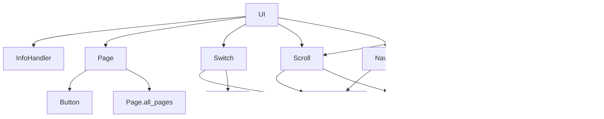

---
description:
alwaysApply: true
---

# module/ui/ 模块分析

> **文档信息**：生成日期 2026-08-14 ｜ 项目版本 dev 分支 ｜ 最后分析的代码版本 f992af6c0

## 1. 模块概述

**定位**：UI 导航系统，负责游戏页面检测、路径规划和页面切换。

**角色**：定义 `Page` 页面图、`UI` 导航控制器、`Switch` 状态切换、`Scroll` 滚动条、`Navbar` 标签导航、`Setting` 游戏设置面板。实现基于 A* 的页面路径规划。

**输入/输出**：
- 输入：截图（`np.ndarray`）、目标页面（`Page`）
- 输出：页面切换操作、当前页面检测结果

**核心职责**：
1. 定义 50+ 游戏页面及其双向链接关系
2. 实现 A* 路径规划，找到最短页面切换路径
3. 处理 20+ 种弹窗和异常情况
4. 提供 `Switch`/`Scroll`/`Navbar`/`Setting` 等 UI 组件

## 2. 文件清单与逐文件分析

`module/ui/` 实际文件：`ui.py`、`page.py`、`switch.py`、`scroll.py`、`navbar.py`、`setting.py`、`assets.py`（7 个）。`module/ui_white/` 为白色主题资源目录，仅有 `assets.py`。

### 2.1 ui.py（733 行）

**导出类型**：类 `UI`

**导入依赖**：
- 内部：`base.button`、`base.decorator`、`base.timer`、`combat.assets`、`exception`、`exercise.assets`、`handler.assets`、`handler.info_handler`、`logger`、`map.assets`、`meowfficer.assets`、`ocr.ocr`、`os_handler.assets`、`raid.assets`、`ui.assets`、`ui.page`、`ui_white.assets`
- 外部：无

**逐段分析**：

- `L49-101`：`UI` 类继承 `InfoHandler`。`ui_page_appear()` 页面检测，处理 `page_main` 双主题和 EN 本地化问题；`is_in_main()` 双主题主界面判断；`ui_main_appear_then_click()` 主页面点击。
- `L103-109`：`ensure_button_execute()` — 统一执行 Button 或回调式检测。
- `L111-187`：`ui_click()` — 通用点击等待方法。点击计时器 + 确认等待 + 附加处理；`ui_process_check_button()` 支持 Button/callable/列表多类型检测。
- `L189-279`：`ui_get_current_page()` — 当前页面检测。遍历所有页面，未知页面尝试回主页面（GOTO_MAIN/RPG_HOME），最终自动重启游戏。
- `L281-354`：`ui_goto()` — A* 路径导航。`Page.init_connection()` 初始化路径，循环检测当前页面并点击父页面链接；30 秒导航超时自动调用 `ui_get_current_page()` 恢复。
- `L356-391`：`ui_ensure()`/`ui_goto_main()`/`ui_goto_campaign()`/`ui_goto_event()`/`ui_goto_sp()` — 页面确保和快捷导航。
- `L393-439`：`ui_ensure_index()` — 索引翻页。OCR 识别当前索引，快速多次点击或单次点击。
- `L441-449`：`ui_back()` — 返回箭头点击。
- `L451-549`：`ui_page_main_popups()`/`ui_page_os_popups()` — 主页面和大世界弹窗处理。20+ 种弹窗类型。
- `L551-675`：`ui_additional()` — 统一弹窗处理入口。按优先级处理：大世界弹窗 → 确认弹窗 → 紧急委托 → 主页面弹窗 → 剧情 → 游戏提示 → 后宅/指挥喵 → 战役准备 → 登录 → 误点击 → 空闲页面 → 白色主题切换。
- `L677-702`：`handle_idle_page()` — 闲置页面检测（`IDLE`/`IDLE_2`/`IDLE_3`）。
- `L704-733`：`ui_button_interval_reset()` — 按钮间隔重置，防止误触。

### 2.2 page.py（426 行）

**导出类型**：类 `Page`，54 个页面实例

**导入依赖**：
- 内部：`coalition.assets`、`event_hospital.assets`、`freebies.assets`、`raid.assets`、`retire.assets`、`ui.assets`、`ui_white.assets`、`config.server`
- 外部：`traceback`

**逐段分析**：

- `L33-107`：`Page` 类 — 页面定义。`all_pages` 类级字典（L49）。`init_connection()` A* 路径初始化（BFS 遍历，L56-78）。`iter_pages()`/`iter_check_buttons()` 迭代。`link()` 建立双向链接。`check_button` 用于页面检测。
- `L110-426`：页面定义 — 54 个页面实例和链接关系：
  - 主页面：`page_main`、`page_main_white`（双主题）
  - 战役：`page_campaign_menu`、`page_campaign`、`page_fleet`
  - 活动：`page_event`、`page_sp`、`page_coalition`、`page_raid`、`page_hospital`
  - 大世界：`page_os`
  - 奖励：`page_reward`、`page_mission`、`page_commission`、`page_tactical`、`page_battle_pass`、`page_event_list`
  - 商店：`page_shop`、`page_supply_pack`、`page_munitions`
  - 宿舍：`page_dormmenu`、`page_dorm`、`page_meowfficer`、`page_academy`、`page_private_quarters`、`page_game_room`
  - 科研：`page_reshmenu`、`page_research`、`page_shipyard`、`page_meta`、`page_archives`
  - 其他：`page_dock`、`page_guild`、`page_build`、`page_mail`、`page_channel`、`page_storage`、`page_unknown`、`page_rpg_stage`、`page_rpg_story`、`page_rpg_city`、`page_island` 系列（11 个）等

### 2.3 switch.py（247 行）

**导出类型**：类 `Switch`

**导入依赖**：
- 内部：`base.base`、`base.timer`、`exception.ScriptError`、`logger`

**逐段分析**：

- `L10-22`：`Switch` 类定义。
- `L24-60`：`__init__()`/`add_state()` — 状态切换器。`is_selector` 区分选择器（多选一）和开关（开/关）。`state_list` 存储状态定义，`set_unknown_timer` 为 5 秒。
- `L62-98`：`offset` 属性、`appear()`/`get()` — 状态检测。遍历状态列表，返回匹配的状态名或 `'unknown'`。
- `L100-128`：`click()`/`get_data()` — 按状态点击按钮。
- `L130-140`：`handle_additional()` — 额外弹窗处理钩子，子类可重写。
- `L142-214`：`set()` — 状态设置。循环检测当前状态，点击目标状态。`unknown_timer` 处理未知状态（可能是切换动画）。`click_timer` 防止快速重复点击；选择器模式点击目标状态，开关模式点击当前状态。
- `L216-247`：`wait()` — 等待任意状态激活。

### 2.4 scroll.py（255 行）

**导出类型**：类 `Scroll`、`AdaptiveScroll`

**导入依赖**：
- 内部：`base.base`、`base.button`、`base.timer`、`base.utils`、`logger`
- 外部：`numpy`、`scipy.signal`

**逐段分析**：

- `L14-43`：`Scroll` 类与类常量（`color_threshold` 等）— `__init__()` 按垂直/水平滚动条计算 `total`。
- `L45-59`：`match_color()` — 颜色匹配检测滚动条位置，向量化掩码。
- `L61-78`：`cal_position()` — 计算 0-1 位置。
- `L80-108`：`position_to_screen()` — 位置转屏幕坐标。
- `L110-126`：`appear()`/`at_top()`/`at_bottom()` — 出现与边界检测。
- `L128-176`：`set()` — 拖拽到目标位置。滚动条消失 5 秒超时假定完成。
- `L178-207`：`set_top()`/`set_bottom()`/`drag_page()`/`next_page()`/`prev_page()` — 翻页。
- `L210-255`：`AdaptiveScroll` — 自适应滚动条。使用 `scipy.signal.find_peaks` 峰值检测，适用于没有固定颜色的滚动条。

### 2.5 navbar.py（218 行）

**导出类型**：类 `Navbar`

**导入依赖**：
- 内部：`base.base`、`base.button`、`base.timer`、`combat.assets`、`logger`、`shop.assets`

**逐段分析**：

- `L12-33`：`Navbar.__init__()` — 标签导航。`active_color`/`inactive_color` 活跃/非活跃颜色与阈值、最小像素计数。
- `L35-61`：`is_button_active()`/`is_button_inactive()` — 颜色计数检测。
- `L63-98`：`get_info()` — 获取活跃标签索引和可见范围。
- `L100-125`：`get_active()`/`get_total()` — 便捷封装。
- `L127-152`：`_shop_obstruct_handle()` — 商店遮挡处理（GET_SHIP、GET_ITEMS 弹窗）。
- `L154-218`：`set()` — 设置标签。支持 `left`/`right`/`upper`/`bottom` 四个方向。10 秒超时。

### 2.6 setting.py（179 行）

**导出类型**：类 `Setting`

**导入依赖**：内部 `base.base`、`base.button`、`base.timer`、`config.utils`、`exception.ScriptError`、`logger`

**逐段分析**：

- `L15-36`：`Setting.__init__()` — 游戏设置面板选项切换工具。`settings` 字典（(设置名, 选项名) → Button）、`settings_default` 默认选项、`reset_first` 先重置、`need_deselect` 是否取消已激活选项。
- `L38-58`：`add_setting()` — 注册一组设置选项，支持 `ButtonGrid`。
- `L60-62`：`is_option_active()` — 颜色计数检测选项是否激活。
- `L64-90`：`_product_setting_status()` — 生成每个选项按钮的目标激活状态。
- `L92-105`：`show_active_buttons()` — 记录当前激活的选项。
- `L107-125`：`get_buttons_to_click()` — 计算需要点击的按钮列表。
- `L127-163`：`_set_execute()` — 执行选项切换，10 秒超时。
- `L165-179`：`set()` — 入口；`reset_first` 为 True 时先重置为默认值再设置。

实际方法为 `add_setting()`/`is_option_active()`/`_product_setting_status()`/`show_active_buttons()`/`get_buttons_to_click()`/`_set_execute()`/`set()`。使用方：`module/storage/ui.py`、`module/retire/setting.py`（`QuickRetireSetting`）、`module/retire/dock.py`、`module/freebies/mail_white.py`（`MailSelectSetting`）等。

### 2.7 assets.py（资源文件）

`module/ui/assets.py` 与 `module/ui_white/assets.py`：按钮/模板资源定义（`MAIN_GOTO_*`、`GOTO_MAIN`、`BACK_ARROW`、`REWARD_GOTO_*`、`IDLE` 系列等）。`ui_white/` 为白色主题（2024.05.22 新 UI）专用资源，配合 `page_main_white` 使用。

## 3. 内部调用关系

## 4. 模块依赖分析

**外部依赖**：
- `scipy.signal`：峰值检测（`AdaptiveScroll`）
- `numpy`：数组操作

**内部依赖**：
- `module.base`：`ModuleBase`、`Button`、`ButtonGrid`、`Timer`、`utils`
- `module.handler.info_handler`：`InfoHandler`（弹窗处理）
- `module.ocr.ocr`：`Ocr`（索引识别）
- `module.exception`：`GameNotRunningError`、`GamePageUnknownError`、`RequestHumanTakeover`、`ScriptError`
- `module.config.server`：服务器配置
- 各模块 `assets`：按钮/模板定义

## 5. 设计模式与架构分析

**设计模式**：
1. **图模型**：`Page` 使用有向图表示页面关系，A* 路径规划
2. **状态模式**：`Switch` 管理多个 UI 状态
3. **模板方法**：`Scroll.set()` 定义拖拽骨架
4. **组合模式**：`UI` 组合 `InfoHandler` 的弹窗处理能力

**架构特点**：
- 页面图是核心数据结构，每个页面有 `check_button` 和 `links` 字典
- A* 路径通过 BFS 初始化 `parent` 指针
- `ui_additional()` 是弹窗处理的统一入口，按优先级排序

## 6. 类型系统分析

- `Page.all_pages` 使用类级字典存储所有页面
- `Switch.state_list` 使用字典列表存储状态定义
- `Scroll` 使用 NumPy 数组进行位置计算
- `Navbar` 使用 `ButtonGrid` 管理标签按钮
- `Setting.settings` 使用 `(str, str) → Button` 字典管理设置项

## 7. 性能分析

- `ui_get_current_page()` 遍历所有页面，O(n) 复杂度
- `ui_goto()` A* 路径初始化 O(V+E)，V=页面数，E=链接数
- `Scroll.match_color()` 使用向量化颜色匹配
- `AdaptiveScroll.match_color()` 使用 `find_peaks` 峰值检测
- `Navbar.get_info()` 遍历所有标签按钮

## 8. 安全分析

- `ui_get_current_page()` 未知页面自动重启游戏，防止永久卡死
- `ui_additional()` 处理 20+ 种弹窗，防止意外中断
- `Switch.set()` 5 秒未知状态超时，防止无限循环
- `Scroll.set()` 5 秒滚动条消失超时
- `Navbar.set()` 10 秒设置超时

## 9. 代码质量评估

**优点**：
- A* 路径规划实现简洁高效
- 弹窗处理覆盖全面（20+ 种类型）
- `Switch`/`Scroll`/`Navbar`/`Setting` 组件设计灵活
- 双主题主页面支持（`page_main`/`page_main_white`）

**问题**：
- `ui.py` 的 `ui_additional()` 过于庞大（120+ 行），应拆分
- 页面定义硬编码在 `page.py`，添加新页面需要修改源码
- `ui_get_current_page()` 未知页面的错误信息过于"个性化"
- `Scroll` 和 `AdaptiveScroll` 缺少公共接口

## 10. 潜在问题与改进建议

1. **弹窗处理拆分**：将 `ui_additional()` 拆分为独立的弹窗处理器类
2. **页面定义配置化**：将页面定义移到配置文件，支持动态添加
3. **路径规划增强**：支持加权边（某些页面切换更快）
4. **Scroll 抽象**：定义 `ScrollBase` 接口，统一 `Scroll` 和 `AdaptiveScroll`
5. **错误信息优化**：`ui_get_current_page()` 的错误信息应更专业
6. **测试覆盖**：A* 路径规划、弹窗处理等核心逻辑缺少单元测试
