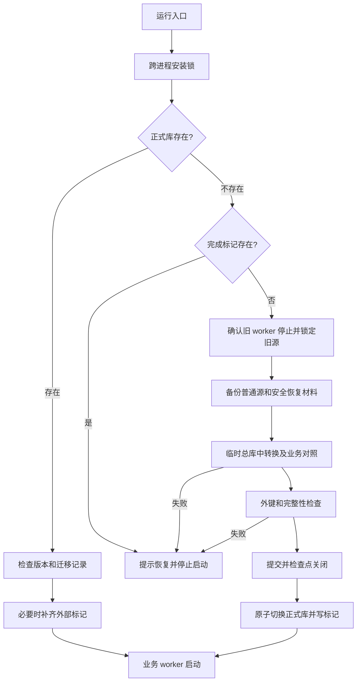

# 普通业务数据存储

> 所有实例共用实际配置目录中的 `azurpilot.db`，以原生列、关联表和类型化兼容树保存普通业务数据。

## 1. 模块概述

`module.persistence` 管理普通数据的连接、事务、版本和首次迁移。统计、资源账本、仓库、日报及调度都接收同一个 `BusinessDatabase`；导入模块只定义对象，不创建数据库。

实例配置继续使用 JSON。账号保险库、茗交所身份、认证历史、所有者与检查点继续使用专用安全存储。普通观察值可以供调度使用，不能用于重建认证链。

v1 固定为 56 张 `STRICT` 表，建表、约束、触发器和查询索引的完整定义见 [schema_v1.sql](../../../module/persistence/schema_v1.sql)。SQLite 需支持 `STRICT`，运行环境版本由项目依赖环境决定。

## 2. 模块职责

### 负责

- 连接设置、写锁、完整提交与回滚、SQLite 备份。
- 实例隔离、文档/月份/运行状态/舰船兼容值的引用范围。
- 将公开快照映射到原生表，保留字段存在性和无法投影的值。
- 只读转换旧源、验证结果、切换正式库和补齐迁移完成标记。
- 为离线工具提供总库检查、单实例调度切片和统计快照导入导出。

### 不负责

- 游戏识别、统计公式、样本裁剪、调度应用校验和服务器日计算。
- 配置生成、游戏账号操作、身份重建或安全密钥降级。
- 自动推测旧记录实例、时区或缺失时间。

## 3. 模块位置

```text
module/persistence/
├── database.py
├── schema_v1.sql
├── values.py
├── snapshots.py
├── scheduler.py
└── migration.py
dev_tools/business_storage.py
module/scheduler/history_store.py
```

| 文件 | 作用 |
| --- | --- |
| `database.py` | 共用数据库句柄、调用范围绑定、安装锁及连接生命周期 |
| `schema_v1.sql` | 版本化建表 SQL；列约束与复合外键是最终依据 |
| `values.py` | 自由参数和兼容值的类型化树 |
| `snapshots.py` | 月度、事件、委托、科研和舰船快照投影 |
| `scheduler.py` | 调度图、变量、运行记录、观察值与切片复制 |
| `migration.py` | 旧源发现、备份、只读解码、转换和切换 |
| `business_storage.py` | 显式离线维护工具 |
| `history_store.py` | 原实例安全历史库的访问，保持原身份和认证语义 |

## 4. 核心入口

| 入口 | 用途 |
| --- | --- |
| `initialize(config_directory)` | 运行入口在业务 worker 创建前执行；迁移失败中止启动 |
| `get_database(config_directory)` | 同一规范化配置目录复用同一个句柄 |
| `BusinessDatabase.transaction()` | 默认写事务，参数 `write=False` 为只读事务 |
| `use_database()` / `configured_database` | 不改变既有 API 参数契约，为一次业务调用绑定实际配置目录 |
| `BusinessDatabase.backup()` | SQLite 备份接口，校验成功后原子发布目标文件 |
| `ProgramStore.backup()` / `restore()` | 只导出、导入一个实例的普通调度切片 |
| `uv run python -m dev_tools.business_storage` | 离线迁移、检查、备份及导入导出 |

WebUI、TUI、终端调度器、MCP lifespan、父进程启动和 worker 初始化都经过同一迁移入口。API 服务把 `ConfigService.database` 注入调度、运行与统计调用，避免自定义配置目录落回默认目录。

首次迁移会检查已登记的 worker 和同一安装目录的旧运行入口。当前入口启动链中的 `uv run` 进程，以及 Windows 虚拟环境转发同一命令的 Python 启动进程不属于旧写入者；只有确认这些进程的身份后才排除它们。其他 Python 祖先进程、并列的旧入口和已登记的 worker 仍阻止迁移，检测器不会终止任何进程。

## 5. 核心组件

| 表组 | 张数 | 保存内容 |
| --- | --- | --- |
| 基础与类型化值 | 4 | 实例、迁移版本、值集合、值节点 |
| 资源、流水、掉落、仓库 | 6 | 快照、账本、水位、物品明细、完整扫描 |
| 月度统计与事件 | 10 | 月度根、侵蚀计数、独立样本序列、行动力与金币事件 |
| 委托、科研、钻石 | 7 | 收益、物品、截图、钻石结算及运行中委托 |
| 舰船经验 | 6 | 检查元数据、舰船、耗时组、样本、每日统计、扩展 |
| 日报与收益缓存 | 6 | 五张日报表及 `farming_aggregates` |
| 调度定义与运行状态 | 17 | 两份文档、图、节点、端口、参数、变量、运行记录、观察 |

`typed_value_sets` 的四种归属恰好一个有效：文档、月份、运行实例或舰船统计。复合外键检查归属与实例一致；归属不可修改，值节点只能整体替换。删除对应业务父记录时级联清理。

## 6. 工作流程



旧库按 SQLite 备份接口取得包含已提交 WAL 的副本。转换期间源库持有写锁但不更新数据，普通文件使用现有文件锁；切换前再次比较源摘要。旧明文、V1/V2 包装和整行密文只在只读解码路径处理，不能调用会改写、隔离原件或销毁旧密钥的初始化流程。

安全恢复材料显式逐层遍历；拒绝访问、链接或路径越界会阻止发布，不能将不可读目录视为没有材料。恢复材料中的 `.db` 可能是历史整库密文，仅确认 SQLite 文件头的材料使用 SQLite 备份接口，其余原件按字节复制；普通业务来源数据库的读取错误仍停止迁移。Windows 的文件操作和 SQLite URI 在 I/O 边界使用扩展绝对路径，支持旧迁移备份嵌套后超过传统 260 字符限制的文件；来源清单继续记录普通路径。

旧数据库优先，月份 JSON 只补缺失月份。无法解密的旧普通记录按条跳过，保留源库及备份，在备份目录的 `unmigrated.json` 中记录来源、记录标识和原因，并输出警告；其余可读记录继续转换，业务启动不受这类旧密文影响。被跳过的月份不创建空快照，也不由月份 JSON 覆盖；旧密文文件无法读取时保留整份文件并列入清单。不符合约定的业务结构、重复月份及写入、完整性检查失败仍拒绝切换。源清单及摘要写入备份的 `sources.json`；正式库的 `storage_migrations` 与 `PRAGMA user_version` 对应，外部标记为 `azurpilot.migrated`。

旧舰船经验和月度 JSON 文件为空、纯空白、损坏 JSON、非 UTF-8 或包装载荷无法解析时，先尝试同批已冻结的 `.bak` 副本；正常主文件始终优先，不用备份覆盖已有月份。旧加密备份仍按主文件路径校验身份，不改写旧文件或密钥。恢复成功时日志标明备份来源，`unmigrated.json` 的主文件条目增加 `recovered_from`；主文件和备份都不可读时分别记录原因，跳过该快照后继续迁移其他来源，不创建空快照。主文件能解析但业务结构不符时仍停止；文件锁、I/O、写入和完整性错误也仍阻断切换。

整行 AES 旧快照的设备 ID 只从已有日志、旧月度文件及备份文件读取，并结合内存中已知 ID 和只读计算的当前硬件 ID 尝试解码；迁移不调用会覆写 `log/device_id.json` 或启动刷新定时器的初始化。已有设备 ID 文件一并纳入迁移备份。迁移完成后不自动重导被跳过的记录；以后找回旧密钥时，通过显式统计导入工具补入可解码的缺失月份。

旧统计、月度、仓库和日报库可能尚未建业务表，或移除业务表后只剩 `sqlite_sequence` 等 SQLite 内部表。这些空库仍备份并按无历史记录转换，不能仅因缺少预期业务表阻止启动；出现未约定的业务表时仍拒绝切换。

初始化日志以 `[存储]` 标识等待安装锁、检查已有总库及就绪；首次迁移以 `[存储迁移]` 标识清点、旧源锁、备份、只读解码、逐来源转换、完整性检查、检查点与正式切换。每个来源记录序号、总数和耗时，数据库表记录条数；大表处理及 SQLite 备份每两秒输出一次条数或页数进度。不可读密文输出记录标识、累计跳过数量和最终清单路径，逐条警告只输出前十条及之后每千条，完整清单仍保存全部记录。日志不输出快照、密文、设备 ID 值或密钥。

### 回退后的数据可见性

迁移成功后，旧源仅作为原件和恢复依据保留，运行期新增数据只写 `azurpilot.db`。回退代码不会自动把新总库导出为旧的 SQLite、JSON 或 CSV；旧代码只能看到迁移前的旧源，因此新增历史仍保存在新总库中，但对旧代码不可见。此格式限制是本次合入选择的迁移行为，不能把 Git 回退当作统计数据回退。

回退前停止所有业务进程，另存当前总库、`azurpilot.migrated` 及必要的安全恢复材料；同时保留 `storage-backups/pre-v1-*` 和未修改的旧源。不要删除新总库或完成标记来触发重新导入。恢复本版代码后继续使用已迁移总库；如需旧代码读取迁移后的新增历史，应先实施并验证独立的兼容导出。

## 7. 调用关系

### 上游

| 模块 | 关系 |
| --- | --- |
| 运行入口与进程管理 | 在业务启动前确认迁移成功 |
| 统计与日报适配器 | 使用原生表和快照编解码，保留业务方法 |
| `ProgramStore` | 普通调度数据进入总库，认证数据委托安全历史存储 |
| 每日备份与离线工具 | 获取数据库快照或按实例筛选切片 |

### 下游

| 模块 | 用途 |
| --- | --- |
| 标准库 `sqlite3` | 连接、事务、备份、完整性检查 |
| `config.transaction` | 跨线程/进程文件锁 |
| 旧统计解码原语 | 读取旧加密载荷，保留原密钥材料 |
| 现有调度模型 | 格式校验；应用校验仍由调度流程执行 |

## 8. 数据流

游戏采集 → 原有业务校验 → 共享写事务 → 原生列/子表 → 公开快照适配器 → 原有统计和 WebSocket 返回结构。

实际行动力采集分别提交安全历史和普通观察值。安全历史认证失败时停止交易同步，普通观察与调度继续按既有语义运行；安全读取不从总库补造历史。

## 9. 状态模型

| 状态 | 判断与处理 |
| --- | --- |
| 未迁移 | 正式库、完成标记均不存在；允许首次转换 |
| 转换中 | 安装锁及旧源写锁被持有，临时库尚不能供业务使用 |
| 已切换 | 正式库有迁移记录；外部标记缺失时幂等补齐 |
| 已完成 | 正式库及外部标记存在；以后不读写旧普通源 |
| 需要恢复 | 标记存在而正式库丢失；禁止重导旧数据 |

## 10. 配置

| 配置 | 默认值 | 说明 |
| --- | --- | --- |
| 实际配置目录 | 当前安装 `config/` | 由运行入口或 `ConfigService` 提供 |
| `AZURPILOT_CONFIG_DIR` | 未设置 | 无显式目录调用的存储默认目录，可用于隔离测试 |
| 普通写锁等待 | 10 秒 | 每个连接启用 `busy_timeout` |
| 日报锁等待 | 50 毫秒 | 保持日报短超时与采集缺口语义 |
| 每日备份开关、保留天数 | 既有配置 | 不新增业务配置字段 |

## 11. 异常与错误处理

| 异常/条件 | 处理 |
| --- | --- |
| `MigrationError`、旧密钥不可用或结构冲突 | 保留原件，不切换，不启动业务 worker |
| 锁超时、提交失败、磁盘写入错误 | 当前事务完整回滚；业务组件沿用原错误处理 |
| revision 不一致 | `ConflictError`，提示重新加载 |
| 正式库丢失但标记存在 | 提示从总库备份恢复 |
| 单实例恢复目标已有调度数据 | 拒绝覆盖，先显式归档 |
| 安全历史认证失败 | 只影响交易同步，不替换认证身份或普通业务数据 |

## 12. 并发与线程模型

连接按操作创建并在退出时关闭，不跨线程共享连接。共用的句柄只管理目录和准备状态。连接启用外键、WAL、`synchronous=FULL`；普通写操作使用 `BEGIN IMMEDIATE` 串行化整段读改写。

委托收益、运行记录移除、钻石结算及跨月更新使用同一个总库事务。流水去重保留 `(instance,event_key,resource)` 唯一约束，迁移保留旧流水 ID 与余额消费水位；水位不是外键。

## 13. 缓存与持久化

`farming_aggregates` 保留全局和实例哈希范围。SQL 重算写 `computed`，旧 CSV 导入写 `legacy` 并记录来源。普通读取不更新刷新时间；显式刷新在一个事务内更新六个等级。实例缓存缺失时只从该实例明细重算。

部分快照按原字段读取；只有整份记录不存在时使用业务默认值。`field_mask` 区分缺字段与显式 `None`，子表和根标记区分缺集合、空字典与空数组。固定顺序定义在 `MONTH_FIELDS`、`SHIP_FIELDS`、事件字段表、`HAZARD_FIELDS`、`GROUP_FIELDS` 和 `RECORD_NAMES`，后续版本只能追加位序。

类型化树支持 `null/bool/int/bigint/real/special_real/string/object/array`，大整数使用规范十进制文本。特殊浮点仅用于兼容统计；调度文档和运行状态继续拒绝。对象成员名和同父顺序唯一，根编号为 1，父编号小于子编号；编解码器检查唯一根和连续顺序。

已知字段不能无损投影时进入兼容树。根字段 `mode=value` 保存完整值，`mode=extra` 保存扩展成员；同名字段不能同时使用两种模式。增量修改保留未触及字段，耗时全局桶和各侵蚀等级桶分别保存，不能从已截断的全局样本重建分桶。

## 14. 生命周期

复制实例只带配置和调度方案。删除实例先完成配置备份、`backup/<归档名>/business/<实例>.sqlite3` 调度切片和 `scheduler/<实例>.sqlite3` 安全历史归档，再删除普通调度行及实例配置，统计历史保留。

可信安全登记识别的改名在单个总库事务内复制并重新映射调度文档和值集合引用，再删除旧调度状态。统计仍归属原实例名。切片恢复只导入指定实例，不能覆盖其他实例，也不能重建安全身份。

每日备份通过 SQLite 备份接口保存总库与安全数据库，并按原保护机制锁定注册信息和密钥材料；外部安全密钥不自动导出。所有文件成功后才发布当日备份目录，失败不会留下完成目录。

## 15. 扩展方式

新增业务字段先决定原生列与关联表，再追加公开字段位序和编解码映射。发布新结构必须增加版本 SQL 和迁移步骤；不能直接改变已发布 v1 位序。自由参数使用具有明确归属的类型化树，不能重新加入整行 JSON 载荷列。

## 16. 修改注意事项

- 不给用户填写的调度 ID、名称或连线端点增加唯一约束、节点外键；草稿允许重复 ID、未知卡片和悬空连线。
- `imgid` 不全局唯一；截图归组使用实例、设备和截图，允许多物品记录。
- 仓库未知数量保存 `NULL`，不能写零；舰船识别等级 0 仍合法。
- 迁移保留旧时间文本、样本顺序、平均值与效率值，普通更新才使用现有公式。
- 删除外部完成标记后重导旧数据不能作为恢复方案；应恢复完整总库。

## 17. 已知限制

只有 v1 升级路径已实现，其他 `user_version` 明确拒绝打开。旧源未支持的业务表或不能映射的列必须先明确转换规则，不能以空值跳过。统计整体保存仍完整投影相应快照，样本上限与历史清理继续由业务模块执行。

## 18. 示例

以下命令在停止旧 worker 后执行，目录和文件名均为示例：

```powershell
uv run python -m dev_tools.business_storage --config-dir ./config migrate
uv run python -m dev_tools.business_storage --config-dir ./config check
uv run python -m dev_tools.business_storage --config-dir ./config backup --output ./backup/azurpilot.db
uv run python -m dev_tools.business_storage --config-dir ./config export-instance --instance pilot --output ./backup/pilot.sqlite3
uv run python -m dev_tools.business_storage --config-dir ./config restore-instance --instance pilot --input ./backup/pilot.sqlite3
uv run python -m dev_tools.business_storage --config-dir ./config export-statistics --instance pilot --output ./backup/pilot-statistics.json
uv run python -m dev_tools.business_storage --config-dir ./config import-statistics --instance pilot --input ./backup/pilot-statistics.json
```

`backup` 只导出普通总库，完整恢复材料使用每日备份流程。`export-instance` 包含运行状态和观察值，分享调度方案使用现有配置导出接口。统计 JSON 只用于显式导入导出；导入同名实例且仅补缺失记录，冲突时全部回滚。

## 19. 调试方法

优先运行 `tests.test_persistence`、`tests.test_persistence_migration` 和对应业务事务测试。跨模块验证使用临时配置目录、夹具与模拟服务，再运行 Python 全量单元测试、基础 CI lint 和导入冒烟检查。

迁移失败先查看保留的源清单、原件与安全恢复材料；不要运行旧自动解密初始化或删除旧密钥来绕过失败。正式库存在时可通过 `check` 查看每表数量与完整性；统计与调度 API 的返回结构仍以原契约为准。

启动停顿时先看最后一条阶段日志：等待锁、备份、解码、转换和 WebUI 后续初始化分别有明确提示。失败日志记录未完成的阶段、耗时和备份目录，原异常继续向上传递。已有总库会输出「已完成迁移，无需再次解密旧数据」。GUI 的启动及迁移日志同时写入控制台与 `log/YYYY-MM-DD_gui-launcher.txt`；服务初始化日志写入 `log/YYYY-MM-DD_webui.txt`，切换前输出实际文件路径。

## 20. 相关模块

- [统计与数据提交](statistics.md)
- [调度程序](../webui/scheduler-program.md)
- [运行时服务](../webui/runtime.md)
- [配置系统](../config.md)
- [基础层与备份](../base/index.md)
- [测试体系](testing.md)
